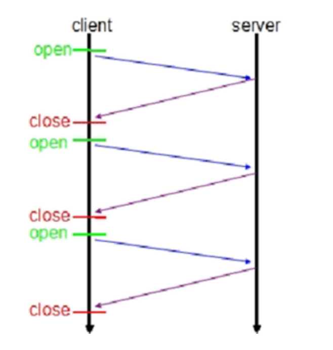

## webSocket

WebSocket是一个独立的基于TCP的协议，是HTML5新出的一个协议，跟我们认识的HTTP协议两者之间具有一定的交集，
webSocket其实是借助了HTTP这个跳板，B格更上了一个档次，能进行全双工通讯（全双工：允许两台设备同时进行双向资料传输）。
它和HTTP唯一的关系就是它的握手请求作为一个升级请求（Upgrade request），经由HTTP服务器解析。
HTTP有1.1和1.0之说，也就是所谓的keep-alive（Keep-Alive功能使客户端到服务器端的连接持续有效，
当出现对服务器的后继请求时，Keep-Alive功能避免了建立或者重新建立连接。
但是保持链接中，暂停通讯期间不会释放资源，比较浪费服务器资源。）。
但是Websocket其实是一个新协议，跟HTTP协议基本没有关系，只是为了兼容现有浏览器的握手规范而已，
也就是说它是HTTP协议上的一种补充。

## 协议

持久化的协议。HTTP协议请求：

HTTP 1.0: 一个request 一个response 一次HTTP链接这样就算是结束了。


HTTP 1.1:在1.0版本有了改进，加入了一个Keep-Alive，在一次HTTP链接中，我可以发送多个 request，
接收多个response，但是一个request 只能对应 一个response。而且这个response，是被动发起的。


webSocket是基于HTTP协议，或者说是借用了HTTP的协议来完成一部分的握手。
```
GET /chat HTTP/1.1
Host: xxxx.com
Upgrade: websocket
Connection: Upgrade
Sec-WebSocket-Key: XXXXXX
Sec-WebSocket-Protocol: XXXX
Sec-WebSocket-Version: X
Origin:http://xxxx.com
```

以上就是一次webSocket的握手请求。

有两个参数：
```
Upgrade：webSocket
Connection：Upgrade
```

告诉服务器（Ngnix）接线员:attention please！爷发起的是webSocket协议，快帮我找一个对应的客服，不是那个蹩脚的HTTP客服。

```
Sec-WebSocket-Key: XXXXX
Sec-WebSocket-Protocol: A, B
Sec-WebSocket-Version: X
```

首先，Sec-WebSocket-Key 是一个Base64 encode的值，这个是浏览器随机生成的，
告诉服务器：别忽悠我，我要验证你是不是webSocket客服。

然后，Sec_WebSocket-Protocol 是一个用户定义的字符串，用来区分同URL下，
不同的服务所需要的子协议（客户端支持的子协议列表）。简单理解：今晚我要服务A，别搞错啦~

最后，Sec-WebSocket-Version 是告诉服务器所使用的Websocket版本 ：服务员，我要的是小学生，不是大学生噢→_→
然后服务器会返回下列东西，表示已经接受到请求， 成功建立Websocket啦！
```
HTTP/1.1 101 Switching Protocols
Upgrade: websocket
Connection: Upgrade
Sec-WebSocket-Accept: XXXX
Sec-WebSocket-Protocol: B
```

这部分就是HTTP最后负责的内容了，此后跟HTTP毫无关系。上诉内容中：
```
Upgrade：webSocket
Connection：Upgrade
```
告诉客户端，服务端已经成功升级成了webSocket协议了。
```
Sec-WebSocket-Accept: XXXX
```

这段内容是经过服务确认之后，根据客户端生成Sec-WebSocket-Key生成的值；
简单理解,服务端：来，你个死傲娇，给你看我的ID info。

Sec-WebSocket-Protocol表示服务端从客户端提供的协议列表中，提供自身支持哪个（B）。

接下去的事，表示跟那个蹩脚的HTTP木有，完全木有，真的木有再有关系了，webSocket客服完全承包后续服务内容。

我表示啥都没听懂，又给你BBB了这么久，HTTP long pull(长链接) 或者 ajax轮询，不都可以进行实时的信息传递么？
webSocket具体还有什么鬼用处？

## 作用
在讲webSocket之前，让我们来脑补一会 long pull 和 ajax轮询吧

#### ajax轮询
ajax的原理非常简单，就是定时器，每隔一会发起一个请求，轮询服务端是否有新的信息

场景大致是这样的：
```
客户：我的快递到了没呀？（request）

客服：你好，你是？没有（response）

客户：我的快递到了没呀？

客服：你好，你是？没有..

客户：我的快递到了没呀？

客服：你好，你是？没有，真没有

客户：我的快递到了没呀？

客服：你好，你是？!@#$%&*,可能还再路上

客户：我的快递到了没呀？

客服：你好，你是？有了会给你送来的

客户：我的快递到了没呀？

客服：你好，你是？没.....没.....没有啊....啊啊啊啊
```

#### long pull
原理其实跟ajax差不多，但是采用的是阻塞的方式（电话接通不挂，直到我满意为止才挂电话）。

客户端发起请求之后，服务端没有消息就一直不返回response。
直到有消息，服务端返回response，客户端再次建立链接，周而复始。

简单理解大致是这样的：
```
客户：有木有新消息呀？有了再回答我（request）

客服：你好，你是？（客户BB一串），稍等！有消息了，BBBBBB（response）

客户：有木有新消息呀？有了再回答我（request）

again and again
```

从上面可以看出其实这两种方式，都是在不断地建立HTTP连接，然后等待服务端处理，`可以体现HTTP协议的另外一个特点，被动性`。
服务端不会主动去联系客户端，只能由客户端主动访问。

简单地说就是，服务器是就是客服，但是领导有命令，如果有客户来，不管多么累都要好好接待。
还有一个特性就是，HTTP的非状态性，每次都需要询问人员身份。

咱们继续再BB一会吧，这两种方式其实都是非常耗资源的。
```
ajax：需要服务端有很高效的处理能力
long pull ：很考验高并发的能力；通俗来说同时接待客户的能力
```
正常情况这两种方式都会出现一个现象：
```
客户：今晚我需要大保健服务(request)
客服：对不起，当前座席正忙（HTTP CODE:503）
```

## webSocket
为了解决上诉的问题，我们的hero出现了

### 变被动为主动
客户端HTTP协议升级成webSocket协议，服务端就可以主动推送信息给客户端，而不是每次都是客户端都傻乎乎的来询问一次。
```
客户：啦啦啦，我要建立Websocket协议，需要的服务：XXX 协议版本：x（HTTP Request）

客服：ok，确认，已升级为Websocket协议（HTTP Protocols Switched）

客户：麻烦你有信息的时候推送给我噢。。

客服：ok，有的时候会告诉你的。

客服：BalaBalaBalaBalaBalaBalaBala

客服：BalaBalaBalaBalaBala

客服：BalaBalaBala
```
只需要进行一次HTTP请求，就可以持续的从服务端拿数据了。解决了上面两种的同步，而且还有延迟，非常耗资源的情况

### 解决服务器上消耗资源
其实我们所用的程序是要经过两层代理的，即HTTP协议在Nginx服务器的解析下，然后再传送给java来处理。
简单地说，我们有一个非常快速的接线员（Nginx），他负责把问题转交给相应的客服（java）。
本身接线员基本上速度是足够的，但是每次都卡在客服（java）了，老有客服处理速度太慢，导致客服不够。
```
Websocket就解决了这样一个难题，建立后，可以直接跟接线员建立持久连接，有信息的时候客服想办法通知接线员，
然后接线员在统一转交给客户。这样就可以解决客服处理速度过慢的问题了。
```

同时，在传统的方式上，要不断的建立，关闭HTTP协议，由于HTTP是非状态性的，每次都要重新传输ID info（鉴别信息），
来告诉服务端你是谁。虽然接线员很快速，但是每次都要听这么一堆，效率也会有所下降的，
同时还得不断把这些信息转交给客服，不但浪费客服的处理时间，而且还会在网路传输中消耗过多的流量/时间。
```
Websocket只需要一次HTTP握手，所以说整个通讯过程是建立在一次连接/状态中，也就避免了HTTP的非状态性，
服务端会一直知道你的信息，直到你关闭请求，这样就解决了接线员要反复解析HTTP协议，还要查看ID info的信息。
```

同时由客户主动询问，转换为服务器（推送）有信息的时候就发送（当然客户端还是等主动发送信息过来的。。），
没有信息的时候就交给接线员（Nginx），不需要占用本身速度就慢的客服（java）了

### 保持数据是最新的
相对于轮询来说，ajax轮询是需要通过客户端不断的请求，务必会导致请求的时候服务端的数据还没有更新，
导致不必要的流量浪费，无谓的请求。