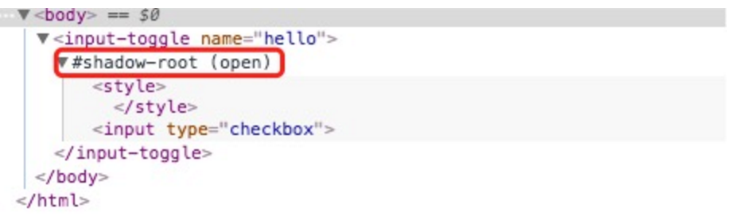

# Web Components

原文: http://gold.xitu.io/post/57c40fd3128fe1005fd4629a

---

前端组件化这个主题相关的内容已经火了很久很久，angular 刚出来时的 Directive 到 angular2 的 components，
还有 React 的 components 等等，无一不是前端组件化的一种实现和探索，但是提上议程的 Web Components 
标准是个怎样的东西，相关的一些框架或者类库，如 React，Angular2，甚至是 x-tag，polymer 
现在实现的组件化的东西和 Web Components 标准差别在哪里？
我花时间努力地把现有的 W3C Web Components 文档看了下，然后坚强地写下这些记录。

首先我们需要知道，Web Components 包括了四个部分：

1. Custom Elements
2. HTML Imports
3. HTML Templates
4. Shadow DOM

这四部分有机地组合在一起，才是 Web Components。

可以用自定义的标签来引入组件是前端组件化的基础，在页面引用 HTML 文件和 HTML 
模板是用于支撑编写组件视图和组件资源管理，而 Shadow DOM 则是隔离组件间代码的冲突和影响。

## 1. Custom Elements

    Custom Elements 顾名思义，是提供一种方式让开发者可以自定义 HTML 元素，包括特定的组成，样式和行为。
    支持 Web Components 标准的浏览器会提供一系列 API 给开发者用于创建自定义的元素，或者扩展现有元素。

这一项标准的草案还处于不稳定的状态，时有更新，API 还会有所变化，下边的笔记以 Cutsom Elements 2016.02.26 
这个版本为准，因为在最新的 chrome 浏览器已经是可以工作的了，这样可以使用 demo 来做尝试，
最后我会再简单写一下最新文档和这个的区别。

#### registerElement

首先，我们可以尝试在 chrome 控制台输入 HTMLInputElement，可以看到是有这么一个东西的，
这个理解为 input DOM 元素实例化时的构造函数，基础的是 HTMLElement。

Web Components 标准提出提供这么一个接口：

    document.registerElement('x-foo', {
      prototype: Object.create(HTMLElement.prototype, {
        createdCallback: {      
          value: function() { ... }
        },
        ...
      })
    })
    
你可以使用 document.registerElement 来注册一个标签，标准中为了提供 namesapce 的支持，防止冲突，
规定标签类型（也可以理解为名字）需要使用 - 连接。同时，不能是以下这一些：

- annotation-xml
- color-profile
- font-face
- font-face-src
- font-face-uri
- font-face-format
- font-face-name
- missing-glyph

第二个参数是标签相关的配置，主要是提供一个 prototype，这个原型对象是以 HTMLElement 等的原型为基础创建的对象。
然后你便可以在 HTML 中去使用自定义的标签。如：

    

      <x-foo></x-foo>
    

    
是不是嗅到了 React 的味道？好吧，React 说它自己主要不是做这个事情的。

#### 生命周期和回调

在这个 API 的基础上，Web Components 标准提供了一系列控制自定义元素的方法。我们来一一看下：

一个自定义元素会经历以下这些生命周期：

1. 注册前创建
2. 注册自定义元素定义
3. 在注册后创建元素实例
4. 元素插入到 document 中
5. 元素从 document 中移除
6. 元素的属性变化时

这个是很重要的内容，开发者可以在注册新的自定义元素时指定对应的生命周期回调来为自定义元素添加各种自定义的行为，
这些生命周期回调包括了：

1. createdCallback 自定义元素注册后，在实例化之后会调用，通常多用于做元素的初始化，如插入子元素，绑定事件等。
2. attachedCallback 元素插入到 document 时触发。
3. detachedCallback 元素从 document 中移除时触发，可能会用于做类似 destroy 之类的事情。
4. attributeChangedCallback 元素属性变化时触发，可以用于从外到内的通信。外部通过修改元素的属性来让内部获取相关的数据并且执行对应的操作。 

这个回调在不同情况下有对应不同的参数：

    设置属性时，参数列表是：属性名称，null，值，命名空间
    修改属性时，参数列表是：属性名称，旧值，新值，命名空间
    删除属性时，参数列表是：属性名称，旧值，null，命名空间
    
好了，就上边了解到的基础上，假设我们要创建一个自定义的 button-hello 按钮，点击时会 alert('hello world')，
代码如下：

    document.registerElement('button-hello', {
      prototype: Object.create(HTMLButtonElement.prototype, {
        createdCallback: {
          value: function createdCallback() {
            this.innerHTML = '<button>hello world</button>'
            this.addEventListener('click', () => {
              alert('hello world')
            })
          }
        }
      })
    })
    
要留意上述代码执行之后才能使用 `<button-hello></button-hello>`

#### 扩展原有元素

其实，如果我们需要一个按钮，完全不需要重新自定义一个元素，Web Components 标准提供了一种扩展现有标签的方式，
把上边的代码调整一下：

    document.registerElement('button-hello', {
      prototype: Object.create(HTMLButtonElement.prototype, {
        createdCallback: {
          value: function createdCallback() {
            this.addEventListener('click', () => {
              alert('hello world')
            })
          }
        }
      }),
      extends: 'button'
    })
    
然后在 HTML 中要这么使用：

    <button is="button-hello">hello world</button>
    
使用 is 属性来声明一个扩展的类型，看起来也蛮酷的。生命周期和自定义元素标签的保持一致。

    当我们需要多个标签组合成新的元素时，我们可以使用自定义的元素标签，但是如果只是需要在原有的 HTML 
    标签上进行扩展的话，使用 is 的这种元素扩展的方式就好。

原有的 createElement 和 createElementNS，在 Web Components 标准中也扩展成为支持元素扩展，
例如要创建一个 button-hello：

    const hello = document.createElement('button', 'button-hello')
    
标准文档中还有很多细节上的内容，例如接口的参数说明和要求，回调队列的实现要求等，
这些更多是对于实现这个标准的浏览器开发者的要求，这里不做详细描述了，内容很多，
有兴趣的自行查阅：Cutsom Elements 2016.02.26。

#### 和最新版的区别

前边我提到说文档的更新变化很快，截止至我写这个文章的时候，最新的文档是这个：Custom Elements 2016.07.21。
细节不做描述了，讲讲我看到的最大变化，就是向 ES6 靠拢。大致有下边三点：

1. 从原本的扩展 prototype 来定义元素调整为建议使用 class extends 的方式
2. 注册自定义元素接口调整，更加方便使用，传入 type 和 class 即可
3. 生命周期回调调整，createdCallback 直接用 class 的 constructor

前两个点，我们直接看下代码，原本的代码按照新的标准，应该调整为：

    class ButtonHelloElement extends HTMLButtonElement {
      constructor() {
        super()
    
        this.addEventListener('click', () => {
          alert('hello world')
        })
      }
    }

    customElements.define('button-hello', ButtonHelloElement, { extends: 'button' })
    
从代码上看会感觉更加 OO，编写上也比原本要显得方便一些，原本的生命周期回调是调整为新的：

    constructor in class 作用相当于原本的 createdCallback
    connectedCallback 作用相当于 attachedCallback
    disconnectedCallback 作用相当于 detachedCallback
    adoptedCallback 使用 document.adoptNode(node) 时触发
    attributeChangedCallback 和原本保持一致
    connect 事件和插入元素到 document 有些许区别，主要就是插入元素到 document 时，
    元素状态会变成 connected，这时会触发 connectedCallback，disconnect 亦是如此。

## 2. HTML Imports
    
    HTML Imports 是一种在 HTMLs 中引用以及复用其他的 HTML 文档的方式。
    这个 Import 很漂亮，可以简单理解为我们常见的模板中的 include 之类的作用。

我们最常见的引入一个 css 文件的方式是：

    <link rel="stylesheet" href="/css/master.css">
    
Web Components 现在提供多了一个这个：

    <link rel="import" href="/components/header.html">
    
#### HTMLLinkElement

原本的 link 标签在添加了 HTML Import 之后，多了一个只读的 import 属性，当出现下边两种情况时，这个属性为 null：

1. 该 link 不是用来 import 一个 HTML 的。
2. 该 link 元素不在 document 中。

否则，这个属性会返回一个表示引入的 HTML 文件的文档对象，类似于 document。
比如说，在上边的代码基础上，可以这样做：

    const link = document.querySelector('link[rel=import]')
    const header = link.import;
    
    const pulse = header.querySelector('div.logo');

#### 阻塞式

我们要知道的是，默认的 link 加载是阻塞式的，除非你给他添加一个 async 标识。
阻塞式从某种程度上讲是有必要的，当你 improt 的是一个完整的自定义组件并且需要在主 HTML 中用标签直接使用时，
非阻塞的就会出现错误了，因为标签还没有被注册。

#### document

有一点值得留意的是，在 import 的 HTML 中，我们编写的 script 里边的 document 是指向 import 这个 
HTML 的主 HTML 的 document。

如果我们要获取 import 的 HTML 的 document 的话，得这么来：

    const d = document.currentScript.ownerDocument
    
这样设计是因为 import 进来的 HTML 需要用到主 HTML 的 document。例如我们上边提到的 registerElement。

在一个被 import 的 HTML 文件中使用下边三个方法会抛出一个 InvalidStateError 异常：

    document.open()
    document.write()
    document.close()
    
对于 HTML Import，标准文档中还有很大一部分内容是关于多个依赖加载的处理算法的，在这里就不详述了，
有机会的话找时间再开篇谈，这些内容是需要浏览器去实现的。

## 3. HTML Templates

这个东西很简单，用过 handlebars 的人都知道有这么一个东西：

    
    
其他模板引擎也有类似的东西，那么 HTML Templates 便是把这个东西官方标准化，
提供了一个 template 标签来存放以后需要但是暂时不渲染的 HTML 代码。

以后可以这么写了：

    <template id="template">
      ...
    </template>

#### 接口和应用

template 元素有一个只读的属性 content，用于返回这个 template 里边的内容，返回的结果是一个 DocumentFragment。
具体是如何使用的，直接参考官方给出的例子：

    <!doctype html>
    <html lang="en">
      <head>
        <title>Homework</title>
      <body>
        <template id="template">
Smile!
</template>
        
    </html>
    
使用 DocumentFragment 的 clone 方法以 template 里的代码为基础创建一个元素节点，
然后你便可以操作这个元素节点，最后在需要的时候插入到 document 中特定位置便可以了。

Template 相关的东西不多，而且它现在已经是纳入生效的 标准文档 中了。

我们接下来看看重磅的 Shadow DOM。

## 4. Shadow DOM

Shadow DOM 好像提出好久了，最本质的需求是需要一个隔离组件代码作用域的东西，
例如我组件代码的 CSS 不能影响其他组件之类的，而 iframe 又太重并且可能有各种奇怪问题。

    可以这么说，Shadow DOM 旨在提供一种更好地组织页面元素的方式，来为日趋复杂的页面应用提供强大支持，
    避免代码间的相互影响。

看下在 chrome 它会是咋样的：

#### Shadow DOM in chrome

我们可以通过 `createShadowRoot()` 来给一个元素节点创建 Shadow Root，这些元素类型必须是下边列表的其中一个，
否则会抛出 NotSupportedError 异常。

    自定义的元素
    article
    aside
    blockquote
    body
    div
    header, footer
    h1, h2, h3, h4, h5, h6
    nav
    p
    section
    span
    
createShadowRoot() 是现在 chrome 实现的 API，来自文档：https://www.w3.org/TR/2014/WD-shadow-dom-20140617/。
最新的文档 API 已经调整为 attachShadow()。

返回的 Shadow Root 对象从 DocumentFragment 继承而来，所以可以使用相关的一些方法，
例如 shadowRoot.getElementById('id') 来获取 Shadow DOM 里边的元素。

简单的使用如下：

    const div = document.getElementById('id')
    const shadowRoot = div.createShadowRoot()
    const span = document.createElement('span')
    
    span.textContent = 'hello world'
    shadowRoot.appendChild(span)
    
在这里，我把这个 div 成为是这个 Shadow DOM 的 宿主元素，下边的内容会延续使用这个称呼。

    Shadow DOM 本身就为了代码隔离而生，所以在 document 上使用 query 时，是没法获取到 Shadow DOM 里边的元素的，
    需要在 Shadow Root 上做 query 才行。

在这里附上一个文档，里边有详细的关于新的标准和现在 blink 引擎实现的 Shadow DOM 的区别，
官方上称之为 v0 和 v1：Shadow DOM v1 in Blink。

#### API

Shadow Root 除了从 DocumentFragment 继承而来的属性和方法外，还多了另外两个属性：

1. host 只读属性，用来获取这个 Shadow Root 所属的元素
2. innerHTML 用来获取或者设置里边的 HTML 字符串，和我们常用的 element.innerHTML 是一样的

另外，在最新的标准文档中，元素除了上边提到的 attachShadow 方法之外，还多了三个属性：

1. assignedSlot 只读，这个元素如果被分配到了某个 Shadow DOM 里边的 slot，那么会返回这个对应的 slot 元素
2. slot 元素的 slot 属性，用来指定 slot 的名称
3. shadowRoot 只读，元素下面对应的 Shadow Root 对象

slot 是什么？接着看下边的内容，看完下一节的最后一部分就会明白上述内容和 slot 相关的两个 API 有什么作用。

#### slot

    slot 提供了在使用自定义标签的时候可以传递子模板给到内部使用的能力，可以简单看下 Vue 的一个例子。

我们先来看下现在 chrome 可以跑的 v0 版本，这一个版本是提供了一个 content 标签，代表了一个占位符，
并且有一个 select 属性用来指定使用哪些子元素。

    <!-- component input-toggle template -->
    <input type="checkbox"></input>
    <content select=".span"></content>
    
自定义的元素里边的子元素代码是这样的：

    <input-toggle name="hello">
      hello
      test
    </input-toggle>
    
那么展现的结果会和下边的代码是一样的：

    <input-toggle name="hello">
      <input type="checkbox"></input>
      test
    </input-toggle>
    
这里只是说展现结果，实际上，input-toggle 里边应该是创建了一个 Shadow DOM，
然后 content 标签引用了目标的 span 内容，在 chrome 看是这样的：

然后，是最新标准中的 slot 使用方式，直接上例子代码：

    <!-- component input-toggle template -->
    <input type="checkbox"></input>
    <slot name="text"></slot>
    
在自定义的元素标签是这么使用 slot 的：

    <input-toggle name="hello">
      <input type="checkbox"></input>
      test
    </input-toggle>
    
通过 slot="text" 的属性来让元素内部的 slot 占位符可以引用到这个元素，多个元素使用这个属性也是可以的。
这样子我们便拥有了使用标签是从外部传 template 给到自定义元素的内部去使用，而且具备指定放在那里的能力。

#### CSS 相关

因为有 Shadow DOM 的存在，所以在 CSS 上又添加了很多相关的东西，其中一部分还是属于讨论中的草案，
命名之类的可能会有变更，下边提及的内容主要来自文档：Shadow DOM in CSS scoping 1，
很多部分在 chrome 是已经实现的了，有兴趣可以写 demo 试试。

因为 Shadow DOM 很大程度上是为了隔离样式作用域而诞生的，主文档中的样式规则不对 Shadow DOM 里的子文档生效，
子文档中的样式规则也不影响外部文档。

但不可避免的，在某些场景下，我们需要外部可以控制 Shadow DOM 中样式，如提供一个组件给你，
有时候你会希望可以自定义它内部的一些样式，同时，Shadow DOM 中的代码有时候可能需要能够控制其所属元素的样式，
甚至，组件内部可以定义上边提到的通过 slot 传递进来的 HTML 的样式。所以呢，是的，CSS 选择器中添加了几个伪类，
我们一一来看下它们有什么作用。

在阅读下边描述的时候，请留意一下选择器的代码是在什么位置的，Shadow DOM 内部还是外部。

:host 用于在 Shadow DOM 内部选择到其宿主元素，当它不是在 Shadow DOM 中使用时，便匹配不到任意元素。

在 Shadow DOM 中的 * 选择器是无法选择到其宿主元素的。

:host( <selector> ) 括号中是一个选择器，这个可以理解为是一个用于兼容在主文档和 Shadow DOM 中使用的方法，
当这个选择器在 Shadow DOM 中时，会匹配到括号中选择器对应的宿主元素，如果不是，则匹配括号中选择器能够匹配到的元素。

文档中提供了一个例子：

    <x-foo class="foo">
      <"shadow tree">
        
...

      </>
    </x-foo>
    
在这个 shadow tree 内部的样式代码中，会有这样的结果：

    :host 匹配 <x-foo> 元素
    x-foo 匹配不到元素
    .foo 只匹配到 
 元素
    .foo:host 匹配不到元素
    :host(.foo) 匹配 <x-foo> 元素
    :host-context( <selector> )，用于在 Shadow DOM 中来检测宿主元素的父级元素，
    如果宿主元素或者其祖先元素能够被括号中的选择器匹配到的话，那么这个伪类选择器便匹配到这个 Shadow DOM 的宿主元素。
    个人理解是用于在宿主元素外部元素满足一定的条件时添加样式。

::shadow 这个伪类用于在 Shadow DOM 外部匹配其内部的元素，而 /deep/ 这个标识也有同样的作用，我们来看一个例子：

    <x-foo>
       <"shadow tree">
         

           ...
         

         ...
       </>
     </x-foo>
     
对于上述这一段代码的 HTML 结构，在 Shadow DOM 外部的样式代码中，会是这样的：

    x-foo::shadow > span 可以匹配到 #top 元素
    #top 匹配不到元素
    x-foo /deep/ span 可以匹配到 #not-top 和 #top 元素
    
/deep/ 这个标识的作用和我们的 > 选择器有点类似，只不过它是匹配其对应的 Shadow DOM 内部的，
这个标识可能还会变化，例如改成 >> 或者 >>> 之类的，个人感觉， >> 会更舒服。

最后一个，用于在 Shadow DOM 内部调整 slot 的样式，在我查阅的这个文档中，暂时是以 chrome 实现的为准，
使用 ::content 伪类，不排除有更新为 ::slot 的可能性。我们看一个例子来了解一下，就算名称调整了也是差不多的用法：

    <x-foo>
      
...

      
...

      

        
...

      

      <"shadow tree">
        
...

        
...

        <content select=".foo"></content>
      </"shadow tree">
    </x-foo>
    
在 Shadow DOM 内部的样式代码中，::content div 可以匹配到 #one，#three 和 #four，
留意一下 #two 为什么没被匹配到，因为它没有被 content 元素选中，即不会进行引用。
如果更换成 slot 的 name 引用的方式亦是同理。

层叠规则，按照这个文档的说法，对于两个优先级别一样的 CSS 声明，没有带 !important 的，
在 Shadow DOM 外部声明的优先级高于在 Shadow DOM 内部的，而带有 !important 的，则相反。
个人认为，这是提供给外部一定的控制能力，同时让内部可以限制一定的影响范围。

继承方面相对简单，在 Shadow DOM 内部的顶级元素样式从宿主元素继承而来。

至此，Web Components 四个部分介绍结束了，其中有一些细节，浏览器实现细节，还有使用上的部分细节，
是没有提及的，因为详细记录的话，还会有很多东西，内容很多。当使用过程中有疑问时可以再次查阅标准文档，
有机会的话会再完善这个文章。下一部分会把这四个内容组合起来，整体看下 Web Components 是怎么使用的。

---

## Web Components

Web Components 总的来说是提供一整套完善的封装机制来把 Web 组件化这个东西标准化，
每个框架实现的组件都统一标准地进行输入输出，这样可以更好推动组件的复用。
结合上边各个部分的内容，我们整合一起来看下应该怎么使用这个标准来实现我们的组件：

    <!-- components/header.html -->
    <template id="">
    
    <content select="ul"></content>
    </template>
    
    
这是一个简单的组件的例子，用于定义一个 test-header，并且给传递进来的子元素 li 添加了一些组件内部的样式，
同时给组件绑定了一个点击事件，来打印点击目标的文本内容。

看下如何在一个 HTML 文件中引入并且使用一个组件：

    <!-- index.html -->
    <!DOCTYPE html>
    <html>
      <head>
        <meta charset="utf-8">
        <title></title>
    
        <link rel="import" href="components/header.html">
      </head>
      <body>
        <test-header>
          <ul>
            <li>Home</li>
            <li>About</li>
          </ul>
        </test-header>
      </body>
    </html>
    
一个 import 的 <link> 把组件的 HTML 文件引用进来，这样会执行组件中的脚本，来注册一个 test-header 元素，
这样子我们便可以在主文档中使用这个元素的标签。

上边的例子是可以在 chrome 正常运行的。

所以，根据上边简单的例子可以看出，各个部分的内容是有机结合在一起，Custom Elements 提供了自定义元素和标签的能力，
template 提供组件模板，import 提供了在 HTML 中合理引入组件的方式，而 Shadow DOM 则处理组件间代码隔离的问题。

不得不承认，Web Components 标准的提出解决了一些问题，必须交由浏览器去处理的是 Shadow DOM，
在没有 Shadow DOM 的浏览器上实现代码隔离的方式多多少少有缺陷。个人我觉得组件化的各个 API 不够简洁易用，
依旧有 getElementById 这些的味道，但是交由各个类库去简化也可以接受，而 import 功能上没问题，
但是加载多个组件时性能问题还是值得商榷，标准可能需要在这个方面提供更多给浏览器的指引，
例如是否有可能提供一种单一请求加载多个组件 HTML 的方式等。

在现在的移动化趋势中，Web Components 不仅仅是 Web 端的问题，越来越多的开发者期望以 Web 的方式去实现移动应用，
而多端复用的实现渐渐是以组件的形式铺开，例如 React Native 和 Weex。
所以 Web Components 的标准可能会影响到多端开发 Web 化的一个模式和发展。

最后，再啰嗦一句，Web Components 个人觉得还是未来发展趋势，所以才有了这个文章。