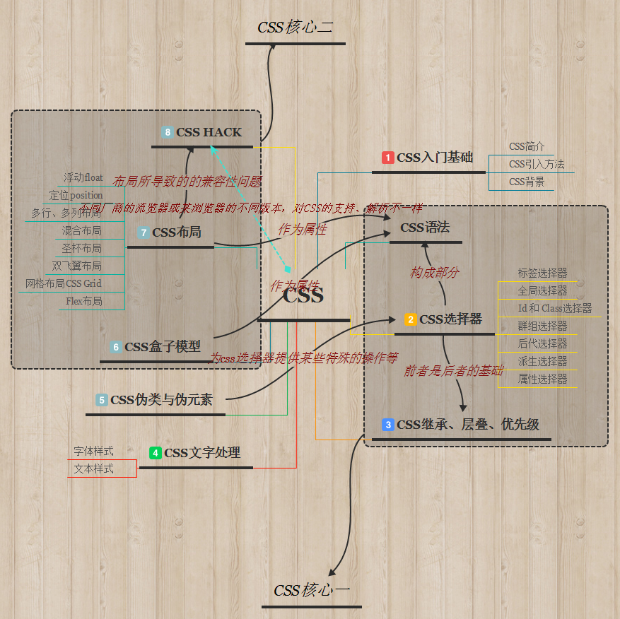
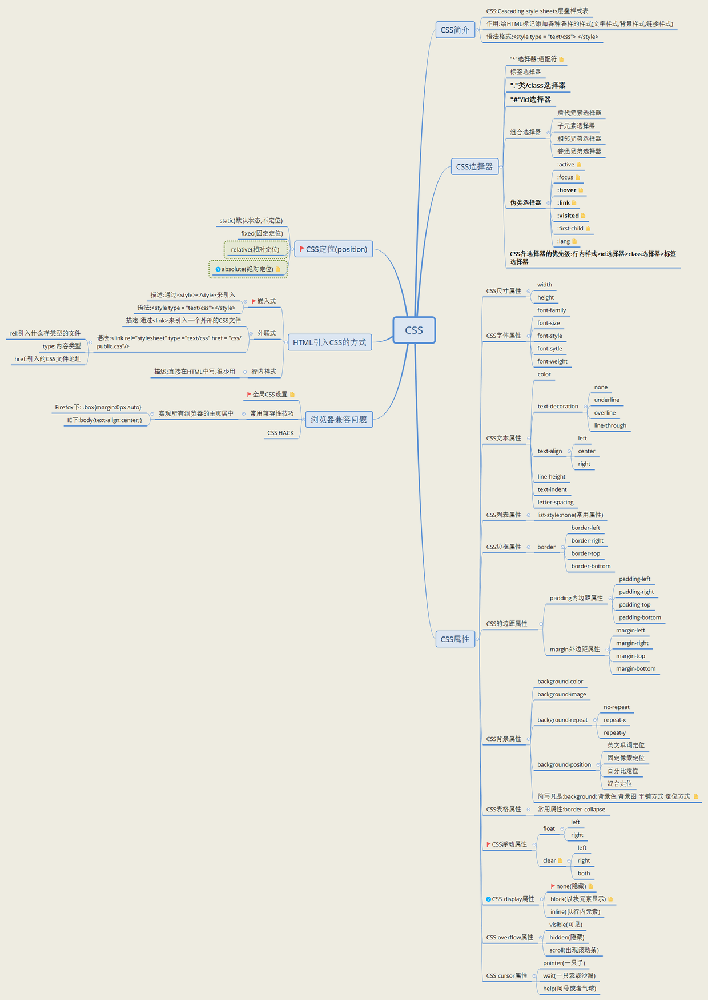

# CSS学习总结
>学了有一小段时间前端了，今做个CSS的总结！

## 目录：
* [CSS简介](CSS简介.md)
* [CSS语法](CSS语法.md)
* [CSS引入方式](CSS引入方式.md)
* [CSS选择器](CSS选择器.md)
* [CSS继承、层叠、优先级](CSS继承、层叠、优先级.md)
* [CSS背景与列表](CSS背景和列表.md)
* [CSS文本样式](CSS文本样式总结.md)
* [CSS字体样式](CSS字体样式总结.md)
* [CSS伪类和伪元素](CSS伪类和伪元素.md)
* [CSS盒子模型](CSS盒子模型.md)
* [CSS浮动](CSS浮动.md)
* [CSS定位](CSS定位.md)
* [CSS网页布局](CSS布局.md)
* [史上最全的CSS hack方式一览](史上最全的CSS hack方式一览.md)
* [CSS高效编写方法](CSS高效编写方法.md)
* [CSS需注意的问题](CSS需注意的问题.md)
## 拓展
* [看这一篇就够了,css选择器知识汇总](https://www.w3cschool.cn/css/css-selector.html)
* [学会这几种方法css居中很简单](https://www.w3cschool.cn/css/css-center.html)
* [css样式就得这么写(css参考样式集合)](https://www.w3cschool.cn/css/css-style.html)
* [CSS 透明度设置方法及常见问题解析](https://www.w3cschool.cn/css/css-transparent.html)
* [你想知道的css hack知识全都帮你整理好了](https://www.w3cschool.cn/css/css-hack.html)
* [DIV+CSS布局基本流程及实例介绍](https://www.w3cschool.cn/css/css-div.html)
* [CSS滚动条实现步骤及美化小技巧](https://www.w3cschool.cn/css/css-scrollbar.html)
* [详细的css导航条实现代码及素材下载](https://www.w3cschool.cn/css/css-navigation.html)
* [CSS两端对齐语法及代码实例教学](https://www.w3cschool.cn/css/css-text-justify.html)
* [CSS半透明属性介绍及代码实例](https://www.w3cschool.cn/css/css-translucent.html)
* [CSS加载失败的6个原因](https://www.w3cschool.cn/css/css-Load.html)
* [css鼠标样式语法及20种可选值（属性）](https://www.w3cschool.cn/css/css-mouse.html)

## 知识联系图

## License

### © 2017 Jomsou