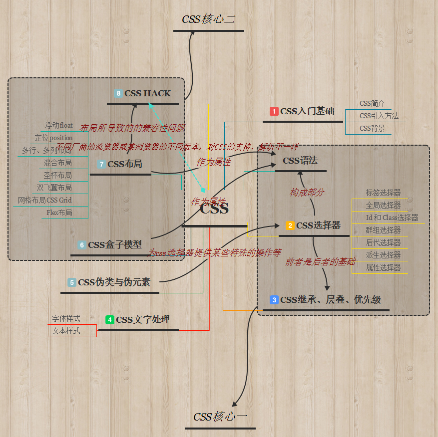

# CSS学习总结
>学了有一小段时间前端了，今做个CSS的总结！

## 知识联系图

## 目录：
* [CSS简介](CSS简介.md)
* [CSS语法](CSS语法.md)
* [CSS引入方式](CSS引入方式.md)
* [CSS选择器](CSS选择器.md)
* [CSS继承、层叠、优先级](CSS继承、层叠、优先级.md)
* [CSS背景与列表](CSS背景与列表.md)
* [CSS文本样式](CSS文本样式总结.md)
* [CSS字体样式](CSS字体样式总结.md)
* [CSS伪类和伪元素](CSS伪类和伪元素.md)
* [CSS盒子模型](CSS盒子模型.md)
* [CSS浮动](CSS浮动.md)
* [CSS定位](CSS定位.md)
* [CSS网页布局](CSS布局.md)
* [史上最全的CSS hack方式一览](史上最全的CSS hack方式一览.md)
* [CSS高效编写方法](CSS高效编写方法.md)
* [CSS需注意的问题](CSS需注意的问题.md)

## License

### © 2017 Jomsou