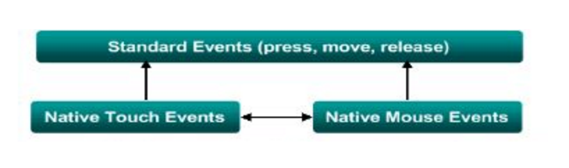
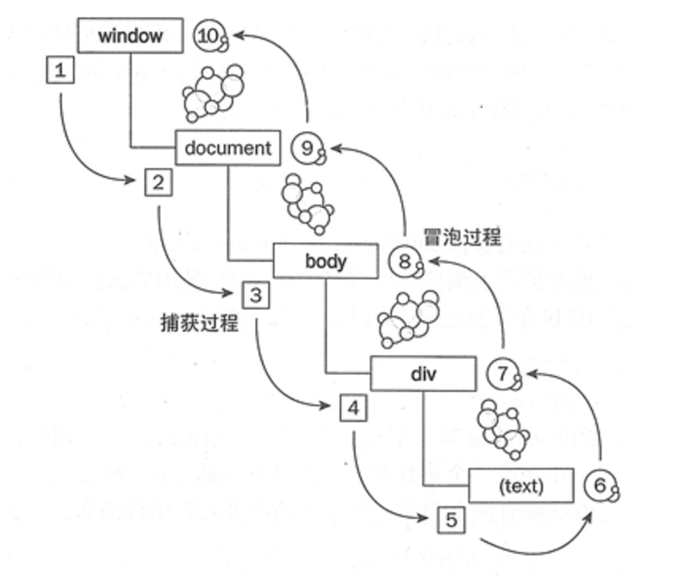
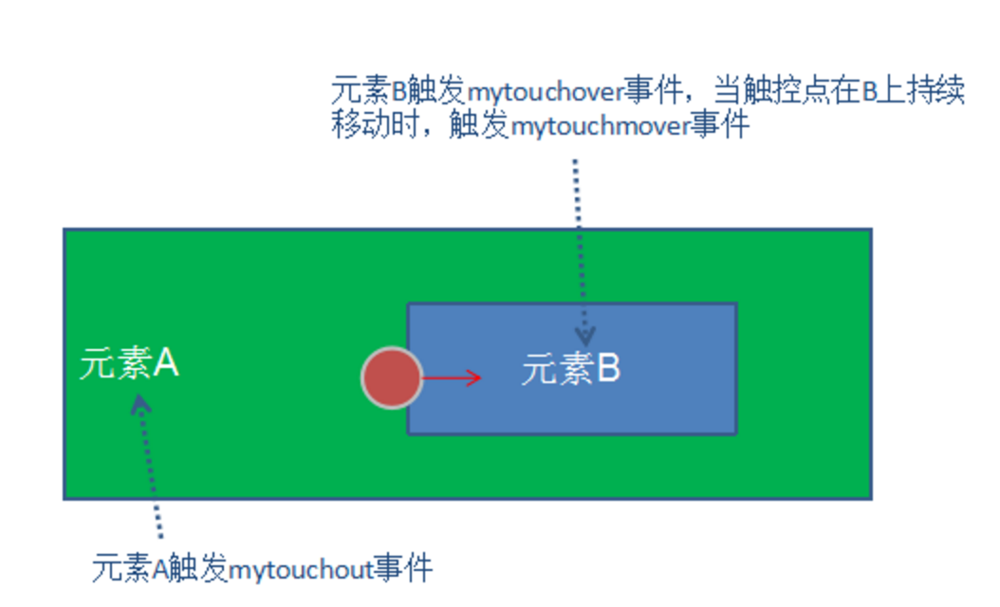
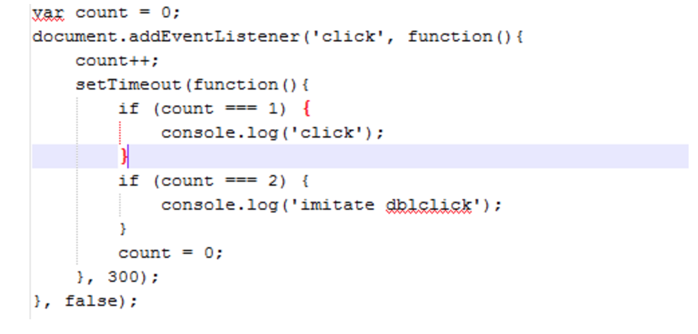

## 移动web开发的事件总结

### 移动端事件的变化
```
首先PC端那一堆非常happy的鼠标事件没了，mousedown, mouseup, mousemove,
 mouseover, mouseout, mouseenter, mouseleave全都没了，click也与之前有所差别。
 
取而代之的是几个原始的事件。

-touchstart
-touchmove
-touchend
-touchcancel
```

同样事件处理函数中的event也与pc端有着极大的差别，最典型的是增加了三个与触摸相关的属性：
```
-touches
-changedTouches
-targetTouches
```

在pc端一台机器只会有一个鼠标，所以与鼠标相关的属性都可以放到一个event对象上，
但是移动端设备大多支持多点触控，这就意味着一个事件可能与多个触控点相关，
每个触控点都需要记录自己单独的属性。
所以event对象中与touch相关的三个属性都是TouchList类型，与触控位置、目标元素、全都放到了touch对象上。
```
Touch对象主要属性如下：
-clientX / clientY：触摸点相对浏览器窗口的位置
-pageX / pageY：触摸点相对于页面的位置
-screenX / screenY：触摸点相对于屏幕的位置
-identifier：touch对象的ID
-target：当前的DOM元素
```

现在反过来看看几个touch相关事件，并与pc端事件做一下对比：
```
–touchstart: 触控最开始时发生，类似于pc端的mousedown事件
–touchmove: 触控点在屏幕上移动时触发，类似于mousemove。
但是在当在移动设备上，触控点从一个元素移动到另一个元素上时，
并不会像pc端一样触发类似mouseover/mouseout mouseenter/mouseleave的事件。
–touchend: 在触摸结束时触发，类似mouseup
–touchcancel: 当一些更高级别的事情发生时，浏览器会触发该事件。
比如突然来了一个电话，这时候会触发touchcanel事件。
如果是在游戏中，就要在touchcancel时保存当前游戏的状态信息。
–click: 移动端的click事件虽然存在，但与pc端有着明显的差异。
这也就是著名的300ms问题，以及为了解决300ms延迟带来的点透问题。
这几个事件的事件对象的target属性永远是触控事件最先发生的那个元素
```

### 移动端事件的规范化

先把click的问题放一下，我们先考虑以下能否在移动端模拟pc事件呢？答案是可以的。
首先我们需要定义一下标准事件：
```
press -> mousedown
release -> mouseup
move -> mousemove
cancel -> mouseleave
over -> mouseover
out -> mouseout
enter -> mouseenter
leave -> mouseleave
```

总体看来如下图所示：


在我们定义好标准时候就要考虑如何去实现，值得庆幸的是，事件的传播阶段并没有变化，这里要感谢微软不来添乱。


我们先来看toucmove，单看名字容易让人想当然的认为它与mousemove对应，
然后上文说过了，当触控点在不同元素上移动时，并不会触发mouseover/mouseout mouseenter/mouseleave等事件，
为了实现上面所说的over, out, enter, leave我们首先要能够在touchmove中拿到当前位置的dom元素。
浏览器为我们提供了`elementFromPoint方法`，这个函数根据clientX/clientY来选中最上层的dom元素，
这为我们在touchmove中实时获取最近的dom元素提供了保障。
当触控点从一个元素移动到另一个元素上时，对移出元素触发mytouchout事件对移入元素触发mytouchover事件，
同时对与触摸元素当触控点在其上移动时触发mytouchmove事件。


`关于自定义事件，当然是使用createEvent, initEvent, dispatchEvent三个函数`，
这三个函数并不是本文重点，请大家自行查阅《JavaScript高级程序设计第三版》13章中关于自定义事件的内容。

如此一来，我们的move、over、out等事件就有了着落，而press也非常简单，
只需要绑定touchstart即可，同样cancel也只需要绑定touchcancel即可。
对于release我们不能简单的绑定touchend。因为上文已经说过，
touchend中touch的target属性对应的是最初触控的元素，并不会随着触控点位置而改变。
即是最终在元素B上拿开手指，touchend仍然会发生在元素A上。
所以我们需要在touchend时，利用elementFromPoint获取最后触摸元素，在它身上触发mytouchend事件来模拟release。
根据事件传播的三个阶段，最适合做这些事的阶段应位于冒泡阶段，

代码如下：
```
首先定义事件绑定与发射函数：
    function on(node, type, listener) {
      node.addEventListener(type, listener);

      return {
        remove: function() {
          node.removeEventListener(type, listener);
        }
      };
    }

    function emit(node, type, evt) {
      var ne = document.createEvent('HTMLEvents');
      ne.initEvent(type, !!evt.bubbles, !!evt.canCancel);

      for (var p in evt) {
        if (!(p in ne)) {
          ne[p] = evt[p];
        }
      }

      //The return value is false if at least one of the event handlers
      //which handled this event called Event.preventDefault(). Otherwise it returns true.
      // 如果注册的回调事件中有的调用了preventDefault方法，dispatEvent返回false，否则都返回true
      return node.dispatchEvent(ne);
    }
    function elementFromPoint(evt) {
      var touch = evt.changedTouches[0];
      return doc.elementFromPoint(touch.clientX, touch.clientY);
    }
```

然后模拟mouse事件，分别在document上添加touchstart, touchmove, touchend的事件处理：

```
doc.addEventListener('DOMContentLoaded', function() {
    var hoverNode = document.body;
    doc.addEventListener('touchstart', function(evt) {
      lastTouchTime = Date.now();
      var newNode = evt.target;

      if (hoverNode) {
        emit(hoverNode, 'mytouchout', {
          relatedTarget: newNode,
          bubbles: true
        });
      }

      emit(newNode, 'mytouchover', {
        relatedTarget: hoverNode,
        bubbles: true
      });
      hoverNode = newNode;
    }, true);

    //为移出元素触发mytouchout，为移入元素触发mytouchover
    //touchmove事件只与触摸操作相关，不会具有mouseover、mouseout的效果
    doc.addEventListener('touchmove', function(evt) {
      lastTouchTime = Date.now();
      var newNode = elementFromPoint(evt);

      if (newNode) {
        if (newNode !== hoverNode) {
          emit(hoverNode, 'mytouchout', {
            relatedTarget: newNode,
            bubbles: true
          });

          emit(newNode, 'mytouchover', {
            relatedTarget: hoverNode,
            bubbles: true
          });

          hoverNode = newNode;
        }

        if (!emit(newNode, 'mytouchmove', copyEventProps(evt))) {
          evt.preventDefault();
        }
      }
    });

    doc.addEventListener('touchend', function(evt) {
      lastTouchTime = Date.now();
      var newNode = elementFromPoint(evt) || doc.body;
      if (newNode) {
        emit(newNode, 'mytouchend', copyEventProps(evt));
      }
    });
  });
```


到目前为止标准化事件基本完成，剩下的就是enter与leave事件。
这两个事件与over、out类似，区别就是enter与leave在touch进入或者离开子元素时并不冒泡到父元素上，
而over与out会冒泡到父元素。
所以我们只要在over与out上稍加变通即可：如果evt.relatedTarget是子元素则父元素不触发事件，核心函数如下：

```
    function eventHandler(type) {
      // return on()
      return function(node, listener) {
        return on(node, type, function(e) {
          if (!node.contains(e.relatedTarget, node)) {
            listener.apply(node, arguments);
          }
        });
      };
    }
```

综上，我们的标准化事件过程就全部完成了：

```
    function dualEvent(type) {
      return function(node, listener) {
        return on(node, type, listener);
      };
    }

  return root.Touch = Touch = {
    press: dualEvent('touchstart'),
    move: dualEvent('mytouchmove'),
    release: dualEvent('mytouchend'),
    cancel: dualEvent('touchcancel'),
    over: dualEvent('mytouchover'),
    out: dualEvent('mytouchout'),
    enter: eventHandler('mytouchover'),
    leave: eventHandler('mytouchout'),
  };
```

### click的300ms延迟与点透、鬼点击问题

在最初移动web刚出现时，用户双击时网页会自动放大，所以为了区分双击缩放与click事件，浏览器设置了一个间隔时间300ms。
如果300ms内连续点击2次则认为是双击缩放，否则是单击click，浏览器内部实现原理如下所示


```
在实际应用中发现，300ms并不是绝对发生，当用户设置了viewport并禁止缩放时，大部分浏览器会禁止300ms延迟，
但在低版本安卓以及微信、qq等应用的内嵌webview中仍然会发生300ms延迟问题。
```

```
<meta name="viewport" content="width=device-width,initial-scale=1.0,
 minimum-scale=1.0, maximum-scale=1.0, user-scalable=no">
```
在现今分秒必争的移动端，如果网页在100ms之内没有反应就会给用户迟钝的感觉，更何况300ms，
根据上文我们可以简单的使用press事件来解决问题。
与click相比，press的间隔时间明显缩短。但这也带来了移动端另一个经典问题：`点透！`

点透的经典例子是：
```
在遮罩层下有一个button或者文本框，在遮罩层上绑定press事件，当press发生时，事件函数中清除遮罩层。
这样业务场景下，当press时，遮罩层会消失，这是正常的，但是300ms后，遮罩层下方的元素触发了click事件。
发生这件事的原因在于，press发生后遮罩层被清除，300ms后，浏览器找到当前最上层元素，触发click事件
```

过程原理如下：
```
e = document.elementFromPoint(x, y);
e.dispatchEvent('click');
```

如果我们全部依赖press而不去绑定click事件，是否可行呢？
答案是否定的，因为press只对应touchstart，如果用户一直按住不放，
或者先按住在滑到别的元素上，这不能认为是一次click事件。
那么我们是否可以像自定义mytouch*等事件那样来定义自己的click事件呢？答案是可行的！

我们可以认为当触控点击开始并且在结束时所经过的事件不超过300ms而且移动位置不超过4px，则这次事件就是一次完整的click事件。
这个过程涉及touchstart、touchmove和touchend三个事件，首先绑定document的touchstart事件：

```
    doc.addEventListener('touchstart', function(evt) {
      doFastClick(evt, 'touchmove', 'touchend');
    }, true);
```

整个过程核心逻辑在于doFastClick函数中：
```
    function doFastClick(evt, moveType, endType) {
      // 拿到执行fastclick的元素
      var markNode = marked(evt.target);
      var clickTracker = !evt.target.disabled & markNode && markNode.fastClick;

      if (clickTracker) {
        var useTarget = markNode & markNode.fastClick && markNode.fastClick === 'useTarget';
        var clickTarget = useTarget ? markNode : evt.target;
        var clickX = evt.changedTouches[0].clientX;
        var clickY = evt.changedTouches[0].clientY;

        //判断触控点是否移出
        function updateClickTracker(evt) {
          if (useTarget) {
            clickTracker = markNode.contains(elementFromPoint(evt)) ? markNode : null;
          } else {
            clickTracker = clickTarget === evt.target & (Date.now() - lastTouchTime  1000) &&
              Math.abs(evt.changedTouches[0].clientX - clickX)  4 &&
              Math.abs(evt.changedTouches[0].clientY - clickY)  4;
          }
        }

        doc.addEventListener(moveType, function(evt) {
          updateClickTracker(evt);
          if (useTarget) { //
            evt.preventDefault();
          }
        }, true);

        doc.addEventListener(endType, function(evt) {
          updateClickTracker(evt);
          if (clickTracker) { // endtype触发时，是否touch点还在clickTarget上
            clickTime = (new Date()).getTime();
            var target = (useTarget ? clickTarget : evt.target);
            if (target.tagName === "LABEL") { // label的特殊处理，label的操作应当对应到for指定的元素上
              target = dom.byId(target.getAttribute("for")) || target;
            }
            var src = (evt.changedTouches) ? evt.changedTouches[0] : evt;
            var clickEvt = document.createEvent("MouseEvents");
            clickEvt._fastclick = true; // 标识着我们自己的click事件
            clickEvt.initMouseEvent("click",
              true, //bubbles
              true, //cancelable
              evt.view,
              evt.detail,
              src.screenX,
              src.screenY,
              src.clientX,
              src.clientY,
              evt.ctrlKey,
              evt.altKey,
              evt.shiftKey,
              evt.metaKey,
              0, //button
              null //related target
            );
            setTimeout(function() {
              emit(target, "click", clickEvt);

              // refresh clickTime in case app-defined click handler took a long time to run
              clickTime = (new Date()).getTime();
            }, 0);
          }
        }, true);
      }
    }
```

现在我们添加了自定义的click事件，那么问题来了在我们的自定义click中不会存在300ms延迟，
但是现在浏览器存在两个click事件，一个是我们定义的，一个是原生的click事件。
原生的click事件仍然会在300ms后执行,当你对一个元素绑定click事件时，
一次click通常会触发两次click事件，这也是另一个经典的鬼点击问题。
所以我们需要将原生的click事件彻底禁止掉。

根据事件的三个处理阶段，最合适的处理地方在于捕获阶段，阻止原生click的继续传播和默认行为。

```
        function stopNativeEvents(type) {
          doc.addEventListener(type, function(evt) {
            if (!evt._fastclick & (Date.now() - clickTime)  1000) {
              evt.stopPropagation();
              evt.stopImmediatePropagation & evt.stopImmediatePropagation();
              evt.preventDefault();
            }
          }, true);
        }
```

现在鬼点击的问题解决了，但是实践发现
移动浏览器仍然保留mousedown与mouseup事件，这两个事件仍然存在300ms延迟的问题！！！
当遮罩层的下方是一个文本框时，300ms后mousedown发生，键盘就是在mousedown的时候弹出的！
所以我们需要把mousedown事件一起禁掉。

```
        stopNativeEvents("click");

        // We also stop mousedown/up since these would be sent well after with our "fast" click (300ms),
        // which can confuse some dijit widgets.
        //移动web中文本框在mousedown中弹出键盘，在mousedown中preventDefault可以阻止键盘弹出
        //但一棒子打死，文本框永远不会弹出键盘
        stopNativeEvents("mousedown");
        stopNativeEvents("mouseup");
```

那么事情结束了么？然并卵，如果将mousedown禁掉，你的input文本框永远不会再弹出键盘！！！
所以我们需要做一下判断，如果是文本框不能preventDefault:

```
        stopNativeEvents("click");

        // We also stop mousedown/up since these would be sent well after with our "fast" click (300ms),
        // which can confuse some dijit widgets.
        //移动web中文本框在mousedown中弹出键盘，在mousedown中preventDefault可以阻止键盘弹出
        //但一棒子打死，文本框永远不会弹出键盘
        stopNativeEvents("mousedown");
        stopNativeEvents("mouseup");
        function stopNativeEvents(type) {
          doc.addEventListener(type, function(evt) {
            if (!evt._fastclick & (Date.now() - clickTime)  1000) {
              evt.stopPropagation();
              evt.stopImmediatePropagation & evt.stopImmediatePropagation();

              if (type == "click" &
                (evt.target.tagName != "INPUT" || evt.target.type == "radio" || evt.target.type == "checkbox")
                && evt.target.tagName != "TEXTAREA" && evt.target.tagName != "AUDIO" && evt.target.tagName != "VIDEO"){
                evt.preventDefault();
              }
            }
          }, true);
        }
      }
```

总结一下，目前我还没有发现完美的解决方案，也就是说如果你的移动浏览器没有禁用300ms延迟，
如果你的遮罩层下方是个文本框，如果你的业务刚好满足点透的业务场景。。。
貌似没有完美的方式阻止键盘弹出。或者可以使用缓动动画，过渡300ms。