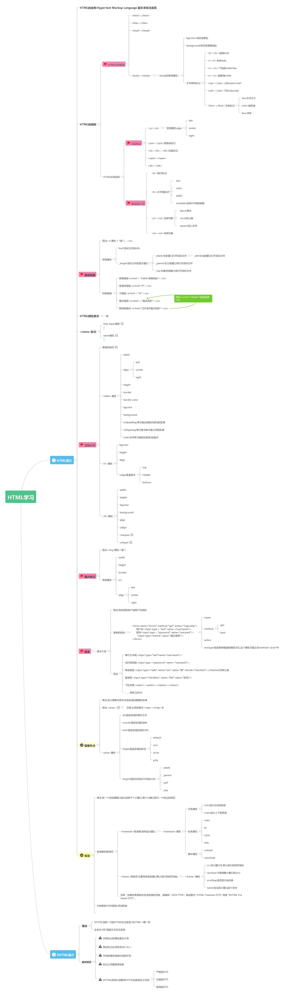
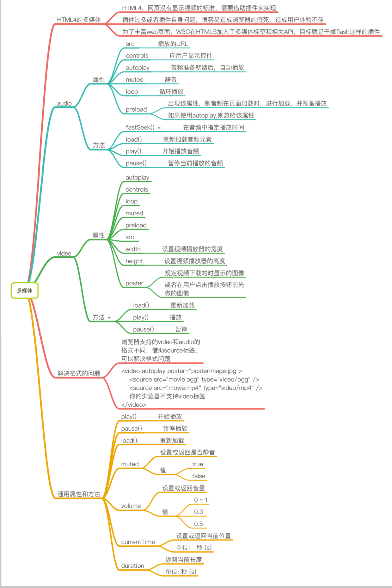

# HTML学习记




## HTML基础:
>HTML是网页的结构，CSS是网页的外观，而JavaScript是页面的行为。

### HTML基本结构
```
<!DOCTYPE html> 
<html xmlns="http://www.w3.org/1999/xhtml">
	<head>
		<meta charset="UTF-8">
		<title></title>
		<!--这是内部样式表，CSS样式在style标签中定义-->
		<style type="text/css"></style>
		<!--这是引入javascript-->
		<script type="text/javascript"></script>
	</head>
	<body>
           <div></div>    
	</body>
</html>
```

### HTML标签
#### 标签的语法
1. 标签由英文尖括号<和>括起来，如<html>就是一个标签。

2. html中的标签一般都是成对出现的，分开始标签和结束标签。结束标签比开始标签多了一个/。

3. 标签与标签之间是可以嵌套的，但先后顺序必须保持一致，如：<div>里嵌套`<p>`，那么`</p>`必须放在`</div>`的前面。如下图所示。


4. `HTML`标签不区分大小写，`<h1>`和`<H1>`是一样的，但建议小写，因为大部分程序员都以小写为准。


#### 常见的标签

|标签/属性|语义|说明|
|-|-|-|
|基本标签|语义|说明|
|`<html>`|html|整个网页是从<html>这里开始的，然后到</html>结束。|
|`<head>`|head|head标签代表页面的“头”，定义一些特殊内容，这些内容往往都是“不可见内容”（在浏览器不可见）|
|head内部标签|语义|说明|
|`<title>`|	title|定义网页的标题|
|`<meta>`|meta	|定义网页的基本信息（供搜索引擎）|
|`<style>`|	style|定义CSS样式|
|`<link>`|link	|链接外部CSS文件或脚本文件|
|`<script>`|script	|定义脚本语言|
|`<base>`|base	|定义页面所有链接的基础定位（用得很少）|
|`<body>`|body|body标签代表页面的“身”，定义网页展示内容，这些内容往往都是“可见内容”（在浏览器可见）。
|段落\文字标签|语义|说明|
|`<h1>~<h6>`|	header|标题|
|`<p>`|	paragraph|	段落|
|`<br>`|	break|	换行|
|`<hr>`|	horizontal rule|	水平线|
|`<div>`|	division	|分割（块元素）|
|`<span>`	|span	|区域（行内元素）,没有语义的，它的作用就是为了设置单独的样式用的。|
|`<q>`|`<q>引用文本</q>`|引用短文本|
|`<blockquote>`|`<blockquote>引用文本</blockquote>`|引用长文本|
|文本格式化标签|语义|说明|
|`<strong>`|	strong（加强）|	加粗
|`<em>`	|emphasized（强调）|	斜体
|`<cite>`|cite（引用）	|斜体
|`<sup>`|	superscripted（上标）	|上标
|`<sub>`|	subscripted（下标）	|下标
|列表标签|语义|说明|	
|`<ol>`|	ordered list|	有序列表
|`<ul>`|	unordered list	|无序列表
|`<dl>`|definition list	|定义列表
|表格基本标签|语义|说明|
|`<caption>`|-|标题标签|
|table|	table（表格）|	表格
|tr|	table row（表格行）|	行
|td	|table data cell（表格单元格）|	单元格
|td内部标签属性|语法|说明|
|rowspan|`<td rowspan="跨度的行数">`|合并行|
|colspan|`<td colspan="跨度的列数">`|合并列,记忆：l代表列|
|表格结构标签|语义|说明|
|thead	|table head	|表头
|tbody	|table body	|表身
|tfoot	|table foot	|表脚
|th	|table header	|表头单元格
|img标签常用属性|语义|说明|
|src|	图像的文件地址|相对路径和绝对路径
|alt|即下载失败，图片显示不出来时的提示文字|-
|title|	鼠标移到图片上的提示文字|-
|图片格式|-|1、JPG可以很好处理大面积色调的图像，如相片、网页一般的图片。<br>2、PNG格式图片体积小，而且无损压缩，能保证网页的打开速度。最重要的是PNG格式图片支持透明信息。PNG格式图片可以称为“网页设计专用格式”。<br>3、GIF格式图片图像效果很差，但是可以制作动画。|
|`<a>`target属性值|-|	说明
|_self|-	|默认方式，即在当前窗口打开链接
|_blank|-|	在一个全新的空白窗口中打开链接
|_top|-|	在顶层框架中打开链接
|_parent|-|	在当前框架的上一层里打开链接
|链接|-|说明|
|外部链接|-|这个超链接的链接对象是外部网站|
|内部链接|-|内部链接指的是超链接的链接对象是在同一个网站中的资源。与自身网站页面有关的链接被称为内部链接。|
|锚点链接|属于内部链接|锚点链接是内部链接的一种，它链接对象是当前页面的某一个部分。有些网页由于内容比较多，导致页面过长，访问者需要不停地拖动浏览器上的滚动条来查看文档中的内容，如下图。为了方便用户查看文档中的内容，在文档中需要建立锚点链接。|

**<i>注意</i>**：记忆标签时不要死记硬背，要根据语义、说明记忆。

**<i>HTML学习中的误区</i>**

学习HTML的目的就是在你需要的地方用到符合语义的标签，把标签用“对”这才是HTML学习的目的。例如一段文字，应该使用p标签，而不是使用div标签或者其他标签。

网页语义结构良好，对于搜索引擎来说也是极为重要的一点。


#### HTML注释
HTML注释是为了代码可读易懂，注释的内容在浏览器不会显示出来。
语法：`<!--注释的内容-->`

说明：`“<!--”表示注释的开始，“-->”表示注释的结束。`
```
<!DOCTYPE html> 
<head>
    <!--这是网页的标题-->
    <title></title>
</head>
<body>
    <!--这是网页的内容-->
    <p></p>
</body>
</html>
```


#### 块元素和行内元素
块元素和行内元素
1、HTML元素根据浏览器表现形式分为两类：①块元素；②行内元素；

2、块元素特点：

（1）独占一行，排斥其他元素跟其位于同一行，包括块元素和行内元素；
（2）块元素内部可以容纳其他块元素或行元素；
常见块元素有：h1~h6、p、hr、div等。

3、行内元素特点：

（1）可以与其他行内元素位于同一行；
（2）行内内部可以容纳其他行内元素，但不可以容纳块元素，不然会出现无法预知的效果；
常见行内元素有：strong、em、span等。

### 使用mailto在网页中链接Email地址
`<a href="mailto:@qq.com"?subject=""&body=""></a>`


注意：如果mailto后面同时有多个参数的话，第一个参数必须以“?”开头，后面的参数每一个都以“&”分隔。同级之间用;隔开。


#### HTML之frameset导航框架

##### 新建all.html
```
<html>
	<frameset cols="120,*">
	<frame name="index" src="index.html" noresize/>
	<frame name="content" src="frame_a.html" noresize/>
	</frameset>
</html>
```

##### 新建index.html
```
<html>
	<head>
		<style type="text/css">
  
			a{text-decoration:none}
		</style>
	</head>
	<body>
		 <a href="frame_a.html" target="content">frame_a</a><br/>
		 <a href="frame_b.html" target="content">frame_b</a><br/>
		 <a href="frame_c.html" target="content">frame_c</a>
	</body>
</html>
```

##### 新建frame_a.html
```
<body bgcolor="red">
	        frame_a
</body>
```

##### 新建frame_b.html
```
<body bgcolor="yellow">
	        frame_b
</body>
```

##### 新建frame_c.html
```
<body bgcolor="blue">
	        frame_c
</body>
```
##### 效果图如下：


## License

### © 2017 Jomsou