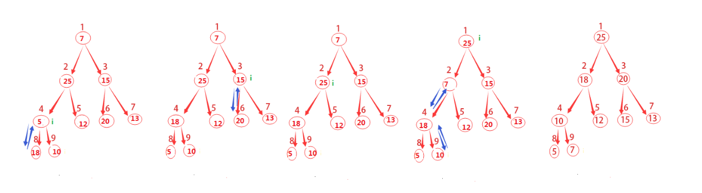

## 堆

## 什么是堆

堆（heap），是一类特殊的数据结构的统称。`它通常被看作一棵树的数组对象`。
在队列中，调度程序反复提取队列中的第一个作业并运行，因为实际情况中某些时间较短的任务却可能需要等待很长时间才能开始执行，
或者某些不短小、但很重要的作业，同样应当拥有优先权。而堆就是为了解决此类问题而设计的数据结构。

二叉堆是一种特殊的堆，二叉堆是完全二叉树或者近似完全二叉树，二叉堆满足堆特性：
父节点的键值总是保持固定的序关系于任何一个子节点的键值，且每个节点的左子树和右子树都是一个二叉堆。

当父节点的键值总是大于任何一个子节点的键值时为`最大堆`，当父节点的键值总是小于或等于任何一个子节点的键值时为`最小堆`。

为了更加形象，我们常用带数字的圆圈和线条来表示二叉堆等，但其实都是用数组来表示的。
如果根节点在数组中的位置是1，第n个位置的子节点则分别在2n和2n+1位置上。

如下图所描的，第2个位置的子节点在4和5，第4个位置的子节点在8和9。所以我们获得父节点和子节点的方式如下：

```
    PARENT(i)
       return 小于或等于i/2的最大整数
    
    LEFT-CHILD(i)
       return 2i
    
    RIGHT-CHILD(i)
       return 2i+1
```


假定表示堆的数组为A，那么A.length通常给出数组元素的个数，A.heap−size表示有多少个堆元素存储在该数组中。
这句话略带拗口，`也就是说数组A[1...A.length]可能都有数据存放，
但只有A[1...A.heap−size]中存放的数据才是堆中的有效数据。毫无疑问0≤A.heap−size≤A.length`。

```
最大堆除了根以外所有结点i都满足：A[PARENT(i)]≥A[i] 。
最小堆除了根以外所有结点i都满足：A[PARENT(i)]≤A[i] 。
```

一个堆中结点的高度是该结点到叶节点最长简单路径上边的数目，如上图所示编号为4的结点的高度为1，
编号为2的结点的高度为2，树的高度就是3。

`包含n个元素的队可以看作一颗完全二叉树，那么该堆的高度是Θ(lgn)`。

## 通过MAX-HEAPIFY维护最大堆
程序中，不可能所有的堆都天生就是最大堆，为了更好的使用堆这一数据结构，我们可能要人为地构造最大堆。
如何将一个杂乱排序的堆重新构造成最大堆，它的主要思路是：
```
从上往下，将父节点与子节点以此比较。如果父节点最大则进行下一步循环，如果子节点更大，则将子节点与父节点位置互换，
并进行下一步循环。注意父节点要与两个子节点都进行比较。
```


如上图说描述的，这里从结点为2开始做运算。先去l为4，r为5，将其与父节点做比较，发现左子节点比父节点更大。
因此将它们做交换，设4为最大的结点，并继续以结点4开始做下一步运算。

因此可以给出伪代码如下：
```
MAX-HEAPIFY(A,i)
1   l=LEFT-CHILD(i)
2   r=RIGHT-CHILD(i)
3   if l<=A.heap-size and A[l]>A[i]
4       largest=l
5   else 
6       largest=i
7   if r<=A.heap-size and A[r]>A[largest]
8       largest=r
9   if largest != i
10      exchange A[i] with A[largest]
11      MAX-HEAPIFY(A,largest)      
```

```
在以上这些步骤中，调整A[i]、A[l]、A[r]的关系的时间代价为Θ(1)，
再加上一棵以i的子节点为根结点的子树上运行MAX-HEAPIFY的时间代价（注意此处的递归不一定会发生，此处只是假设其发生）。
因为每个子节点的子树的大小至多为2n/3（最坏情况发生在树的底层恰好半满的时候）。因此MAX-HEAPIFY过程的运行时间为：

T(n)≤T(2n/3)+Θ(1)
也就是：
T(n)=O(lgn)
```

## 通过BUILD-MAX-HEAP构建最大堆
```
前面我们通过自顶向下的方式维护了一个最大堆，这里将通过自底向上的方式通过MAX-HEAPIFY将一个
n=A.length的数组A[1...n]转换成最大堆。
```
回顾一下上面的图示，其总共有9个结点，取小于或等于9/2的最大整数为4，从4+1，4+2，一直到n都是该树的叶子结点，
你发现了么？这对任意n都是成立的哦。

因此这里我们就要从4开始不断的调用MAX-HEAPIFY(A,i)来构建最大堆。

为什么会有这一思路呢？

原因是既然我们知道了哪些结点是叶子结点，从最后一个非叶子结点（这里是4）开始，一次调用MAX-HEAPIFY函数，
就会将该结点与叶子结点做相应的调整，这其实也就是一个递归的过程。


图示已经这么清晰了，就直接上伪代码咯。
```
BUILD-MAX-HEAP(A)
1   A.heap-size=A.length
2   for i=小于或等于A.length/2的最大整数 downto 1
3       MAX-HEAPIFY(A,i)
```

## 通过HEAPSORT进行堆排序算法
```
所谓的堆排序算法，先通过前面的BUILD-MAX-HEAP将输入数组A[1...n]建成最大堆，其中n=A.length。
而数组中的元素总在根结点A[1]中，通过把它与A[n]进行互换，就能将该元素放到正确的位置。

如何让原来根的子结点仍然是最大堆呢，可以通过从堆中去掉结点n，而这可以通过减少A.heap−size来间接的完成。
但这样一来新的根节点就违背了最大堆的性质，因此仍然需要调用MAX-HEAPIFY(A,1)，
从而在A[1...n−1]上构造一个新的最大堆。

通过不断重复这一过程，知道堆的大小从n−1一直降到2即可。
```


上图的演进方式主要有两点：
```
1）将A[1]和A[i]互换，i从A.length一直递减到2
2）不断调用MAX-HEAPIFY(A,1)对剩余的整个堆进行重新构建

一直到最后堆已经不存在了。

HEAPSORT(A)
1   BUILD-MAX-HEAP(A)
2   for i=A.length downto 2
3       exchange A[1] with A[i]
4       A.heap-size=A.heap-size-1
5       MAX-HEAPIFY(A,1)
```

## 优先队列
话说堆排序虽然性能上不及快速排序，但作为一个尽心尽力的数据结构而言，其可谓业界良心呐。
它还为我们提供了传说中的“优先队列”。

优先队列（priority queue）和堆一样，堆有最大堆和最小堆，优先队列也有最大优先队列和最小优先队列。

`优先队列是一种用来维护由一组元素构成的集合S的数据结构，其中每个元素都有一个相关的值，称之为关键字（key）。`

一个最大优先队列支持一下操作：
```
MAXIMUM(S)：返回S中有着最大键值的元素。 
EXTRACT−MAX(S)：去掉并返回S中的具有最大键字的元素。 
INCREASE−KEY(S,x,a)：将元素x的关键字值增加到a，这里假设a的值不小于x的原关键字值。 
INSERT(S,x)：将元素x插入集合S中，这一操作等价于S=S∪{x}。
```
这里来举一个最大优先队列的示例，我曾在关于“50% CPU 占有率”题目的内容扩展 这篇博文中简单介绍过Windows的系统进程机制。

这里以图片的形式简单的贴出来如下：


在用堆实现优先队列时，需要在堆中的每个元素里存储对应对象的句柄（handle）。
句柄的准确含义依赖于具体的应用程序，可以是指针，也可以是整型数。

在堆的操作过程中，元素会改变其在数组中的位置，因此在具体实现中，在重新确定堆元素位置时，
就自然而然地需要改变其在数组中的位置。

一、前面的MAXIMUM(S)过程其实很简单，完全可以在Θ(1)时间内完成，因为只需要返回数组的第一个元素就可以呀，
它已经是最大优先队列了嘛。
```
HEAP-MAXIMUM(A)
1   return A[1]
```

二、EXTRACT−MAX(S)就稍显复杂了一点，它的时间复杂度是O(lgn)，因为这里面除了MAX-HEAPIFY(A,1)以外，
其他的操作都是常量时间的。
```
HEAP-EXTRACT-MAX(A)
1   if A.heap-size < 1
2       error "堆下溢"
3   max=A[1]
4   A[1]=A[A.heap-size]
5   A.heap-size=A.heap-size-1
6   MAX-HEAPIFY(A,1)
7   return max
```

三、INCREASE−KEY(S,x,a)需要将一个大于元素x原有关键字值的a加到元素x上。
和上一个函数一样，首先判断a知否比原有的关键字更大。
然后就是老办法了，不断的将该结点与父结点做对比，如果父结点更小，那么就将他们进行对换。

相信有图示会更加清楚，于是……再来一张图。


```
HEAP-INCREASE-KEY(A,i,key)
1   if key < A[i]
2       error "新关键字值比当前关键字值更小"
3   A[i]=key
4   while i>1 and A[PARENT(i)] < A[i]
5       exchange A[i] with A[PARENT(I)]
6       i=PARENT(i)
```

在包含n个元素的堆上，HEAP-INCREASE-KEY的运行时间就是O(lgn)了。
因为在第3行做了关键字更新的结点到根结点的路径长度为O(lgn)。

四、INSERT(S,x)首先通过一个特殊的关键字（比如这里的-10000扩展）结点来扩展最大堆，
然后调用HEAP-INCREASE-KEY来为新的结点设置对应的关键字，同时保持最大堆的性质。

```
MAX-HEAP-INSERT(A,key)
1   A.heap-size=A.heap-sieze+1
2   A[A.heap-size]=-10000
3   HEAP-INCREASE-KEY(A,A.hep-size,key)
```

在包含n个元素的堆上，MAX-HEAP-INSERT的运行时间就是O(lgn)了。
因为这个算法相对于上一个算法，除了HEAP-INCREASE-KEY之外就都是常量的运行时间了，
而HEAP-INCREASE-KEY的运行时间我们在上一部分已经讲过了。
总而言之，在一个包含n个元素的堆中，所有优先队列的操作时间都不会大于O(lgn)。


## 总结与应用

堆的最常见应用是堆排序，时间复杂度为O(N lg N)。如果是从小到大排序，用小顶堆；从大到小排序，用大顶堆。
虽然堆排序是一个很漂亮的算法，但实际中，快排的一个好的实现往往优于堆排序。
尽管这样，对数据结构还是有着很大的用处，比如说优先队列。

## 例1：在O(n lg k)时间内，将k个排序表合并成一个排序表，n为所有有序表中元素个数。

## 例2：一个文件中包含了1亿个随机整数，如何快速的找到最大(小)的100万个数字?（时间复杂度：O（n lg k））
```
【解析】取前100 万个整数，构造成了一棵数组方式存储的具有小顶堆，然后接着依次取下一个整数，
如果它大于最小元素亦即堆顶元素，则将其赋予堆顶元素，然后用Heapify调整整个堆，
如此下去，则最后留在堆中的100万个整数即为所求 100万个数字。该方法可大大节约内存。
```

堆是一种非常基础但很实用的数据结构，很多复杂算法或者数据结构的基础就是堆，因而，了解和掌握堆这种数据结构显得尤为重要。