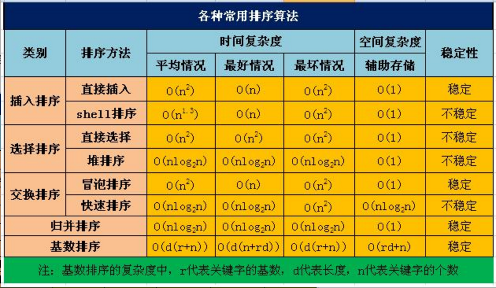

#### 1 快速排序（QuickSort）
```
快速排序是一个就地排序，分而治之，大规模递归的算法。从本质上来说，它是归并排序的就地版本。
快速排序可以由下面四步组成。

（1） 如果不多于1个数据，直接返回。
（2） 一般选择序列最左边的值作为支点数据。
（3） 将序列分成2部分，一部分都大于支点数据，另外一部分都小于支点数据。
（4） 对两边利用递归排序数列。

快速排序比大部分排序算法都要快。尽管我们可以在某些特殊的情况下写出比快速排序快的算法，
但是就通常情况而言，没有比它更快的了。
快速排序是递归的，对于内存非常有限的机器来说，它不是一个好的选择。 
```

#### 2 归并排序（MergeSort）
```
归并排序先分解要排序的序列，从1分成2，2分成4，依次分解，当分解到只有1个一组的时候，就可以排序这些分组，
然后依次合并回原来的序列中，这样就可以排序所有数据。合并排序比堆排序稍微快一点，
但是需要比堆排序多一倍的内存空间，因为它需要一个额外的数组。
```

#### 3 堆排序（HeapSort）
```
堆排序适合于数据量非常大的场合（百万数据）。

堆排序不需要大量的递归或者多维的暂存数组。这对于数据量非常巨大的序列是合适的。
比如超过数百万条记录，因为快速排序，归并排序都使用递归来设计算法，在数据量非常大的时候，可能会发生堆栈溢出错误。

堆排序会将所有的数据建成一个堆，最大的数据在堆顶，然后将堆顶数据和序列的最后一个数据交换。
接下来再次重建堆，交换数据，依次下去，就可以排序所有的数据。
```

#### 4 Shell排序（ShellSort）
```
Shell排序通过将数据分成不同的组，先对每一组进行排序，然后再对所有的元素进行一次插入排序，
以减少数据交换和移动的次数。
平均效率是O(nlogn)。
其中分组的合理性会对算法产生重要的影响。现在多用D.E.Knuth的分组方法。

Shell排序比冒泡排序快5倍，比插入排序大致快2倍。Shell排序比起QuickSort，MergeSort，HeapSort慢很多。
但是它相对比较简单，它适合于数据量在5000以下并且速度并不是特别重要的场合。
它对于数据量较小的数列重复排序是非常好的。
```

#### 5 插入排序（InsertSort）
```
插入排序通过把序列中的值插入一个已经排序好的序列中，直到该序列的结束。
插入排序是对冒泡排序的改进。它比冒泡排序快2倍。
一般不用在数据大于1000的场合下使用插入排序，或者重复排序超过200数据项的序列。
```

#### 6 冒泡排序（BubbleSort）
```
冒泡排序是最慢的排序算法。在实际运用中它是效率最低的算法。
它通过一趟又一趟地比较数组中的每一个元素，使较大的数据下沉，
较小的数据上升。它是O(n^2)的算法。
```

#### 7 选择排序（SelectSort）
```
这两种排序方法都是交换方法的排序算法，效率都是 O(n2)。在实际应用中处于和冒泡排序基本相同的地位。
它们只是排序算法发展的初级阶段，在实际中使用较少。
```

#### 8 基数排序（RadixSort）
```
基数排序和通常的排序算法并不走同样的路线。它是一种比较新颖的算法，但是它只能用于整数的排序，
如果我们要把同样的办法运用到浮点数上，我们必须了解浮点数的存储格式，并通过特殊的方式将浮点数映射到整数上，
然后再映射回去，这是非常麻烦的事情，因此，它的使用同样也不多。而且，最重要的是，这样算法也需要较多的存储空间。
```

### 总结(稳定的排序算法: IBM (Insertion、Bubble、Merge),加上一个不常用的:基数排序)
<table>
    <thead>
        <tr>
            <th>排序法</th>
            <th>平均时间</th>
            <th>最差情形</th>
            <th>稳定度</th>
            <th>额外空间</th>
            <th>备注</th>
        </tr>
    </thead>
    <tbody>
        <tr>
            <td>冒泡排序</td>
            <td>O(n^2)</td>
            <td>O(n^2)</td>
            <td>稳定</td>
            <td>O(1)</td>
            <td>效率最低,n很小时可以使用,一般不用</td>
        </tr>
        <tr>
            <td>选择排序</td>
            <td>O(n^2)</td>
            <td>O(n^2)</td>
            <td>不稳定</td>
            <td>O(1)</td>
            <td>效率很低,n很小时可以使用,一般不用</td>
        </tr>
        <tr>
            <td>插入排序</td>
            <td>O(n^2)</td>
            <td>O(n^2)</td>
            <td>稳定</td>
            <td>O(1)</td>
            <td>大部分已排序时比较好</td>
        </tr>
        <tr>
            <td>希尔排序</td>
            <td>O(nlogn)</td>
            <td>O(n^1.5)</td>
            <td>不稳定</td>
            <td>O(1)</td>
            <td>s=1.5</td>
        </tr>
        <tr>
            <td>快速排序</td>
            <td>O(nlogn)</td>
            <td>O(n^2)</td>
            <td>不稳定</td>
            <td>O(nlogn)</td>
            <td>数据量很大时好,平均效率最高的算法</td>
        </tr>
        <tr>
            <td>归并排序</td>
            <td>O(nlogn)</td>
            <td>O(nlogn)</td>
            <td>稳定</td>
            <td>O(1)</td>
            <td>数据量很大时好</td>
        </tr>
        <tr>
            <td>堆排序</td>
            <td>O(nlogn)</td>
            <td>O(nlogn)</td>
            <td>不稳定</td>
            <td>O(1)</td>
            <td>数据量很大时好</td>
        </tr>
    </tbody>
</table>

## 比较图

