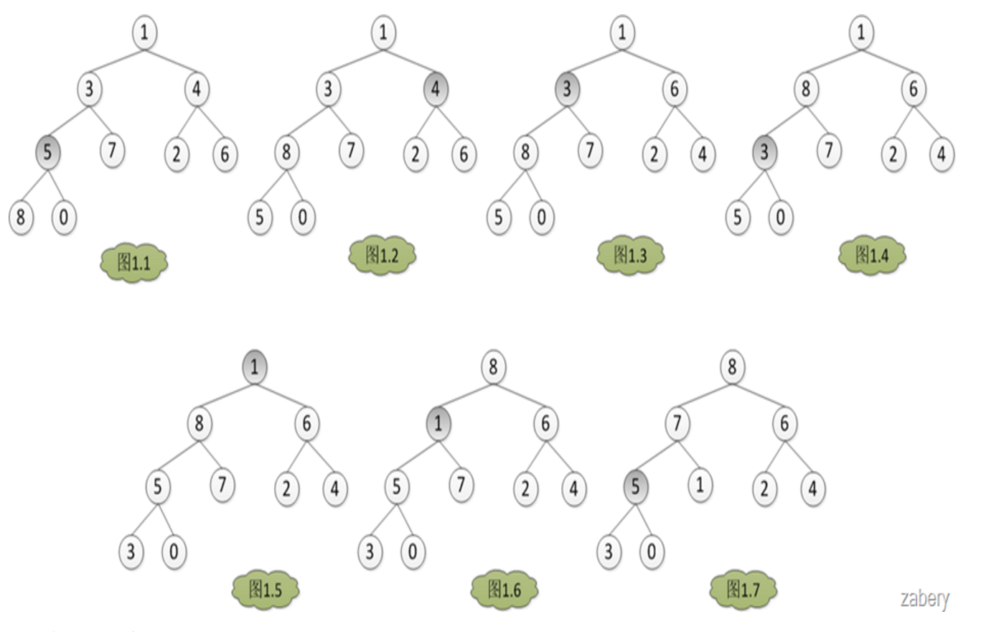
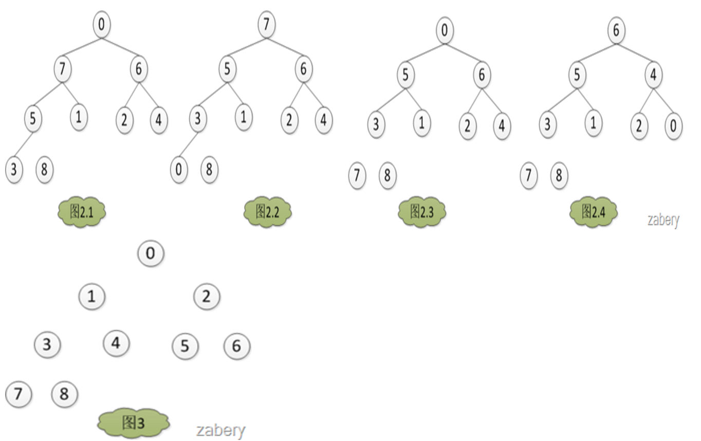
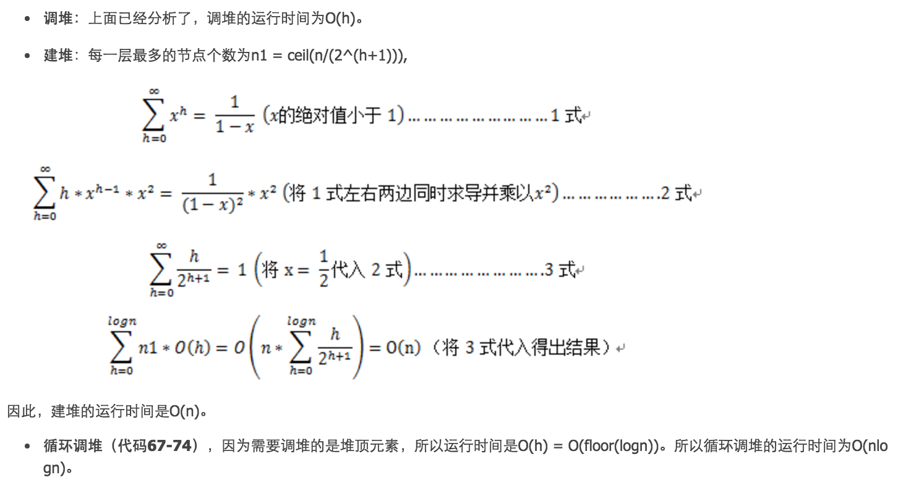

# 堆排序原理详解

## 前言

    必须理解算法的原理,而不是短暂的高清记忆!

## 堆排序过程

    堆分为大根堆和小根堆，是完全二叉树。
    大根堆的要求是每个节点的值都不大于其父节点的值，即A[PARENT[i]] >= A[i]。
    在数组的非降序排序中，需要使用的就是大根堆，因为根据大根堆的要求可知，最大的值一定在堆顶。
    
    既然是堆排序，自然需要先建立一个堆，而建堆的核心内容是调整堆，使二叉树满足堆的定义
    （每个节点的值都不大于其父节点的值）。
    调堆的过程应该从最后一个非叶子节点开始，假设有数组A = {1, 3, 4, 5, 7, 2, 6, 8, 0}。
    那么调堆的过程如下图，数组下标从0开始，A[3] = 5开始。
    分别与左孩子和右孩子比较大小，如果A[3]最大，则不用调整，否则和孩子中的值最大的一个交换位置，
    在图1中是A[7] > A[3] > A[8]，所以A[3]与A[7]对换，从图1.1转到图1.2。

所以建堆的过程就是

    for ( i = headLen/2; i >= 0; i++)
       do AdjustHeap(A, heapLen, i)
       
调堆：

    如果初始数组是非降序排序，那么就不需要调堆，直接就满足堆的定义，此为最好情况，运行时间为Θ(1)；
    如果初始数组是如图1.5，只有A[0] = 1不满足堆的定义，经过与子节点的比较调整到图1.6，
    但是图1.6仍然不满足堆的定义，所以要递归调整，一直到满足堆的定义或者到堆底为止。
    如果递归调堆到堆底才结束，那么是最坏情况，运行时间为O(h) (h为需要调整的节点的高度，堆底高度为0，
    堆顶高度为floor(logn) )。

    建堆完成之后，堆如图1.7是个大根堆。将A[0] = 8 与 A[heapLen-1]交换,然后heapLen减一，如图2.1，
    然后AdjustHeap(A, heapLen-1, 0)，如图2.2。
    如此交换堆的第一个元素和堆的最后一个元素，然后堆的大小heapLen减一，对堆的大小为heapLen的堆进行调堆，
    如此循环，直到heapLen == 1时停止，最后得出结果如图3。

       1: /*
       2:     输入：数组A，堆的长度hLen，以及需要调整的节点i
       3:     功能：调堆
       4: */
       5:  
       6: void AdjustHeap(int A[], int hLen, int i)
       7: {
       8:     int left = LeftChild(i);  //节点i的左孩子
       9:     int right = RightChild(i); //节点i的右孩子节点
      10:     int largest = i;
      11:     int temp;
      12:  
      13:     while(left < hLen || right < hLen)
      14:     {
      15:         if (left < hLen && A[largest] < A[left])
      16:         {
      17:             largest = left;
      18:         }
      19:         
      20:         if (right < hLen && A[largest] < A[right])
      21:         {
      22:             largest = right;
      23:         }
      24:  
      25:         if (i != largest)   //如果最大值不是父节点
      26:         {
      27:              temp = A[largest]; //交换父节点和和拥有最大值的子节点交换
      28:              A[largest] = A[i];
      29:              A[i] = temp;
      30:  
      31:             i = largest;         //新的父节点，以备迭代调堆
      32:             left = LeftChild(i);  //新的子节点
      33:             right = RightChild(i);
      34:         }
      35:         else
      36:         {
      37:             break;
      38:         }
      39:     }
      40: }
      41:  
      42: /*
      43:     输入：数组A，堆的大小hLen
      44:     功能：建堆
      45: */
      46: void BuildHeap(int A[], int hLen)
      47: {
      48:     int i;
      49:     int begin = hLen/2 - 1;  //最后一个非叶子节点
      50:     for (i = begin; i >= 0; i--)
      51:     {
      52:         AdjustHeap(A, hLen, i);  
      53:     }
      54: }
      55:  
      56: /*
      57:     输入：数组A，待排序数组的大小aLen
      58:     功能：堆排序
      59: */
      60: void HeapSort(int A[], int aLen)
      61: {
      62:     int hLen = aLen;
      63:     int temp;
      64:  
      65:     BuildHeap(A, hLen);      //建堆
      66:  
      67:     while (hLen > 1)
      68:     {
      69:         temp = A[hLen-1];    //交换堆的第一个元素和堆的最后一个元素
      70:         A[hLen-1] = A[0];
      71:         A[0] = temp;
      72:         hLen--;        //堆的大小减一
      73:         AdjustHeap(A, hLen, 0);  //调堆
      74:     }
      75: }
  
## 性能分析

    总运行时间T(n) = O(nlogn) + O(n) = O(nlogn)。
    对于堆排序的最好情况与最坏情况的运行时间，因为最坏与最好的输入都只是影响建堆的运行时间O(1)或者O(n)，
    而在总体时间中占重要比例的是循环调堆的过程，即O(nlogn) + O(1) =O(nlogn) + O(n) = O(nlogn)。
    因此最好或者最坏情况下，堆排序的运行时间都是O(nlogn)。
    而且堆排序还是原地算法（in-place algorithm）。