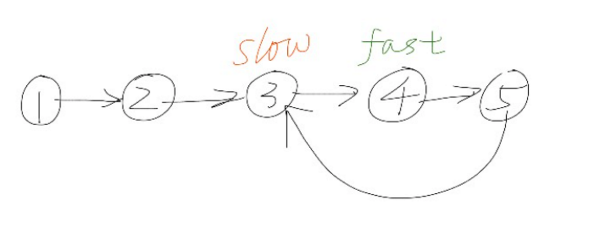

# Linked List Cycle

## Question

- leetcode: Linked List Cycle | LeetCode OJ
- lintcode: (102) Linked List Cycle

```
Given a linked list, determine if it has a cycle in it.

Example
Given -21->10->4->5, tail connects to node index 1, return true

Challenge
Follow up:
Can you solve it without using extra space?
```

## 题解 - 快慢指针

对于带环链表的检测，效率较高且易于实现的一种方式为使用快慢指针。
快指针每次走两步，慢指针每次走一步，如果快慢指针相遇(快慢指针所指内存为同一区域)则有环，
否则快指针会一直走到NULL为止退出循环，返回false.
快指针走到NULL退出循环即可确定此链表一定无环这个很好理解。那么带环的链表快慢指针一定会相遇吗？先来看看下图。


在有环的情况下，最终快慢指针一定都走在环内，加入第i次遍历时快指针还需要k步才能追上慢指针，
由于快指针比慢指针每次多走一步。那么每遍历一次快慢指针间的间距都会减少1，直至最终相遇。
故快慢指针相遇一定能确定该链表有环。

## C++

    /**
     * Definition of ListNode
     * class ListNode {
     * public:
     *     int val;
     *     ListNode *next;
     *     ListNode(int val) {
     *         this->val = val;
     *         this->next = NULL;
     *     }
     * }
     */
    class Solution {
    public:
        /**
         * @param head: The first node of linked list.
         * @return: True if it has a cycle, or false
         */
        bool hasCycle(ListNode *head) {
            if (NULL == head || NULL == head->next) {
                return false;
            }
    
            ListNode *slow = head, *fast = head->next;
            while (NULL != fast && NULL != fast->next) {
                fast = fast->next->next;
                slow = slow->next;
                if (slow == fast) return true;
            }
    
            return false;
        }
    };

## 源码分析

    异常处理，将head->next也考虑在内有助于简化后面的代码。
    慢指针初始化为head, 快指针初始化为head的下一个节点，这是快慢指针初始化的一种方法，有时会简化边界处理，
    但有时会增加麻烦，比如该题的进阶版。

## 复杂度分析
    
    在无环时，快指针每次走两步走到尾部节点，遍历的时间复杂度为 O(n/2).
    有环时，最坏的时间复杂度近似为 O(n). 最坏情况下链表的头尾相接，此时快指针恰好在慢指针前一个节点，
    还需 n 次快慢指针相遇。最好情况和无环相同，尾节点出现环。
    故总的时间复杂度可近似为 O(n).