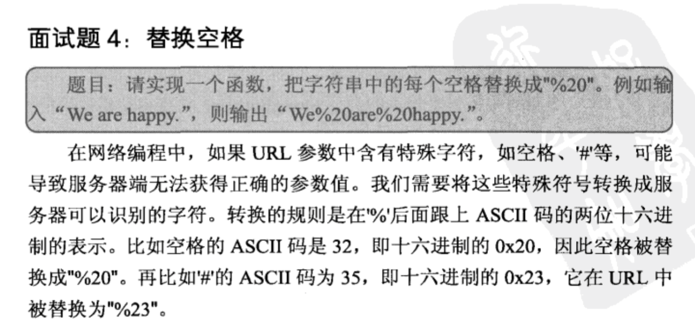

## 替换空格



```
合并两个数组(字符串)时,如果从前往后复制每项需要复制某个项多次,可以考虑从后往前复制,
这样能减少移动次数从而提高效率。
```


## javascript

    function replaceSpaces(str) {
        var arr = str.split('');
        var spaceCount = 0;
        var len = arr.length;
    
        //先遍历一次,得到空格字符的个数
        for (var i = 0, l = len; i < l; i++) {
            if (arr[i] === ' ') {
                spaceCount += 2;
            }
        }
    
        //从后往前遍历,避免元素的多次移动
        var totalLength = len + spaceCount;
        var index = totalLength - 1;  //从后往前的指针
        for (var j = len - 1; j >= 0; j--) {
            if (arr[j] !== ' ') {
                arr[index] = arr[j];
                index--;
            } else {
                arr[index--] = '0';
                arr[index--] = '2';
                arr[index--] = '%';
            }
        }
    
        return arr.join('');
    }
    
    console.log(replaceSpaces('This is a sentence for testing.'));

## 解法1:正则表达式

    public class Solution {  
        public String replaceSpace(StringBuffer str) {  
            String s = str.toString();  
            String res = s.replaceAll(" ","%20");  
            return res;  
        }  
    }  
    
    
## 解法2：这道题目的本意是考察从后向前遍历数组的。比较笨的方法是，先记下一共有多少空格，
## 然后申请一个新的数组长度，将遍历将空格替换成数组。

    public class Solution {  
        public String replaceSpace(StringBuffer str) {  
            int spaceCount = 0;  
            for(int i=0;i<str.length();i++){  
                if(' '==str.charAt(i)){  
                    spaceCount += 2;  
                }else{  
                    spaceCount++;  
                }  
            }  
                      
            StringBuffer sb = new StringBuffer(spaceCount);       
            for(int i=0;i<str.length();i++){  
                if(' '!=str.charAt(i)){  
                    sb.append(str.charAt(i));                 
                }else{  
                    sb.append('%');  
                    sb.append('2');               
                    sb.append('0');               
                }  
            }  
                              
            return sb.toString();  
        }  
    }  