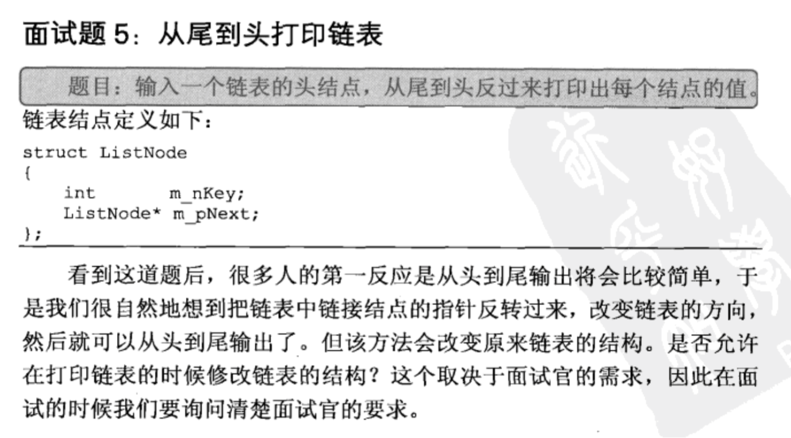

## 从尾到头打印链表

## 解法: 使用栈,遍历后入栈,然后再依次pop

    import java.util.ArrayList;  
    import java.util.Stack;  
    public class Solution {  
        public ArrayList<Integer> printListFromTailToHead(ListNode listNode) {  
            Stack<Integer> stack = new Stack<Integer>();  
            ListNode p = listNode;   
            while(p!=null){  
                stack.add(p.val);  
                p = p.next;  
            }  
            ArrayList<Integer> arr = new ArrayList<Integer>();  
            while(stack.size()!=0){  
                arr.add(stack.pop());   
            }  
              
            return arr;  
        }  
    }  

注: 递归本质上就是栈结构,所以也可以使用递归实现,但是长度很长时可能导致栈溢出(下面使用递归逆序打印数组元素):

    function printReverseOrder_recursively(arr) {
        if (arr) {
            var a = arr.slice(1);
            if (a.length >= 1) {  //注意递归结束条件!
                printReverseOrder_recursively(a);
            }
        }
        console.log(arr[0]);
    }
    
    var arr = [1, 2, 3, 4, 5, 6, 7, 8, 9, 10, 11, 12, 13, 14, 15, 16, 17, 18, 19, 20];
    
    printReverseOrder_recursively(arr);
