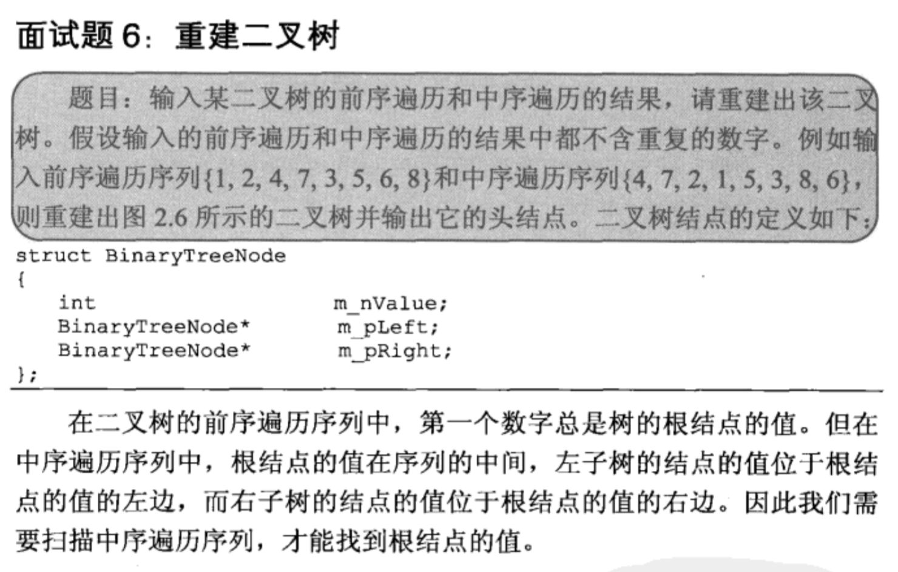

## 重建二叉树

## 解析

    明白由先序遍历和中序遍历生成二叉树的过程就好了。
    首先找到先序遍历的第一个节点，就是根节点，然后在中序遍历中找到根节点。
    此时，根节点左右两边，分别是左右子树的中序遍历。
    再对于先序遍历，从第二个节点开始，到中序遍历中左子树的长度，就是左子树的先序遍历。
    同理，右子树也是一样，这是一个递归过程。
    
## 代码

    /** 
     * Definition for binary tree 
     * public class TreeNode { 
     *     int val; 
     *     TreeNode left; 
     *     TreeNode right; 
     *     TreeNode(int x) { val = x; } 
     * } 
     */  
    public class Solution {  
        public TreeNode reConstructBinaryTree(int [] pre,int [] in) {  
            return build(pre,in,0,pre.length-1,0,in.length-1);          
        }  
          
        public TreeNode build(int[] pre,int[] in,int pstart,int pend,int istart,int iend){  
            if(pstart>pend) return null;          
            int cur = pre[pstart];//根节点  
            int find = istart;  
            while(find<=iend){//在中序遍历中查找根节点  
                if(cur==in[find]) break;  
                else find++;  
            }  
            int len = find-istart;  
            TreeNode res = new TreeNode(cur);//创建根节点  
            res.left = build(pre,in,pstart+1,pstart+len,istart,find-1);//创建左子树  
            res.right = build(pre,in,pstart+len+1,pend,find+1,iend);//创建右子树  
            return res;  
        }  
    }  