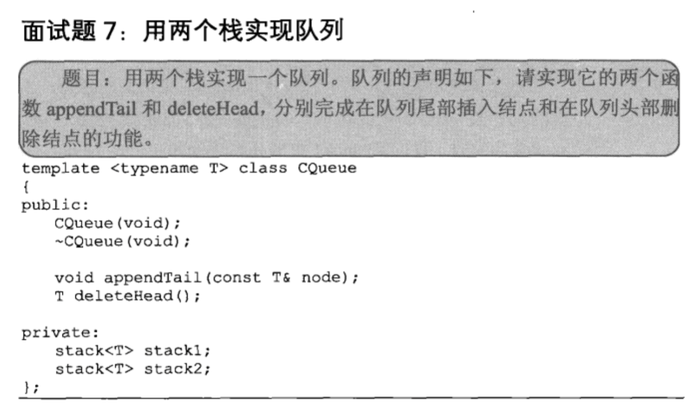

## 两个栈实现队列

## javascript

    /***
     * 利用2个栈实现一个队列, 只需要实现先进先出的功能
     * @constructor
     */
    var Queue = function () {
        this.stack1 = new Stack();
        this.stack2 = new Stack();
    }
    
    Queue.prototype.enqueue = function (ele) {
        this.stack1.push(ele);   //入队操作都压入栈1
    }
    
    Queue.prototype.dequeue = function () {
        if (this.stack2.length()) {  //栈2不空,直接pop
            return this.stack2.pop();
        } else {  //若第二个栈不空,则将第一个栈中的所有元素出栈并压入栈2,并pop一次
            while (this.stack1.length()) {
                this.stack2.push(this.stack1.pop());
            }
            return this.stack2.pop();
        }
    }
