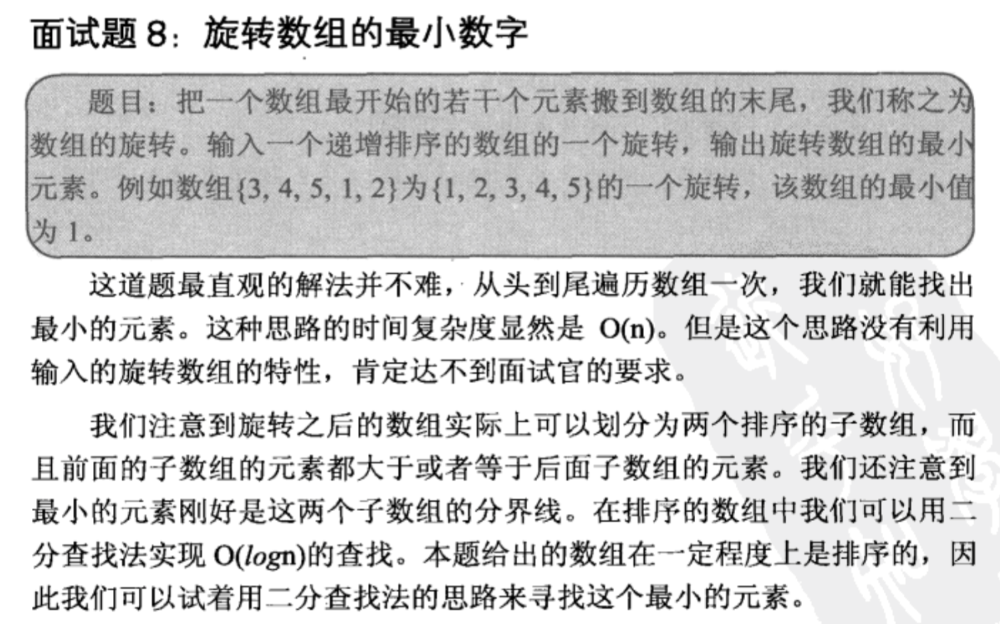

## 求旋转数组的最小数字

    把一个数组最开始的若干个元素搬到数组的末尾，我们称之为数组的旋转。
    输入一个递增排序的数组的一个旋转，输出旋转数组的最小元素。
    例如数组{3,4,5,1,2}为{1,2,3,4,5}的一个旋转，该数组的最小值为1。

## 解析 

    对于旋转数组，使用二分法来查找最小元素。取中间mid元素，如果array[mid]>array[end]，
    说明最小元素应该在mid的右边，因为我们实际是要找没有旋转之前的第一个元素，
    观察数组规律可以知道，在mid的右边
    
    如果array[mid]<array[start]，说明已经取到了被旋转的那一节数组了，
    因此此时的最小元素，应该在mid的左边
    
    另外有一个特殊情况，就是分不清楚在哪段数组中，也就是恰好有重复元素，那就只能遍历查找了，
    所以最坏的时间复杂度是O(n)，最好是O(logn)
    
## java

    import java.util.ArrayList;  
    public class Solution {  
        public int minNumberInRotateArray(int [] array) {  
            if(array.length==0) return 0;   
            int start = 0;  
            int end = array.length-1;  
            while(start<end){  
                int mid = (start+end)/2;  
                if(array[mid]>array[end]){  
                    start = mid+1;          
                }else if(array[mid]<array[start]){  
                    end = mid;  
                }else{  
                    int cur = start+1;  
                    int min = array[start];  
                    while(cur<=end){  
                        min = min<array[cur]?min:array[cur];  
                        cur++;  
                    }      
                    return min;  
                }  
            }  
            return array[start];  
        }  
    }  