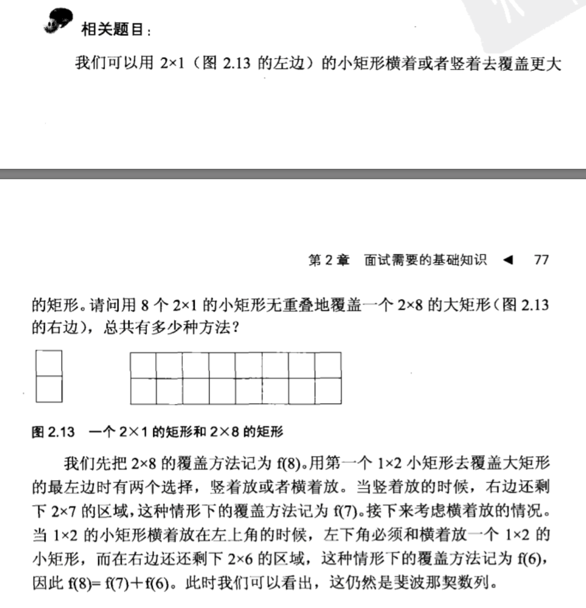

## 递归

    public class Solution {  
        public int RectCover(int target) {  
            if(target==1) return 1;  
            if(target==2) return 2;  
            return RectCover(target-1)+RectCover(target-2);  
        }  
    }
      
      
## 循环

    public class Solution {  
        public int RectCover(int target) {  
            if(target==0||target==1) return 1;    
            if(target==2) return 2;    
            int pre  = 1;    
            int next = 2;    
            int t = 0;    
            int i =2;    
            while(i<target){    
                t = pre+next;    
                pre = next;    
                next = t;    
                i++;    
            }           
            return next;    
        }  
    }  