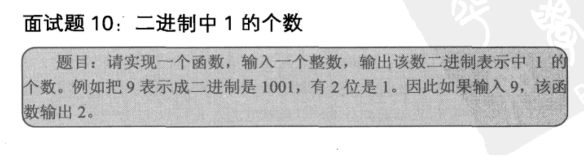

## 二进制中1的个数

## Java

对于某个数n，n与(n-1)取与运算，可以消除最后一个1.

    public class Solution {  
        public int NumberOf1(int n) {  
            int count = 0;  
            while(n!=0){     
                n=(n&(n-1));  
                count++;  
            }  
            return count;  
        }  
    } 
    
    
