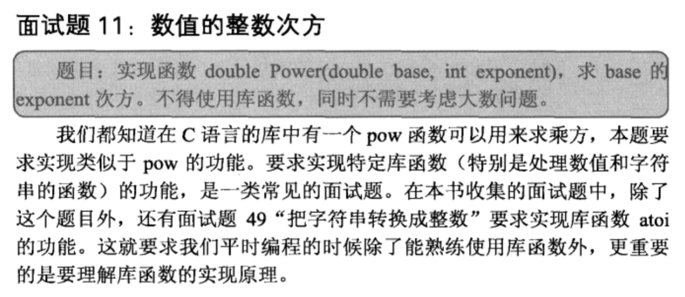

## 数组的整数次方

## java

显然可以使用递归解决，为了提高递归效率，避免重复计算，对于exponent，
可以分成exponent/2两部分来求。如果exponent是奇数，则减一，再分成(exponent-1)/2

    public class Solution {  
        public double Power(double base, int exponent) {          
            if(exponent<0){  
                exponent = -exponent;  
                return 1/solve(base,exponent);  
            }  
            return solve(base,exponent);  
          }  
          
        public double solve(double base, int exponent){  
            if(exponent==0) return 1;  
            if(exponent%2==1){  
                return base*solve(base,(exponent-1)/2)*solve(base,(exponent-1)/2);  
            }else{  
                return solve(base,exponent/2)*solve(base,exponent/2);  
            }  
        }  
    } 
