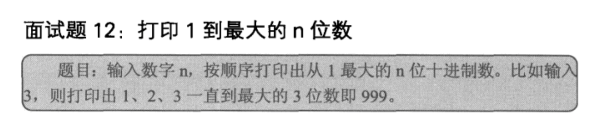

## 打印1到最大的n位数

## 算法一

    最直观的算法，求出最大的n位数是多少，然后一个循环打印。掉进了坑,如果是10位、100位?溢出!
    
    void Print1ToMaxOfNDigits1(int n)  
    {  
        int number=1;  
        int i=0;  
        while(i++<n)  
            number*=10;  
      
        for(i=1; i<number; i++)  
            cout<<i<<" ";  
    }
    
## 算法二: 字符串表示大数
   
    当n很大时，算法一会溢出，所以考虑大数问题一般用数组或字符串。
    
    用字符串表达数字的时候，最直观的方法就是字符串里每个字符都是’0’到’9’之间的某一个字符，
    表示数字中的某一位。因为数字最大是n位的，因此我们需要一个n+1位字符串（最后一位为结束符号’/0’）。
    当实际数字不够n位的时候，在字符串的前半部分补零。
    这样，数字的个位永远都在字符串的末尾（除去结尾符号）。
    
    首先我们把字符串中每一位数字都初始化为’0’。然后每一次对字符串表达的数字加1，再输出。
    因此我们只需要做两件事：一是在字符串表达的数字上模拟加法。另外我们要把字符串表达的数字输出。
    值得注意的是，当数字不够n位的时候，我们在数字的前面补零。
    输出的时候这些补位的0不应该输出。比如输入3的时候，那么数字98以098的形式输出，
    就不符合我们的习惯了。
    
    
## C++
 
    bool Increment(char* number)  
    {  
        bool isOverflow=false;  
        int nTakeOver=0;  
        int nLength=strlen(number);  
          
        for(int i=nLength-1; i>=0; i--)  
        {  
            int nSum=number[i]-'0'+nTakeOver;  
            if(i==nLength-1)  
                nSum++;  
              
            if(nSum>=10)  
            {  
                if(i==0)  
                    isOverflow=true;  
                else  
                {  
                    nSum-=10;  
                    nTakeOver=1;  
                    number[i]='0'+nSum;  
                }  
            }  
            else  
            {  
                number[i]='0'+nSum;  
                break;  
            }  
      
        }  
          
        return isOverflow;  
    }  
      
    void PrintNumber(char* number)  
    {  
        bool isBeginning0=true;  
        int nLength=strlen(number);  
      
        for(int i=0; i<nLength; i++)  
        {  
            if(isBeginning0 && number[i]!='0')  
                isBeginning0=false;  
      
            if(!isBeginning0)  
            {  
                cout<<number[i];  
            }  
        }  
        cout<<" ";  
    }  
      
    void Print1ToMaxOfNDigits2(int n)  
    {  
        if(n<=0)  
            return;  
        char *number=new char[n+1];  
        memset(number, '0', n);  
        number[n]='\0';  
      
        while(!Increment(number))  
        {  
            PrintNumber(number);  
      
        }  
        cout<<endl;  
        delete[] number;  
    } 