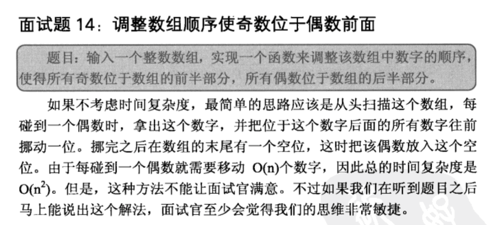

## 调整数组顺序使奇数位于偶数前面

## 解析
    
    联想到快速排序中的partition方法!!!快排中,是调整顺序,让小的数在数组的一边,大数在另一边,
    本质上与本题要求是一样的!

## javascript 

    function adjustArray(arr) {
        var low = 0, high = arr.length - 1;
    
        while (low <= high) {
            while (arr[low] % 2 === 1) {
                low++;
            }
    
            while (arr[high] % 2 === 0) {
                high--;
            }
    
            var tmp = arr[low];
            arr[low] = arr[high];
            arr[high] = tmp;
            low++;
            high--;
        }
    
        return arr;
    }
    
    console.log(adjustArray([1, 2, 3, 4, 5, 6, 7, 8, 9]));

## 解法1
类似选择排序，遍历每个元素，对于奇数，
向前遍历，使其前面的偶数向后覆盖，直到遇上奇数，结束遍历，最后将奇数放入正确位置
    
    public class Solution {  
        public void reOrderArray(int [] array) {  
            for(int i=1;i<array.length;i++){  
                int temp = array[i];  
                if(array[i] % 2 == 1){//如果遇上奇数  
                    int j = i-1;  
                    while(j>=0 && (array[j]%2)==0){//向前覆盖，直到遇到偶数  
                        array[j+1] = array[j];                
                        j--;  
                    }  
                    array[j+1] = temp;//找到奇数的正确位置  
                }  
            }  
        }  
    } 
    
    
## 解法2

    快排思想
    
## java

    public class Solution {  
        public static void main(String[] args){  
            int[] arr = {2,1,6,5,8,9,3,6,5,7};  
            Reorder(arr);  
            for(int i=0;i<arr.length;i++){  
                System.out.print(arr[i]+",");  
            }  
        }  
        
        //判断n是否为偶数，偶数返回true，奇数返回false  
        public static boolean isEven(int n ){  
            if(n%2==0){  
                return true;  
            }  else  {
                return false; 
            } 
        }  
        
        public static void Reorder(int[] arr){  
            if(arr == null){  
                return ;  
            }  
            int small = 0;  
            int big = arr.length-1;  
            while(small<=big){  
                if(!isEven(arr[small]))small++;  
                if(isEven(arr[big])) big--;  
                if(isEven(arr[small])&&!isEven(arr[big])){  
                    int temp = arr[small];  
                    arr[small] = arr[big];  
                    arr[big] = temp;  
                }  
            }  
        }  
    }  
