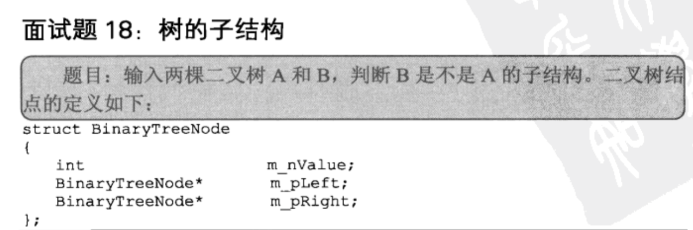

## 树的子结构

## 解析

    判断B是不是A的子结构，首先要找到B的根节点在A中的位置
    如果找到，接下来，就必须确认每个节点上的值都相同，这个我们利用一个函数isSubTree()来判断
    如果当前节点找不到，就接着找，直到找不到位置
    
## java
    
    /*public class TreeNode { 
        int val = 0; 
        TreeNode left = null; 
        TreeNode right = null; 
     
        public TreeNode(int val) { 
            this.val = val; 
     
        } 
     
    }*/  
    public class Solution {  
       public boolean HasSubtree(TreeNode root1,TreeNode root2) {  
            if(root2==null) return false;  
            if(root1==null && root2!=null) return false;          
            boolean flag = false;  
            if(root1.val==root2.val){  
                flag = isSubTree(root1,root2);  
            }  
            if(!flag){  
                flag = HasSubtree(root1.left, root2);  
                if(!flag){  
                    flag = HasSubtree(root1.right, root2);  
                }  
            }  
            return flag;  
        }  
        //判断是否是子树  
        private boolean isSubTree(TreeNode root1, TreeNode root2) {  
            if(root2==null) return true;  
            if(root1==null && root2!=null) return false;          
            if(root1.val==root2.val){  
                return isSubTree(root1.left, root2.left) && isSubTree(root1.right, root2.right);  
            }  
            return false;  
        }  
    }  