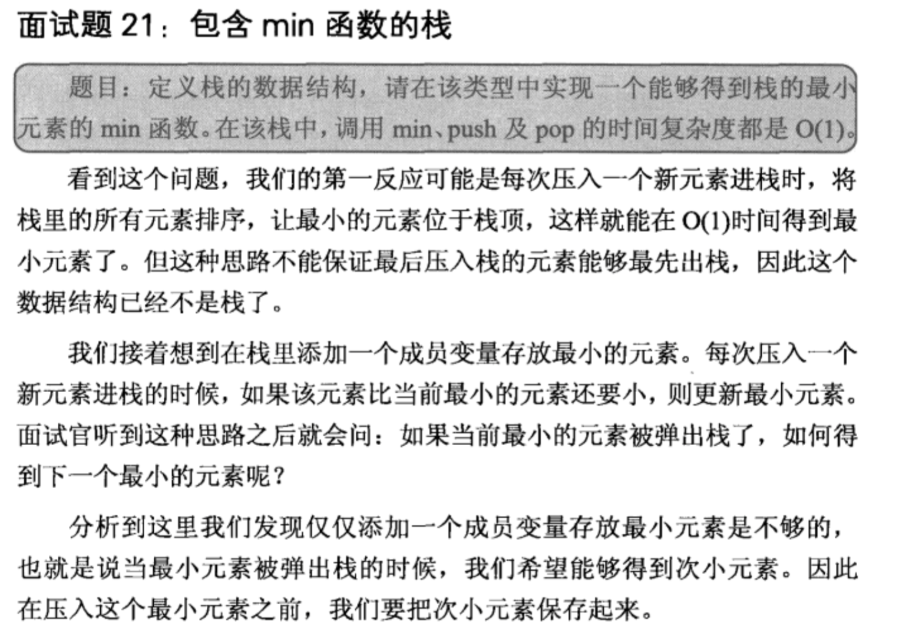

## 包含min函数的栈

## 解析

    利用两个栈，一个存储最小元素，每次新增一个元素的时候，就要更新最小元素栈
    
## java

    import java.util.Stack;  
      
    public class Solution {  
      
          
        Stack<Integer> stack1 = new Stack<Integer>();  
        Stack<Integer> stack2 = new Stack<Integer>();  
          
        public void push(int node) {  
            stack1.add(node);  
            if(stack2.size()==0){  
                stack2.add(node);  
            }else{  
                int min = stack2.peek();  
                if(min>node){  
                    stack2.add(node);  
                }else{  
                    stack2.add(min);  
                }  
            }  
        }  
          
        public void pop() {  
            stack1.pop();  
            stack2.pop();  
        }  
          
        public int top() {  
            return stack1.peek();  
        }  
          
        public int min() {  
            return stack2.peek();  
        }  
    } 