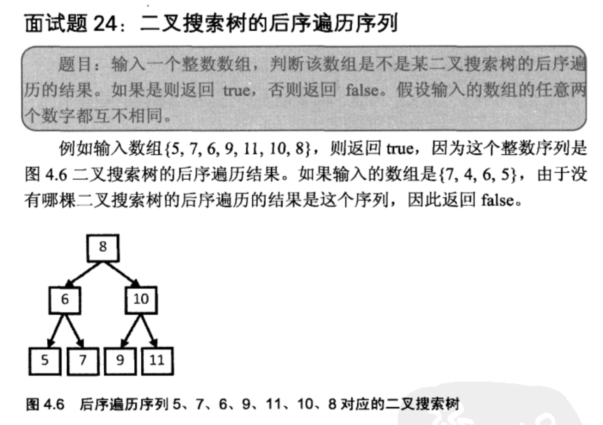

## 二叉搜索树的后序遍历序列

    输入一个整数数组，判断该数组是不是某二叉搜索树的后序遍历的结果。
    如果是则输出Yes,否则输出No。假设输入的数组的任意两个数字都互不相同。

## 解析

    对于搜索二叉树而已，后续遍历的最后一个节点，就是根节点，并且根节点将树分成两部分
    一部分小于根节点，一部分大于根节点，也就是左右子树
    于是遍历数组，找到小于根节点的最后一个数所在index
    再找到大于根节点的最后一个数所在index
    这两个index应该相差1，否则不是后序遍历的结果
    如果相差1，再递归判断左右子树
    
## java

    public class Solution {  
        public boolean VerifySquenceOfBST(int [] sequence) {  
            if(sequence.length==0) return false;  
            return checkBST(sequence, 0, sequence.length-1);  
        }  
           
        public boolean checkBST(int[] sequence,int start,int end){       
            if(start>=end) return true;  
            int flag = sequence[end];  
            int i=start;  
            for(;i<=end;i++){  
                if(sequence[i]>=flag) break;          
            }  
            int j=end-1;  
            for(;j>=start;j--){  
                if(sequence[j]<=flag) break;          
            }        
            if(i-j!=1) return false;  
            return checkBST(sequence, start, i-1)  
                    &&checkBST(sequence, j+1, end-1);    
        }  
    }  
