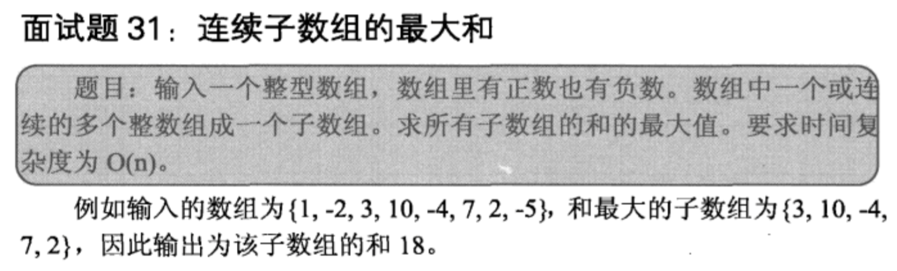

## 连续子数组的最大和

## 解析

    动态规划，每次保留从0到i的，包含arr[i]的最大连续和
    
## java

    public class Solution {  
        public int FindGreatestSumOfSubArray(int[] array) {  
            if(array.length==0) return 0;  
            int[] d = new int[array.length];  
            d[0] = array[0];  
            int max = d[0];  
            for(int i=1;i<array.length;i++){  
                if(d[i-1]<=0){  
                    d[i] = array[i];  
                }else{  
                    d[i] = d[i-1]+array[i];  
                }  
                if(d[i]>max) max = d[i];  
            }  
              
            return max;  
        }  
    }  