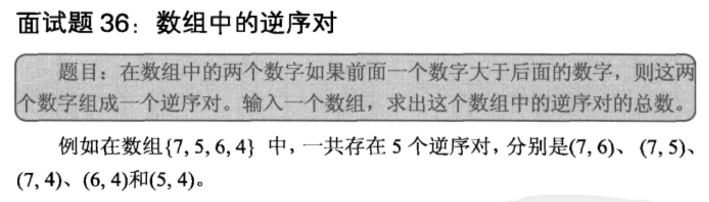

## 数组中的逆序对

## 解析

    使用归并排序来统计。对于左右已经排好序的数组，可以很容易的计算逆序对的数目。
    
## java

    public class Solution {  
        public int InversePairs(int [] array) {    
            if(array.length==0) return 0;    
            if(array.length==1) return 0;    
            int i = solve(array,0,array.length-1);          
            return i;    
        }    
            
        public int solve(int[] arr,int start,int end){    
            if(start>=end) return 0;    
            int mid = (start+end)/2;    
            int left = solve(arr,start,mid);    
            int right = solve(arr, mid+1, end);    
            int i=mid;int j=end;    
            int count = left+right;    
            while(i>=start && j>=mid+1){    
                if(arr[j]<arr[i]){    
                    count += j-mid;    
                    i--;    
                }else if(arr[i]==arr[j]){    
                    count += j-mid-1;    
                    i--;    
                }else{    
                    j--;    
                }    
            }           
                
            i = start;j=mid+1;          
            int[] t_arr = new int[end-start+1];         
            int k=0;    
            while(i<=mid&&j<=end){    
                if(arr[i]<arr[j]){    
                    t_arr[k] = arr[i];    
                    i++;    
                }else{   
                    t_arr[k] = arr[j];    
                    j++;    
                }  
                k++;    
            }    
            while(i<=mid){    
                t_arr[k] = arr[i];     
                i++;    
                k++;    
            }    
            while(j<=end){    
                t_arr[k] = arr[j];     
                j++;    
                k++;    
            }    
            for(k=0;k<end-start+1;k++){    
                arr[start+k] = t_arr[k];    
            }    
            return count;    
        }    
    }  
    
    
    
## 详细分析

    考虑一下，逆序是说a[i]>a[j]，i<j。那么在排序的过程中，会把a[i]和a[j]交换过来，这个交换的过程，
    每交换一次，就是一个逆序对的“正序”过程。
    
    一个比较好的思路是利用分治的思想：先求前面一半数组的逆序数，再求后面一半数组的逆序数，
    然后求前面一半数组比后面一半数组中大的数的个数（也就是逆序数），这三个过程加起来就是整体的逆序数目了。
    看这个描述，是不是有点像归并排序呢？归并排序的思想就是把前一段排序，后一段排序，然后再整体排序。
    而且，归并排序的规程中，需要判断前一半数组和后一半数组中当前数字的大小。
    这也就是刚刚描述的逆序的判断过程了。如果前一半数组的当前数字大于后一半数组的当前数字，那么这就是一个逆序数。
    
    利用归并排序的过程中，在每一次归并两个数组的时候，如果左数组比右数组大，那么着就是一个逆序。
    记录所有左数组比右数组大的情况，就是全部的逆序数目。
    
## java
    
    package a;  
      
    public class MergeSort {  
        static int count = 0;  
      
        // 将有二个有序数列a[first...mid]和a[mid...last]合并。  
        static void mergearray(int a[], int first, int mid, int last, int temp[]) {  
            int i = first, j = mid + 1;  
            int m = mid, n = last;  
            int k = 0;  
            while (i <= m && j <= n) {  
                if (a[i] > a[j]) {  
                    // 左数组比右数组大  
                    temp[k++] = a[j++];  
                    // 因为如果a[i]此时比右数组的当前元素a[j]大，  
                    // 那么左数组中a[i]后面的元素就都比a[j]大  
                    // 【因为数组此时是有序数组】  
                    count += mid - i + 1;  
                } else {  
                    temp[k++] = a[i++];  
                }  
            }  
            while (i <= m) {  
                temp[k++] = a[i++];  
            }  
            while (j <= n) {  
                temp[k++] = a[j++];  
            }  
            for (i = 0; i < k; i++)  
                a[first + i] = temp[i];  
        }  
      
        static void mergesort(int a[], int first, int last, int temp[]) {  
            if (first < last) {  
                int mid = (first + last) / 2;  
                mergesort(a, first, mid, temp); // 左边有序  
                mergesort(a, mid + 1, last, temp); // 右边有序  
                mergearray(a, first, mid, last, temp); // 再将二个有序数列合并  
            }  
        }  
      
        static void mergeSort(int a[]) {  
            int[] p = new int[a.length];  
            mergesort(a, 0, a.length - 1, p);  
        }  
      
        public static void main(String ss[]) {  
      
            // int data[] = { 8, 7, 5, 6, 4 };  
            int data[] = { 4, 3, 2, 1 };  
            mergeSort(data);  
      
            for (int i = 0; i < data.length; i++) {  
                System.out.print(data[i] + "\t");  
            }  
            System.out.println();  
            System.out.println(count);  
        }  
    } 

## 代码分析
    
    代码中，完全套用了归并排序的代码。并在归并数组的时候，记录逆序的数目。
    不知道上面代码中的，增加count值的注释部分解释明白了没有。
    举个例子，
    对于4,3,2,1，从第一个4开始数，它的逆序个数是几个？很明显是3个。因为4>3,4>2,4>1。
    这就是为什么count=mid-i+1。因为在归并的时候，一旦一个数A大于另外一个数B，
    那么这个数A右侧的数就都是大于这个B的。所以要把这个数A的右侧的数字个数全部加到count中。
    这样应该是解释的比较明白了。