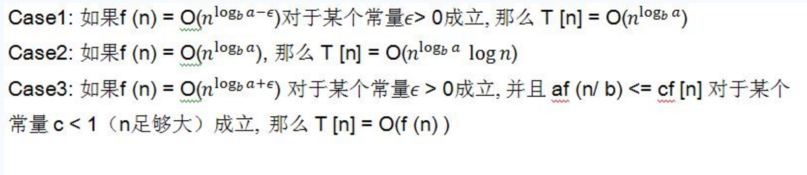
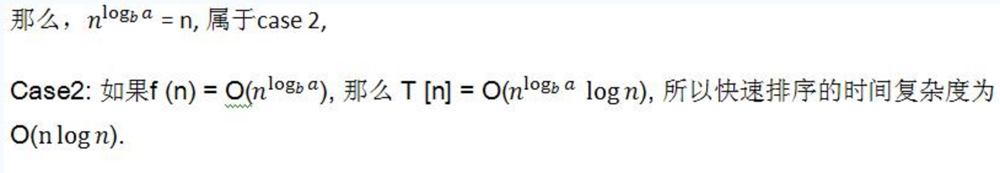

# 快速排序算法的时间复杂度分析
 
    快速排序算法的时间复杂度，有时候是O(nlgn), 有时候就是O(n^2), 在你不知道自己数据特性的情况下，
    很难选择是否使用快速排序，因为他并不总是最快的。
 
为了分析快速排序的时间复杂度，请先看下面的主定理：

 
    主定理: T [n] = aT[n/b] + f (n)
    其中 a >= 1 and b > 1 是常量 并且 f (n) 是一个渐近正函数， 为了使用这个主定理，
    您需要考虑下列三种情况：
 

    快速排序的每一次划分把一个 问题分解成两个子问题，其中的关系可以用下式表示：
     
    T[n] = 2T[n/2] + O(n) 其中O(n)为PARTITION()的时间复杂度，对比主定理，
     
    T [n] = aT[n/b] + f (n)
     
    我们的快速排序中：a = 2, b = 2, f(n) = O(n)

那么为什么还有最坏情况呢？
 
    考虑如下极端情况，
     
    T[n] = T[n-1] + T[1] + O(n),
    
    问题来了，这一次的划分白玩了，划分之后一边是一个，一边是n-1个，
    这种极端情况的时间复杂度就是O(n^2).
 
 
## 总结

    理解了主定理好多算法分析就迎刃而解了，本文没有给出注定理的证明，因为对于大家意义不大，
    感兴趣的读者可以参考相关的书籍。最后用一句话总结：天下大事必做于细，差之毫厘有时候真会谬之千里..
