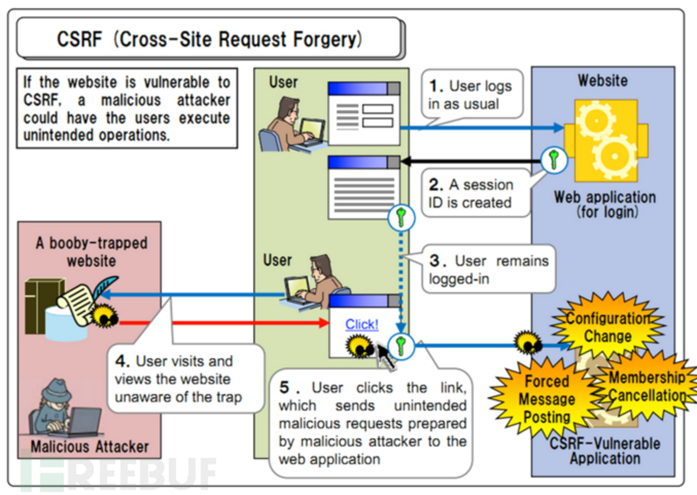

# XSS和CSRF

## PART1  XSS跨站脚本（Cross-site scripting）

XSS成因概括 ：

    XSS其实就是Html的注入问题，攻击者的输入没有经过严格的控制进入了数据库，最终显示给来访的用户，
    导致可以在来访用户的浏览器里以浏览用户的身份执行Html代码，数据流程如下：
    攻击者的Html输入—>web程序—>进入数据库—>web程序—>用户浏览器。

检测方法：
    //通常有一些方式可以测试网站是否有正确处理特殊字符：
    
    >
    ='>
    ">
    
    
    %3Cscript%3Ealert('XSS')%3C/script%3E
    
    
    
    
（这个仅限 IE 有效）
    
攻击手段和目的:

    攻击者使被攻击者在浏览器中执行脚本后，如果需要收集来自被攻击者的数据（如cookie或其他敏感信息），
    可以自行架设一个网站，让被攻击者通过JavaScript等方式把收集好的数据作为参数提交，
    随后以数据库等形式记录在攻击者自己的服务器上。 

    a. 盗用 cookie ，获取敏感信息。
    b.利用植入 Flash ，通过 crossdomain 权限设置进一步获取更高权限；或者利用Java等得到类似的操作。 
    c.利用 iframe、frame、XMLHttpRequest或上述Flash等方式，以（被攻击）用户的身份执行一些管理动作，
      或执行一些一般的如发微博、加好友、发私信等操作。 
    d.利用可被攻击的域受到其他域信任的特点，以受信任来源的身份请求一些平时不允许的操作，如进行不当的投票活动。
    e.在访问量极大的一些页面上的XSS可以攻击一些小型网站，实现DDoS攻击的效果。

漏洞的防御和利用:

避免XSS的方法之一主要是`将用户所提供的内容进行过滤`，许多语言都有提供对HTML的过滤：

    PHP的htmlentities()或是htmlspecialchars()。
    Python的cgi.escape()。
    ASP的Server.HTMLEncode()。
    ASP.NET的Server.HtmlEncode()或功能更强的Microsoft Anti-Cross Site Scripting Library
    Java的xssprotect(Open Source Library)。
    Node.js的node-validator。
    
使用HTTP头指定类型:

    很多时候可以使用HTTP头指定内容的类型，使得输出的内容避免被作为HTML解析。如在PHP语言中使用以下代码： 
    header('Content-Type: text/javascript; charset=utf-8');
    即可强行指定输出内容为文本/JavaScript脚本（顺便指定了内容编码），而非可以引发攻击的HTML。

## PART2 CSRF：冒充用户之手

示意图：

    XSS 是实现 CSRF 的诸多途径中的一条，但绝对不是唯一的一条。一般习惯上把通过 XSS 来实现的 CSRF 称为 XSRF。
    CSRF 顾名思义，是伪造请求，冒充用户在站内的正常操作。
    我们知道，绝大多数网站是通过 cookie 等方式辨识用户身份（包括使用服务器端 Session 的网站，
    因为 Session ID 也是大多保存在 cookie 里面的），再予以授权的。所以要伪造用户的正常操作，
    最好的方法是通过 XSS 或链接欺骗等途径，让用户在本机（即拥有身份 cookie 的浏览器端）发起用户所不知道的请求。 

要完成一次CSRF攻击，受害者必须依次完成两个步骤：

    1.登录受信任网站A，并在本地生成Cookie。
    2.在不登出A的情况下，访问危险网站B。
        看到这里，你也许会说：“如果我不满足以上两个条件中的一个，我就不会受到CSRF的攻击”。
        是的，确实如此，但你不能保证以下情况不会发生：
    - 你不能保证你登录了一个网站后，不再打开一个tab页面并访问另外的网站。
    - 你不能保证你关闭浏览器了后，你本地的Cookie立刻过期，你上次的会话已经结束。
    （事实上，关闭浏览器不能结束一个会话，但大多数人都会错误的认为关闭浏览器就等于退出登录/结束会话了……）
    - 上图中所谓的攻击网站，可能是一个存在其他漏洞的可信任的经常被人访问的网站。
        上面大概地讲了一下CSRF攻击的思想，下面我将用几个例子详细说说具体的CSRF攻击，
        这里我以一个银行转账的操作作为例子（仅仅是例子，真实的银行网站没这么傻:>）

示例1：

    银行网站A，它以GET请求来完成银行转账的操作，如：
    http://www.mybank.com/Transfer.php?toBankId=11&money=1000
    
    危险网站B，它里面有一段HTML的代码如下：
     
        首先，你登录了银行网站A，然后访问危险网站B，噢，这时你会发现你的银行账户少了1000块……
        为什么会这样呢？原因是银行网站A违反了HTTP规范，使用GET请求更新资源。
        在访问危险网站B的之前，你已经登录了银行网站A，而B中的以GET的方式请求第三方资源
        （这里的第三方就是指银行网站了，原本这是一个合法的请求，但这里被不法分子利用了），
        所以你的浏览器会带上你的银行网站A的Cookie发出Get请求，
        去获取资源“http://www.mybank.com/Transfer.php?toBankId=11&money=1000”，
        结果银行网站服务器收到请求后，认为这是一个更新资源操作（转账操作），所以就立刻进行转账操作……

示例2：

    为了杜绝上面的问题，银行决定改用POST请求完成转账操作。
    
    银行网站A的WEB表单如下：　　
    <form action="Transfer.php" method="POST">
        　　　　
ToBankId: <input type="text" name="toBankId" />

        　　　　
Money: <input type="text" name="money" />

        　　　　
<input type="submit" value="Transfer" />

    </form>
    
    后台处理页面Transfer.php如下：
    <?php
        　　session_start();
        if (isset($_REQUEST[&#039;toBankId&#039;] &&　isset($_REQUEST[&#039;money&#039;]))
        {
        　　 buy_stocks($_REQUEST[&#039;toBankId&#039;],　$_REQUEST[&#039;money&#039;]);
        }
    >
    
    危险网站B，仍然只是包含那句HTML代码：
    
        和示例1中的操作一样，你首先登录了银行网站A，然后访问危险网站B，结果…..
        和示例1一样，你再次没了1000块～T_T，这次事故的原因是：银行后台使用了$_REQUEST去获取请求的数据，
        而$_REQUEST既可以获取GET请求的数据，也可以获取POST请求的数据，
        这就造成了在后台处理程序无法区分这到底是GET请求的数据还是POST请求的数据。
        在PHP中，可以使用$_GET和$_POST分别获取GET请求和POST请求的数据。
        在JAVA中，用于获取请求数据request一样存在不能区分GET请求数据和POST数据的问题。 

示例3：

        经过前面2个惨痛的教训，银行决定把获取请求数据的方法也改了，改用$_POST，
        只获取POST请求的数据，后台处理页面Transfer.php代码如下：
    <?php
        　session_start();
        　if (isset($_POST['toBankId'] &&　isset($_POST['money']))
        　{
        　　　 buy_stocks($_POST['toBankId'],　$_POST['money']);
        　}
    ?>
    
    然而，危险网站B与时俱进，它改了一下代码：
    <html>
        　　<head>
        　　　　
        　　</head>
        　　<body onload="steal()">
        　　　　<iframe name="steal" display="none">
        　　　　　　<form method="POST" name="transfer"　action="http://www.myBank.com/Transfer.php">
        　　　　　　　　<input type="hidden" name="toBankId" value="11">
        　　　　　　　　<input type="hidden" name="money" value="1000">
        　　　　　　</form>
        　　　　</iframe>
        　　</body>
    </html>
        如果用户仍是继续上面的操作，很不幸，结果将会是再次不见1000块……因为这里危险网站B暗地里发送了POST请求到银行!

总结一下上面3个例子，CSRF主要的攻击模式基本上是以上的3种，其中以第1,2种最为严重，因为触发条件很简单，
一个就可以了，而第3种比较麻烦，需要使用JavaScript，所以使用的机会会比前面的少很多，
但无论是哪种情况，只要触发了CSRF攻击，后果都有可能很严重。
理解上面的3种攻击模式，其实可以看出，CSRF攻击是源于WEB的隐式身份验证机制！
WEB的身份验证机制虽然可以保证一个请求是来自于某个用户的浏览器，但却无法保证该请求是用户批准发送的！

## 如何防御CSRF？

    请求令牌（一种简单有效的防御方法）：
    
    首先服务器端要以某种策略生成随机字符串，作为令牌（token），保存在 Session 里。
    然后在发出请求的页面，把该令牌以隐藏域一类的形式，与其他信息一并发出。在接收请求的页面，
    把接收到的信息中的令牌与 Session 中的令牌比较，只有一致的时候才处理请求，处理完成后清理session中的值，
    否则返回 HTTP 403 拒绝请求或者要求用户重新登陆验证身份 
    
    令牌来防止 CSRF 有以下几点要注意：
    a.虽然请求令牌原理和验证码有相似之处，但不应该像验证码一样，全局使用一个 Session Key。
    因为请求令牌的方法在理论上是可破解的，破解方式是解析来源页面的文本，获取令牌内容。
    如果全局使用一个 Session Key，那么危险系数会上升。
    原则上来说，每个页面的请求令牌都应该放在独立的 Session Key 中。
    我们在设计服务器端的时候，可以稍加封装，编写一个令牌工具包，将页面的标识作为 Session 中保存令牌的键。
    
    b.在 ajax 技术应用较多的场合，因为很有请求是 JavaScript 发起的，使用静态的模版输出令牌值或多或少有些不方便。
    但无论如何，请不要提供直接获取令牌值的 API。这么做无疑是锁上了大门，却又把钥匙放在门口，
    让我们的请求令牌退化为同步令牌。
    
    c.第一点说了请求令牌理论上是可破解的，所以非常重要的场合，应该考虑使用验证码
    （令牌的一种升级，目前来看破解难度极大），或者要求用户再次输入密码（亚马逊、淘宝的做法）。
    但这两种方式用户体验都不好，所以需要产品开发者权衡。
    
    d.无论是普通的请求令牌还是验证码，服务器端验证过一定记得销毁。
    忘记销毁用过的令牌是个很低级但是杀伤力很大的错误。我们学校的选课系统就有这个问题，验证码用完并未销毁，
    故只要获取一次验证码图片，其中的验证码可以在多次请求中使用（只要不再次刷新验证码图片），一直用到。
    
    如下也列出一些据说能有效防范 CSRF，其实效果甚微或甚至无效的做法：
    a.通过 referrer 判定来源页面：referrer 是在 HTTP Request Head 里面的，也就是由请求的发送者决定的。
    如果我喜欢，可以给 referrer 任何值。当然这个做法并不是毫无作用，起码可以防小白。但我觉得性价比不如令牌。
    
    b.过滤所有用户发布的链接：这个是最无效的做法，因为首先攻击者不一定要从站内发起请求（上面提到过了），
    而且就算从站内发起请求，途径也远远不知链接一条。比如  就是个不错的选择，
    还不需要用户去点击，只要用户的浏览器会自动加载图片，就会自动发起请求。
    
    c.在请求发起页面用 alert 弹窗提醒用户：这个方法看上去能干扰站外通过 iframe 发起的 CSRF，
    但攻击者也可以考虑用 window.alert = function(){}; 把 alert 弄哑，或者干脆脱离 iframe，
    使用 Flash 来达到目的。

总体来说，目前防御 CSRF 的诸多方法还没几个能彻底无解的。 作为开发者，我们能做的就是尽量提高破解难度。
当破解难度达到一定程度，网站就逼近于绝对安全的位置了。

# CSRF防御
CSRF的防御可以从服务端和客户端两方面着手，防御效果是从服务端着手效果比较好，现在一般的CSRF防御也都在服务端进行。
服务端的CSRF方式方法很多样，但总的思想都是一致的，就是在客户端页面增加伪随机数。

## (1).Cookie Hashing(所有表单都包含同一个伪随机值)：
这可能是最简单的解决方案了，因为攻击者不能获得第三方的Cookie(理论上)，所以表单中的数据也就构造失败了:>
    
    <?php
    　　//构造加密的Cookie信息
    　　$value = “DefenseSCRF”;
    　　setcookie(”cookie”, $value, time()+3600);
    ?>
    
    在表单里增加Hash值，以认证这确实是用户发送的请求。
    　　<?php
    　　　　$hash = md5($_COOKIE['cookie']);
    　　?>
    　　<form method=”POST” action=”transfer.php”>
    　　　　<input type=”text” name=”toBankId”>
    　　　　<input type=”text” name=”money”>
    　　　　<input type=”hidden” name=”hash” value=”<?=$hash;?>”>
    　　　　<input type=”submit” name=”submit” value=”Submit”>
    　　</form>
    
    然后在服务器端进行Hash值验证
    <?php
    　　      if(isset($_POST['check'])) {
    　　      $hash = md5($_COOKIE['cookie']);
      　　 if($_POST['check'] == $hash) {
           　　 doJob();
    　　           } else {
    　　　　　　　　//...
      　　 }
    　　      } else {
    　　　　　　//...
    　　      }
    ?>
      
这个方法个人觉得已经可以杜绝99%的CSRF攻击了，那还有1%呢....
由于用户的Cookie很容易由于网站的XSS漏洞而被盗取，这就另外的1%。
一般的攻击者看到有需要算Hash值，基本都会放弃了，某些除外，所以如果需要100%的杜绝，这个不是最好的方法。

## (2).验证码

这个方案的思路是：每次的用户提交都需要用户在表单中填写一个图片上的随机字符串，厄....
这个方案可以完全解决CSRF，但个人觉得在易用性方面似乎不是太好，
还有听闻是验证码图片的使用涉及了一个被称为MHTML的Bug，可能在某些版本的微软IE中受影响。

## (3).One-Time Tokens(不同的表单包含一个不同的伪随机值)

    在实现One-Time Tokens时，需要注意一点：就是“并行会话的兼容”。
    如果用户在一个站点上同时打开了两个不同的表单，CSRF保护措施不应该影响到他对任何表单的提交。
    考虑一下如果每次表单被装入时站点生成一个伪随机值来覆盖以前的伪随机值将会发生什么情况：
    用户只能成功地提交他最后打开的表单，因为所有其他的表单都含有非法的伪随机值。
    必须小心操作以确保CSRF保护措施不会影响选项卡式的浏览或者利用多个浏览器窗口浏览一个站点。

下面是一个实现: 

1).先是令牌生成函数(gen_token())：

     <?php
     function gen_token() {
    　　　　//这里我是贪方便，实际上单使用Rand()得出的随机数作为令牌，也是不安全的。
    　　　　//这个可以参考我写的Findbugs笔记中的《Random object created and used only once》
          $token = md5(uniqid(rand(), true));
          return $token;
     }
     
2).然后是Session令牌生成函数(gen_stoken())：

     <?php
     　　function gen_stoken() {
    　　　　　　$pToken = "";
    　　　　　　if($_SESSION[STOKEN_NAME]  == $pToken){
    　　　　　　　　//没有值，赋新值
    　　　　　　　　$_SESSION[STOKEN_NAME] = gen_token();
    　　　　　　}    
    　　　　　　else{
    　　　　　　　　//继续使用旧的值
    　　　　　　}
     　　}
     ?>
 
3).WEB表单生成隐藏输入域的函数：　　

     <?php
    　　     function gen_input() {
     　　     gen_stoken();
    　　          echo “<input type=\”hidden\” name=\”" . FTOKEN_NAME . “\”
          　　     value=\”" . $_SESSION[STOKEN_NAME] . “\”> “;
     　　}
     ?>

4).WEB表单结构：

     <?php
          session_start();
          include(”functions.php”);
     ?>
     <form method=”POST” action=”transfer.php”>
          <input type=”text” name=”toBankId”>
          <input type=”text” name=”money”>
          <? gen_input(); ?>
          <input type=”submit” name=”submit” value=”Submit”>
     </FORM>
 
5).服务端核对令牌：这个很简单，这里就不再啰嗦了。
