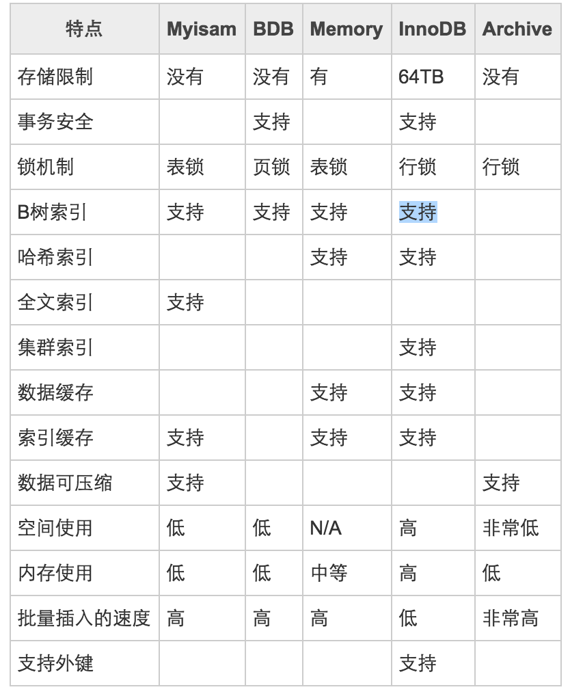

# Mysql存储引擎

MySQL5.5以后默认使用`InnoDB`存储引擎，其中InnoDB和BDB提供事务安全表，其它存储引擎都是非事务安全表。
若要修改默认引擎，可以修改配置文件中的default-storage-engine。
可以通过：`show variables like 'default_storage_engine';`查看当前数据库到默认引擎。
命令：`show engines和show variables like 'have%'`可以列出当前数据库所支持到引擎。
其中Value显示为disabled的记录表示数据库支持此引擎，而在数据库启动时被禁用。
在MySQL5.1以后，INFORMATION_SCHEMA数据库中存在一个ENGINES的表，它提供的信息与show engines;
语句完全一样，可以使用下面语句来查询哪些存储引擎支持事物处理：
`select engine from information_chema.engines where transactions = 'yes';`
可以通过engine关键字在创建或修改数据库时指定所使用到引擎。

主要存储引擎：MyISAM、InnoDB、MEMORY和MERGE介绍：

## (一)MyISAM
　　它不支持事务，也不支持外键，尤其是访问速度快，对事务完整性没有要求或者以SELECT、INSERT为主的应用基本都可以使用这个引擎来创建表。
每个MyISAM在磁盘上存储成3个文件，其中文件名和表名都相同，但是扩展名分别为：

    1. .frm(存储表定义)
    2. MYD(MYData，存储数据)
    3. MYI(MYIndex，存储索引)
    　　 数据文件和索引文件可以放置在不同的目录，平均分配IO，获取更快的速度。要指定数据文件和索引文件的路径，
        需要在创建表的时候通过DATA DIRECTORY和INDEX DIRECTORY语句指定，文件路径需要使用绝对路径。
    　　 每个MyISAM表都有一个标志，服务器或myisamchk程序在检查MyISAM数据表时会对这个标志进行设置。
        MyISAM表还有一个标志用来表明该数据表在上次使用后是不是被正常的关闭了。如果服务器以为当机或崩溃，
        这个标志可以用来判断数据表是否需要检查和修复。如果想让这种检查自动进行，可以在启动服务器时使用--myisam-recover现象。
        这会让服务器在每次打开一个MyISAM数据表是自动检查数据表的标志并进行必要的修复处理。MyISAM类型的表可能会损坏，
        可以使用CHECK TABLE语句来检查MyISAM表的健康，并用REPAIR TABLE语句修复一个损坏到MyISAM表。
    　　
    
MyISAM的表还支持3种不同的存储格式：

    静态(固定长度)表
    动态表
    压缩表
    　　其中静态表是默认的存储格式。静态表中的字段都是非变长字段，这样每个记录都是固定长度的，
       这种存储方式的优点是存储非常迅速，容易缓存，出现故障容易恢复；缺点是占用的空间通常比动态表多。
       静态表在数据存储时会根据列定义的宽度定义补足空格，但是在访问的时候并不会得到这些空格，这些空格在返回给应用之前已经去掉。
       同时需要注意：在某些情况下可能需要返回字段后的空格，而使用这种格式时后面到空格会被自动处理掉。
    　　动态表包含变长字段，记录不是固定长度的，这样存储的优点是占用空间较少，但是频繁到更新删除记录会产生碎片，
       需要定期执行OPTIMIZE TABLE语句或myisamchk -r命令来改善性能，并且出现故障的时候恢复相对比较困难。
    　　压缩表由myisamchk工具创建，占据非常小的空间，因为每条记录都是被单独压缩的，所以只有非常小的访问开支。 

### (二)InnoDB

InnoDB存储引擎提供了具有提交、回滚和崩溃恢复能力的事务安全。但是对比MyISAM的存储引擎，
InnoDB写的处理效率差一些并且会占用更多的磁盘空间以保留数据和索引。

    1)自动增长列：
        InnoDB表的自动增长列可以手工插入，但是插入的如果是空或0，则实际插入到则是自动增长后到值。
        可以通过"ALTER TABLE...AUTO_INCREMENT=n;"语句强制设置自动增长值的起始值，默认为1，但是该强制到默认值是保存在内存中，
        数据库重启后该值将会丢失。可以使用LAST_INSERT_ID()查询当前线程最后插入记录使用的值。
        如果一次插入多条记录，那么返回的是第一条记录使用的自动增长值。
        对于InnoDB表，自动增长列必须是索引。如果是组合索引，也必须是组合索引的第一列，但是对于MyISAM表，
        自动增长列可以是组合索引的其他列，这样插入记录后，自动增长列是按照组合索引到前面几列排序后递增的。
    
    2)外键约束：
        MySQL支持外键的存储引擎只有InnoDB，在创建外键的时候，父表必须有对应的索引，子表在创建外键的时候也会自动创建对应的索引。
        在创建索引的时候，可以指定在删除、更新父表时，对子表进行的相应操作，包括restrict、cascade、set null和no action。
        其中restrict和no action相同，是指限制在子表有关联的情况下，父表不能更新；casecade表示父表在更新或删除时，
        更新或者删除子表对应的记录；set null 则表示父表在更新或者删除的时候，子表对应的字段被set null。
        当某个表被其它表创建了外键参照，那么该表对应的索引或主键被禁止删除。
        可以使用set foreign_key_checks=0;临时关闭外键约束，set foreign_key_checks=1;打开约束。

## (三)MEMORY

    memory使用存在内存中的内容来创建表。每个MEMORY表实际对应一个磁盘文件，格式是.frm。
    MEMORY类型的表访问非常快，因为它到数据是放在内存中的，并且默认使用HASH索引，但是一旦服务器关闭，表中的数据就会丢失，但表还会继续存在。
    默认情况下，memory数据表使用散列索引，利用这种索引进行“相等比较”非常快，但是对“范围比较”的速度就慢多了。
    因此，散列索引值适合使用在"="和"<=>"的操作符中，不适合使用在"<"或">"操作符中，也同样不适合用在order by字句里。
    如果确实要使用"<"或">"或betwen操作符，可以使用btree索引来加快速度。
    存储在MEMORY数据表里的数据行使用的是长度不变的格式，因此加快处理速度，这意味着不能使用BLOB和TEXT这样的长度可变的数据类型。
    VARCHAR是一种长度可变的类型，但因为它在MySQL内部当作长度固定不变的CHAR类型，所以可以使用。
    
    create table tab_memory engine=memory select id,name,age,addr from man order by id;
    　　使用USING HASH/BTREE来指定特定到索引。
    create index mem_hash using hash on tab_memory(city_id);
    
    在启动MySQL服务的时候使用--init-file选项，把insert into...select或load data infile 这样的语句放入到这个文件中，
    就可以在服务启动时从持久稳固的数据源中装载表。
    服务器需要足够的内存来维持所在的在同一时间使用的MEMORY表，当不再使用MEMORY表时，要释放MEMORY表所占用的内存，
    应该执行DELETE FROM或truncate table或者删除整个表。
    每个MEMORY表中放置到数据量的大小，受到max_heap_table_size系统变量的约束，这个系统变量的初始值是16M，
    同时在创建MEMORY表时可以使用MAX_ROWS子句来指定表中的最大行数。

## (四)MERGE

    merge存储引擎是一组MyISAM表的组合，这些MyISAM表结构必须完全相同，MERGE表中并没有数据，
    对MERGE类型的表可以进行查询、更新、删除的操作，这些操作实际上是对内部的MyISAM表进行操作。
    对于对MERGE表进行的插入操作，是根据INSERT_METHOD子句定义的插入的表，可以有3个不同的值，
    first和last值使得插入操作被相应的作用在第一个或最后一个表上，不定义这个子句或者为NO，表示不能对这个MERGE表进行插入操作。
    可以对MERGE表进行drop操作，这个操作只是删除MERGE表的定义，对内部的表没有任何影响。
    MERGE在磁盘上保留2个以MERGE表名开头文件：.frm文件存储表的定义；.MRG文件包含组合表的信息，包括MERGE表由哪些表组成，
    插入数据时的依据。可以通过修改.MRG文件来修改MERGE表，但是修改后要通过flush table刷新。
    
    create table man_all(id int,name varchar(20))engine=merge union=(man1,man2) insert_methos=last;
    
    
## 对比表格

## 最常使用的2种存储引擎：

- Myisam是Mysql的默认存储引擎(MySQL5.5以后默认使用`InnoDB`存储引擎)。
当create创建新表时，未指定新表的存储引擎时，默认使用Myisam。每个MyISAM在磁盘上存储成三个文件。
文件名都和表名相同，扩展名分别是.frm（存储表定义）、.MYD (MYData，存储数据)、.MYI (MYIndex，存储索引)。
数据文件和索引文件可以放置在不同的目录，平均分布io，获得更快的速度。 
  
- InnoDB存储引擎提供了具有提交、回滚和崩溃恢复能力的事务安全。但是对比Myisam的存储引擎，
InnoDB写的处理效率差一些并且会占用更多的磁盘空间以保留数据和索引。

## 如何选择合适的存储引擎
   
选择标准：根据应用特点选择合适的存储引擎，对于复杂的应用系统可以根据实际情况选择多种存储引擎进行组合。
   
下面是常用存储引擎的适用环境：
   
    MyISAM：默认的MySQL插件式存储引擎，它是在Web、数据仓储和其他应用环境下最常使用的存储引擎之一
    InnoDB：用于事务处理应用程序，具有众多特性，包括ACID事务支持。
    Memory：将所有数据保存在RAM中，在需要快速查找引用和其他类似数据的环境下，可提供极快的访问。
    Merge：允许MySQL DBA或开发人员将一系列等同的MyISAM表以逻辑方式组合在一起，并作为1个对象引用它们。
    对于诸如数据仓储等VLDB环境十分适合。