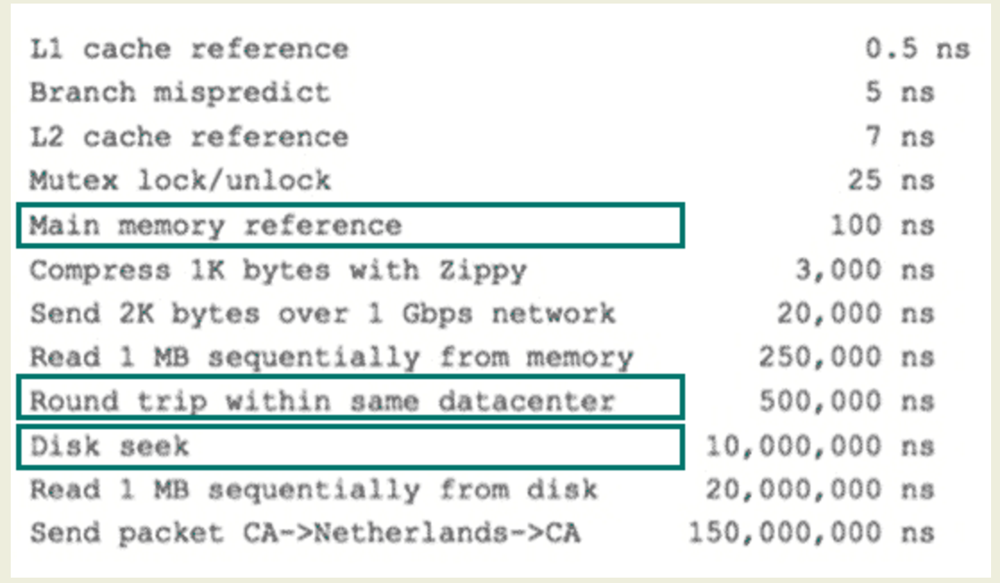
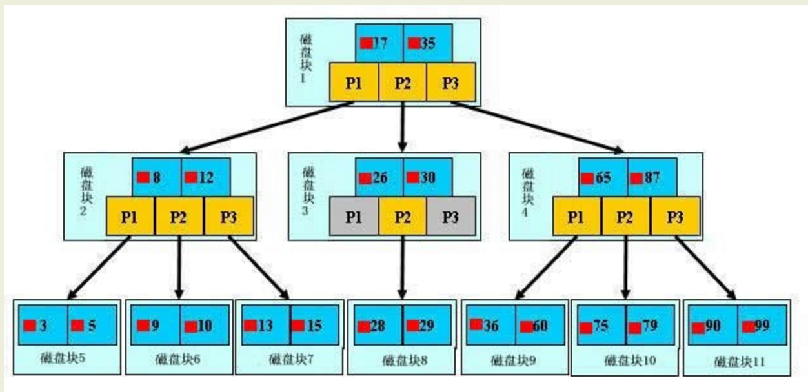

# mysql索引及其优化

## 基础

## 索引的存储分类

`myisam表的数据文件和索引文件是自动分开的；innodb的数据和索引是存储在同一个表空间里面，但可以有多个文件组成。 `

创建索引语法如下：

    CREATE [UNIQUE|FULLTEXT|SPATIAL] INDEX index_name
    [USING index_type]
    ON tbl_name (index_col_name,...)
    index_col_name:
    col_name [(length)] [ASC | DESC]
 
索引的存储类型目前只有两种（btree和hash），具体和表的模式相关：

    myisam     btree
    innodb      btree
    memory/heap hash，btree

mysql目前不支持函数索引，只能对列的前一部分（length）进行索引，例：

    create index ind_test on table1(name(5))，
    
对于char和varchar列，使用前缀索引将大大节省空间。

## MySQL如何使用索引

    索引用于快速找出在某个列中有一特定值的行。对相关列使用索引是提高SELECT操作性能的最佳途径。
    查询要使用索引最主要的条件是查询条件中需要使用索引关键字，如果是多列索引，
    那么只有查询条件使用了多列关键字最左边的前缀时，才可以使用索引，否则将不能使用索引。

下列情况下，Mysql不会使用已有的索引：

    1.如果mysql估计使用索引比全表扫描更慢，则不使用索引。例如：如果key_part1均匀分布在1和100之间，
    下列查询中使用索引就不是很好：
        SELECT * FROM table_name where key_part1 > 1 and key_part1 < 90
    2.如果使用heap表并且where条件中不用＝索引列，其他> 、<、 >=、 <=均不使用索引；
    3.如果不是索引列的第一部分；
    4.如果like是以％开始；
    5.对where后边条件为字符串的一定要加引号，字符串如果为数字mysql会自动转为字符串，但是不使用索引。

## 查看索引使用情况

如果索引正在工作，Handler_read_key的值将很高，这个值代表了一个行被索引值读的次数，
很低的值表明增加索引得到的性能改善不高，因为索引并不经常使用。

Handler_read_rnd_next的值高则意味着查询运行低效，并且应该建立索引补救。
这个值的含义是在数据文件中读下一行的请求数。如果你正进行大量的表扫描，该值较高。
通常说明表索引不正确或写入的查询没有利用索引。语法：

    mysql> show status like 'Handler_read%';
    
# mysql索引原理详解

一般的应用系统，读写比例在10:1左右，而且插入操作和一般的更新操作很少出现性能问题，
`遇到最多的，也是最容易出问题的，还是一些复杂的查询操作，所以查询语句的优化显然是重中之重`。

## 一个慢查询引发的思考

    select count(*) from task where status=2 and operator_id=20839 and operate_time>1371169729 
    and operate_time<1371174603 and type=2;
    
    系统使用者反应有一个功能越来越慢，于是工程师找到了上面的SQL。
    并且兴致冲冲的找到了我，“这个SQL需要优化，给我把每个字段都加上索引”
    我很惊讶，问道“为什么需要每个字段都加上索引？”
    “把查询的字段都加上索引会更快”工程师信心满满
    “这种情况完全可以建一个联合索引，因为是最左前缀匹配，所以operate_time需要放到最后，
    而且还需要把其他相关的查询都拿来，需要做一个综合评估。”
    “联合索引？最左前缀匹配？综合评估？”工程师不禁陷入了沉思。
    多数情况下，我们知道索引能够提高查询效率，但应该如何建立索引？索引的顺序如何？许多人却只知道大概。
    其实理解这些概念并不难，而且索引的原理远没有想象的那么复杂。

## MySQL索引原理

#### 索引目的

索引的目的在于提高查询效率，可以类比字典，如果要查“mysql”这个单词，我们肯定需要定位到m字母，然后从下往下找到y字母，
再找到剩下的sql。如果没有索引，那么你可能需要把所有单词看一遍才能找到你想要的，如果我想找到m开头的单词呢？
或者ze开头的单词呢？是不是觉得如果没有索引，这个事情根本无法完成？

#### 索引原理

    除了词典，生活中随处可见索引的例子，如火车站的车次表、图书的目录等。
    
    它们的原理都是一样的，通过不断的缩小想要获得数据的范围来筛选出最终想要的结果，同时把随机的事件变成顺序的事件，
    也就是我们总是通过同一种查找方式来锁定数据。
    
    数据库也是一样，但显然要复杂许多，因为不仅面临着等值查询，还有范围查询(>、<、between、in)、模糊查询(like)、
    并集查询(or)等等。数据库应该选择怎么样的方式来应对所有的问题呢？
    
    我们回想字典的例子，能不能把数据分成段，然后分段查询呢？最简单的如果1000条数据，1到100分成第一段，
    101到200分成第二段，201到300分成第三段......这样查第250条数据，只要找第三段就可以了，一下子去除了90%的无效数据。
    但如果是1千万的记录呢，分成几段比较好？
    
    稍有算法基础的同学会想到搜索树，其平均复杂度是lgN，具有不错的查询性能。
    
    但这里我们忽略了一个关键的问题，复杂度模型是基于每次相同的操作成本来考虑的，数据库实现比较复杂，数据保存在磁盘上，
    而为了提高性能，每次又可以把部分数据读入内存来计算，因为我们知道访问磁盘的成本大概是访问内存的十万倍左右，
    所以简单的搜索树难以满足复杂的应用场景。

## 磁盘IO与预读

    前面提到了访问磁盘，那么这里先简单介绍一下磁盘IO和预读，磁盘读取数据靠的是机械运动，
    每次读取数据花费的时间可以分为寻道时间、旋转延迟、传输时间三个部分，寻道时间指的是磁臂移动到指定磁道所需要的时间，
    主流磁盘一般在5ms以下；旋转延迟就是我们经常听说的磁盘转速，比如一个磁盘7200转，表示每分钟能转7200次，
    也就是说1秒钟能转120次，旋转延迟就是1/120/2 = 4.17ms；传输时间指的是从磁盘读出或将数据写入磁盘的时间，一般在零点几毫秒，
    相对于前两个时间可以忽略不计。那么访问一次磁盘的时间，即一次磁盘IO的时间约等于5+4.17 = 9ms左右，听起来还挺不错的，
    但要知道一台500 -MIPS的机器每秒可以执行5亿条指令，因为指令依靠的是电的性质，换句话说执行一次IO的时间可以执行40万条指令，
    数据库动辄十万百万乃至千万级数据，每次9毫秒的时间，显然是个灾难。

下图是计算机硬件延迟的对比图，供大家参考：

考虑到磁盘IO是非常高昂的操作，计算机操作系统做了一些优化，当一次IO时，不光把当前磁盘地址的数据，
而是把相邻的数据也都读取到内存缓冲区内，因为局部预读性原理告诉我们，当计算机访问一个地址的数据的时候，
与其相邻的数据也会很快被访问到。
每一次IO读取的数据我们称之为一页(page)。具体一页有多大数据跟操作系统有关，一般为4k或8k，
也就是我们读取一页内的数据时候，实际上才发生了一次IO，这个理论对于索引的数据结构设计非常有帮助。

## 索引的数据结构

前面讲了生活中索引的例子，索引的基本原理，数据库的复杂性，又讲了操作系统的相关知识，目的就是让大家了解，
任何一种数据结构都不是凭空产生的，一定会有它的背景和使用场景，我们现在总结一下，我们需要这种数据结构能够做些什么，
其实很简单，那就是：`每次查找数据时把磁盘IO次数控制在一个很小的数量级，最好是常数数量级`。
那么我们就想到如果一个高度可控的多路搜索树是否能满足需求呢？就这样，b+树应运而生。

## 详解b+树

如上图，是一颗b+树，关于b+树的定义可以参见B+树，这里只说一些重点，浅蓝色的块我们称之为一个磁盘块，
可以看到每个磁盘块包含几个数据项（深蓝色所示）和指针（黄色所示），如磁盘块1包含数据项17和35，
包含指针P1、P2、P3，P1表示小于17的磁盘块，P2表示在17和35之间的磁盘块，P3表示大于35的磁盘块。
真实的数据存在于叶子节点即3、5、9、10、13、15、28、29、36、60、75、79、90、99。
非叶子节点只不存储真实的数据，只存储指引搜索方向的数据项，如17、35并不真实存在于数据表中。

## b+树的查找过程

如图所示，如果要查找数据项29，那么首先会把磁盘块1由磁盘加载到内存，此时发生一次IO，
在内存中用二分查找确定29在17和35之间，锁定磁盘块1的P2指针，内存时间因为非常短（相比磁盘的IO）可以忽略不计，
通过磁盘块1的P2指针的磁盘地址把磁盘块3由磁盘加载到内存，发生第二次IO，29在26和30之间，锁定磁盘块3的P2指针，
通过指针加载磁盘块8到内存，发生第三次IO，同时内存中做二分查找找到29，结束查询，总计三次IO。
真实的情况是，3层的b+树可以表示上百万的数据，如果上百万的数据查找只需要三次IO，性能提高将是巨大的，如果没有索引，
每个数据项都要发生一次IO，那么总共需要百万次的IO，显然成本非常非常高。

## b+树性质

    1.通过上面的分析，我们知道IO次数取决于b+数的高度h，假设当前数据表的数据为N，每个磁盘块的数据项的数量是m，
    则有h=㏒(m+1)N，当数据量N一定的情况下，m越大，h越小；而m = 磁盘块的大小 / 数据项的大小，
    磁盘块的大小也就是一个数据页的大小，是固定的，如果数据项占的空间越小，数据项的数量越多，树的高度越低。
    这就是为什么每个数据项，即索引字段要尽量的小，比如int占4字节，要比bigint8字节少一半。
    这也是为什么b+树要求把真实的数据放到叶子节点而不是内层节点，一旦放到内层节点，磁盘块的数据项会大幅度下降，导致树增高。
    当数据项等于1时将会退化成线性表。
    
    2.当b+树的数据项是复合的数据结构，比如(name,age,sex)的时候，b+数是按照从左到右的顺序来建立搜索树的，
    比如当(张三,20,F)这样的数据来检索的时候，b+树会优先比较name来确定下一步的所搜方向，
    如果name相同再依次比较age和sex，最后得到检索的数据；但当(20,F)这样的没有name的数据来的时候，
    b+树就不知道下一步该查哪个节点，因为建立搜索树的时候name就是第一个比较因子，必须要先根据name来搜索才能知道下一步去哪里查询。
    比如当(张三,F)这样的数据来检索时，b+树可以用name来指定搜索方向，但下一个字段age的缺失，
    所以只能把名字等于张三的数据都找到，然后再匹配性别是F的数据了， 这个是非常重要的性质，即索引的最左匹配特性。

## 慢查询优化

关于MySQL索引原理是比较枯燥的东西，大家只需要有一个感性的认识，并不需要理解得非常透彻和深入。
我们回头来看看一开始我们说的慢查询，了解完索引原理之后，大家是不是有什么想法呢？

先总结一下索引的几大基本原则
建索引的几大原则

    1.最左前缀匹配原则，非常重要的原则，mysql会一直向右匹配直到遇到范围查询(>、<、between、like)就停止匹配，
    比如a = 1 and b = 2 and c > 3 and d = 4 如果建立(a,b,c,d)顺序的索引，d是用不到索引的，
    如果建立(a,b,d,c)的索引则都可以用到，a,b,d的顺序可以任意调整。
    
    2.=和in可以乱序，比如a = 1 and b = 2 and c = 3 建立(a,b,c)索引可以任意顺序，
    mysql的查询优化器会帮你优化成索引可以识别的形式
    
    3.尽量选择区分度高的列作为索引,区分度的公式是count(distinct col)/count(*)，表示字段不重复的比例，
    比例越大我们扫描的记录数越少，唯一键的区分度是1，而一些状态、性别字段可能在大数据面前区分度就是0，
    那可能有人会问，这个比例有什么经验值吗？使用场景不同，这个值也很难确定，一般需要join的字段我们都要求是0.1以上，
    即平均1条扫描10条记录
    
    4.索引列不能参与计算，保持列“干净”，比如from_unixtime(create_time) = ’2014-05-29’就不能使用到索引，
    原因很简单，b+树中存的都是数据表中的字段值，但进行检索时，需要把所有元素都应用函数才能比较，显然成本太大。
    所以语句应该写成create_time = unix_timestamp(’2014-05-29’);
    
    5.尽量的扩展索引，不要新建索引。比如表中已经有a的索引，现在要加(a,b)的索引，那么只需要修改原来的索引即可

## 回到开始的慢查询

根据最左匹配原则，最开始的sql语句的索引应该是status、operator_id、type、operate_time的联合索引；
其中status、operator_id、type的顺序可以颠倒，所以我才会说，把这个表的所有相关查询都找到，会综合分析；

    比如还有如下查询
    select * from task where status = 0 and type = 12 limit 10;
    select count(*) from task where status = 0 ;
    
那么索引建立成(status,type,operator_id,operate_time)就是非常正确的，因为可以覆盖到所有情况。
这个就是利用了索引的最左匹配的原则

## 查询优化神器 - explain命令

关于explain命令相信大家并不陌生，具体用法和字段含义可以参考官网explain-output，这里需要强调rows是核心指标，
绝大部分rows小的语句执行一定很快（有例外，下面会讲到）。所以优化语句基本上都是在优化rows。

## 慢查询优化基本步骤

    0.先运行看看是否真的很慢，注意设置SQL_NO_CACHE
    1.where条件单表查，锁定最小返回记录表。这句话的意思是把查询语句的where都应用到表中返回的记录数最小的表开始查起，
    单表每个字段分别查询，看哪个字段的区分度最高
    2.explain查看执行计划，是否与1预期一致（从锁定记录较少的表开始查询）
    3.order by limit 形式的sql语句让排序的表优先查
    4.了解业务方使用场景
    5.加索引时参照建索引的几大原则
    6.观察结果，不符合预期继续从0分析

## 写在后面的话

    并不是所有语句都能优化，而往往我们优化时，由于SQL用例回归时落掉一些极端情况，会造成比原来还严重的后果。所以，

    第一：不要指望所有语句都能通过SQL优化，
    第二：不要过于自信，只针对具体case来优化，而忽略了更复杂的情况。

    我们在优化过程中遇到过超过1000行，涉及到16个表join的“垃圾SQL”，也遇到过线上线下数据库差异导致应用直接被慢查询拖死，
    也遇到过varchar等值比较没有写单引号，还遇到过笛卡尔积查询直接把从库搞死。
    再多的案例其实也只是一些经验的积累，如果我们熟悉查询优化器、索引的内部原理，那么分析这些案例就变得特别简单了。

    其实做了这么长时间的语句优化后才发现，任何数据库层面的优化都抵不上应用系统的优化，同样是MySQL，
    可以用来支撑Google/FaceBook/Taobao应用，但可能连你的个人网站都撑不住。
    套用最近比较流行的话：“查询容易，优化不易，且写且珍惜！”