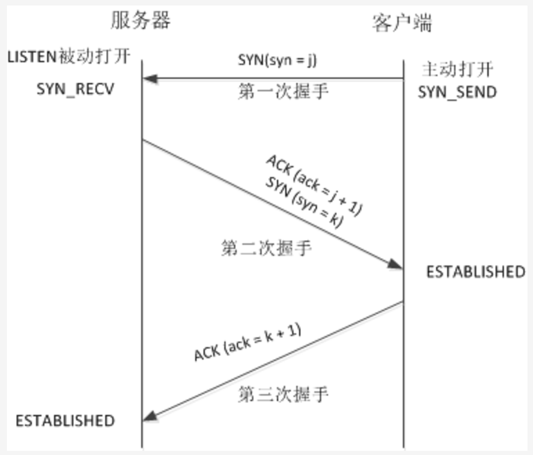
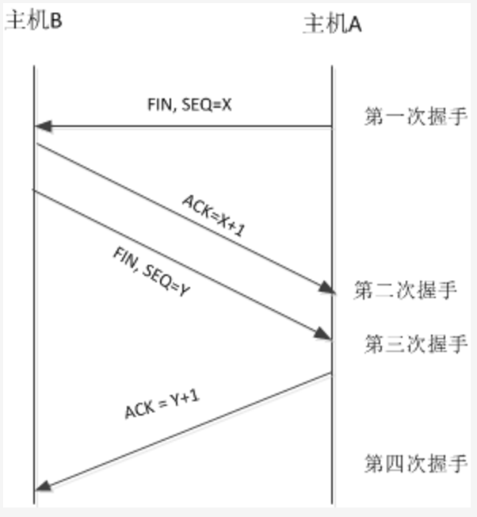

# TCP三次握手原理

TCP/IP协议不是TCP和IP这两个协议的合称，而是指因特网整个TCP/IP协议族。

从协议分层模型方面来讲，TCP/IP由四个层次组成：`网络接口层、网络层、传输层、应用层`。

TCP协议：即传输控制协议，它提供的是一种可靠的数据流服务。
当传送受差错干扰的数据，或举出网络故障，或网络负荷太重而使网际基本传输系统不能正常工作时，
就需要通过其他的协议来保证通信的可靠。TCP就是这样的协议。

    TCP采用“带重传的肯定确认”技术来实现传输的可靠性。
    并使用“滑动窗口”的流量控制机制来高网络的吞吐量。
    
TCP通信建立实现了一种“虚电路”的概念。双方通信之前，先建立一条链接然后双方就可以在其上发送数据流。
这种数据交换方式能提高效率，但事先建立连接和事后拆除连接需要开销。

## 本文主要讲述的是

1. TCP三次握手原理，以及为什么要三次握手，两次握手带来的不利后果。
2. TCP四次挥手原理，为什么要四次挥手。

 

## TCP三次握手原理：

首先，给张图片，建立TCP三次握手的直观印象。

                                   
每次握手（发送数据请求或应答）时，发送的数据为TCP报文，TCP段包含了源/目的地址，端口号，初始序号，滑动窗口大小，
窗口 扩大因子，最大报文段长度等。还有一些标志位：

    （1）SYN：同步序号
    （2）ACK：应答回复
    （3）RST：复位连接，消除旧有的同步序号
    （4）PSH：尽可能的将数据送往接收进程
    （5）FIN：发送方完成数据发送
    （6）URG

从图中，可以看出三次握手的基本步骤是：

    第一次握手：客户端向服务器端发送连接请求包SYN（syn=j），等待服务器回应；
    
    第二次握手：服务器端收到客户端连接请求包SYN（syn=j）后，将客户端的请求包SYN（syn=j）放入到自己的未连接队列，
    此时服务器需要发送两个包给客户端；
    　　（1）向客户端发送确认自己收到其连接请求的确认包ACK（ack=j+1），向客户端表明已知道了其连接请求
    　　（2）向客户端发送连接询问请求包SYN（syn=k），询问客户端是否已经准备好建立连接，进行数据通信；
    　　即在第二次握手时服务器向客户端发送ACK（ack=j+1）和SYN（syn=k）包，此时服务器进入SYN_RECV状态。
    
    第三次握手：客户端收到服务器的ACK（ack=j+1）和SYN（syn=k）包后，知道了服务器同意建立连接，
    此时需要发送连接已建立的消息给服务器；
    　　向服务器发送连接建立的确认包ACK（ack=k+1），回应服务器的SYN（syn=k）告诉服务器，我们之间已经建立了连接，
       可以进行数据通信。
    　　ACK（ack=k+1）包发送完毕，服务器收到后，此时服务器与客户端进入ESTABLISHED状态，开始进行数据传送。 

 

## 为什么不能只两次握手？

有了三次握手的详细步骤，就可以分析为什么需要三次握手而不是两次握手了。

三次握手的目的：消除旧有连接请求的SYN消息对新连接的干扰，同步连接双方的序列号和确认号并交换TCP 窗口大小信息。

设想：如果只有两次握手，那么第二次握手后服务器只向客户端发送ACK包，此时客户端与服务器端建立连接。
在这种握手规则下： 

    假设：如果发送网络阻塞，由于TCP/IP协议定时重传机制，B向A发送了两次SYN请求，分别是x1和x2，且因为阻塞原因，
    导致x1连接请求和x2连接请求的TCP窗口大小和数据报文长度不一致，如果最终x1达到A，x2丢失，
    此时A同B建立了x1的连接，这个时候，因为AB已经连接，B无法知道是请求x1还是请求x2同B连接，
    如果B默认是最近的请求x2同A建立了连接，此时B开始向A发送数据，数据报文长度为x2定义的长度，窗口大小为x2定义的大小，
    而A建立的连接是x1，其数据包长度大小为x1，TCP窗口大小为x1定义，这就会导致A处理数据时出错。
    
    很显然，如果A接收到B的请求后，A向B发送SYN请求y3（y3的窗口大小和数据报长度等信息为x1所定义），
    确认了连接建立的窗口大小和数据报长度为x1所定义，A再次确认回答建立x1连接，然后开始相互传送数据，
    那么就不会导致数据处理出错了。

 

## TCP释放连接需四次挥手

先看图，直观的了解下：

    需四次挥手原因：由于TCP的半关闭特性，TCP连接时双全工（即数据在两个方向上能同时传递），
    因此，每个方向必须单独的进行关闭。
    这个原则就是：当一方完成它的数据发送任务后就能发送一个FIN来终止这个方向上的连接。
    当一端收到一个FIN后，它必须通知应用层另一端已经终止了那个方向的数据传送。
    即收到一个FIN意味着在这一方向上没有数据流动了。
    
    目的：保证服务器与客户端都能完全的接受对方发送的数据。
    
    
    假设客户机A向服务器B请求释放TCP连接，则：
    第一次挥手：主机A向主机B发送FIN包；A告诉B，我（A）发送给你（B）的数据大小是N，我发送完毕，请求断开A->B的连接。
    
    第二次挥手：主机B收到了A发送的FIN包，并向主机A发送ACK包；B回答A，是的，我总共收到了你发给我N大小的数据，
    A->B的连接关闭。
    
    第三次挥手：主机B向主机A发送FIN包；B告诉A，我（B）发送给你（A）的数据大小是M，我发送完毕，请求断开B->A的连接。
    
    第四次挥手：主机A收到了B发送的FIN包，并向主机B发送ACK包；A回答B，是的，我收到了你发送给我的M大小的数据，
    B->A的连接关闭。