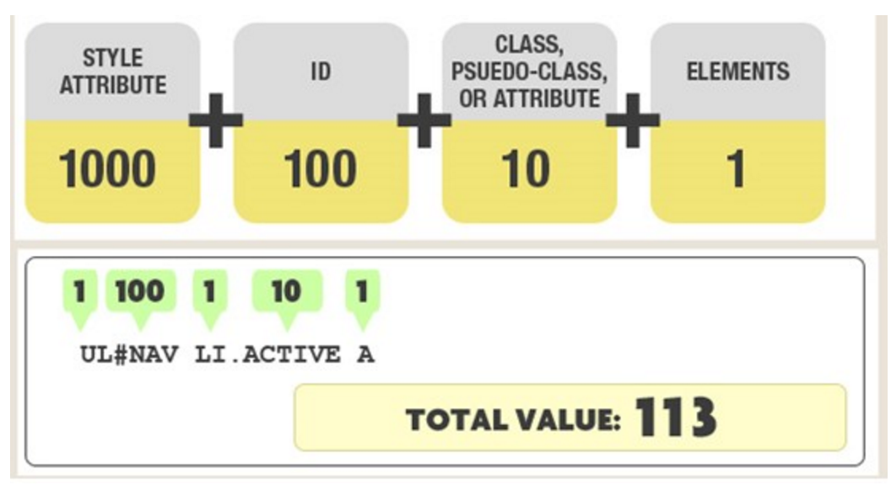
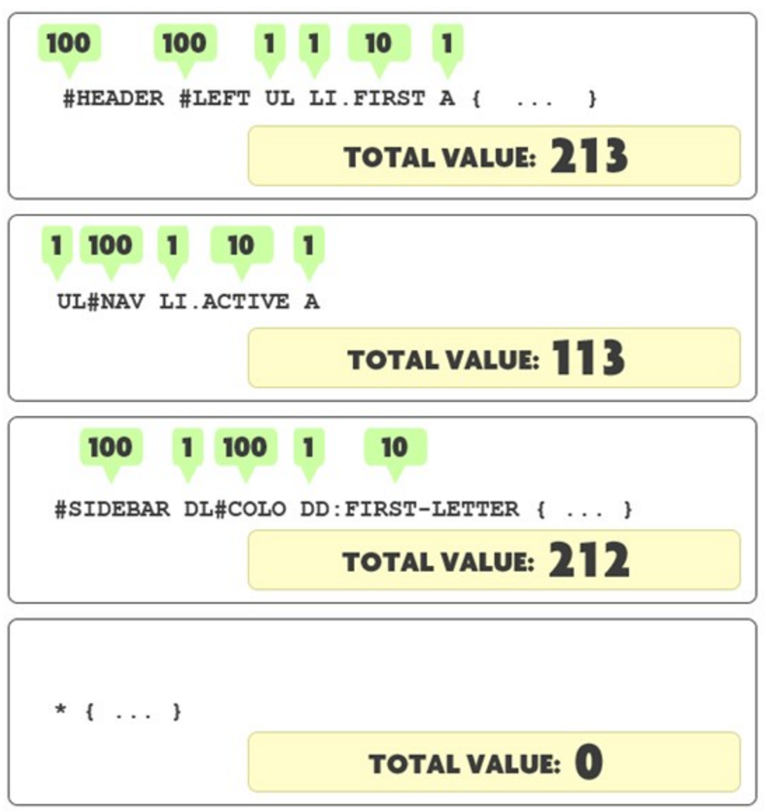

### css选择器权重计算


我们在使用CSS对网页元素定义样式时经常会遇到这种情况：
要对一般元素应用一般样式，然后在更特殊的元素上覆盖它们。
那么我们怎么样来保证我们所新定义的元素样式能覆盖目标元素上原有的样式呢？

在CSS中，会根据选择器的特殊性来决定所定义的样式规则的次序，
具有更特殊选择器的规则优先于具有一般选择器的规则，如果两个规则的特殊性相同，那么后定义的规则优先。

那么，又怎么来计算选择器的特殊性呢？下面这张图介绍了特殊性的计算方法：



我们把特殊性分为4个等级，每个等级代表一类选择器，每个等级的值为其所代表的选择器的个数乘以这一等级的权值，
最后把所有等级的值相加得出选择器的特殊值。

4个等级的定义如下：
```
1. 第一等：代表内联样式，如: style=””，权值为1000。
2. 第二等：代表ID选择器，如：#content，权值为100。
3. 第三等：代表类，伪类和属性选择器，如.content，权值为10。
4. 第四等：代表类型选择器和伪元素选择器，如div p，权值为1。
5. 通配符、子选择器、相邻选择器等的。如*、>、+,权值为0000。
6. 继承的样式没有权值。
```
例如上图为例，其中#NAV为二等选择器，.ACTIVE为三等选择器，UL、LI和A为四等选择器。
则整个选择器表达式的特殊性的值为1*100+1*10+3*1=113

下面是一些计算示例：


`注意：通用选择器（*），子选择器（>）和相邻同胞选择器（+）并不在这四个等级中，所以他们的权值都为0。`

我们再来看一个具体的例子：假如有以下组样式规则，你能判断出HTML代码中的两个标题是什么颜色吗？
```
#content div#main-content h2{
    color:red;
}
#content #main-content>h2{
    color:blue
}
body #content div[id="main-content"] h2{
    color:green;
}
#main-content div.paragraph h2{
    color:orange;
}
#main-content [class="paragraph"] h2{
    color:yellow;
}
div#main-content div.paragraph h2.first{
    color:pink;
}
```
以下是HTML代码：
```
<div id="content">
    <div id="main-content">
        <h2>CSS简介</h2>
        <p>CSS（Cascading Style Sheet，可译为“层叠样式表”或“级联样式表”）是一组格式设置规则，用于控制Web页面的外观。</p>
        <div class="paragraph">
            <h2 class="first">使用CSS布局的优点</h2>
            <p>1、表现和内容相分离 2、提高页面浏览速度 3、易于维护和改版 4、使用CSS布局更符合现在的W3C标准.</p>
        </div>
    </div>
</div>
```
判断出来了么？答案是：两个标题都是红色的！

让我们来一起算算六个样式规则各自的特殊性的值：
```
第一个特殊性的值=2*100+2*1=202
第二个特殊性的值=2*100+1=201
第三个特殊性的值=1*100+1*10+3*1=113
第四个特殊性的值=1*100+1*10+2*1=112
第五个特殊性的值=1*100+1*10+1*1=111
第六个特殊性的值=1*100+2*10+3*1=123
```
清楚了吧，第一个样式规则以其202的高分一举夺得了本次样式选择器特殊性大赛的冠军，
后面一些规则虽然看起来好像更复杂，但特殊性并不是拼谁的选择器表达式写得更长，`ID选择器才是王道`！

理解选择器的特殊性很重要，特别是在修复bug的时候，因为你需要了解哪些规则优先及其原因。
```
如果你遇到了似乎没有起作用的CSS规则，很可能是出现了特殊性冲突。
请在你的选择器中添加他的一个父元素的ID，从而提高它的特殊性。
如果这能解决问题，就说明样式表中其他地方很可能有更特殊的规则，它覆盖了你的规则。
如果是这种情况，你可能需要检查代码，解决特殊性冲突，让代码尽可能简洁。
```