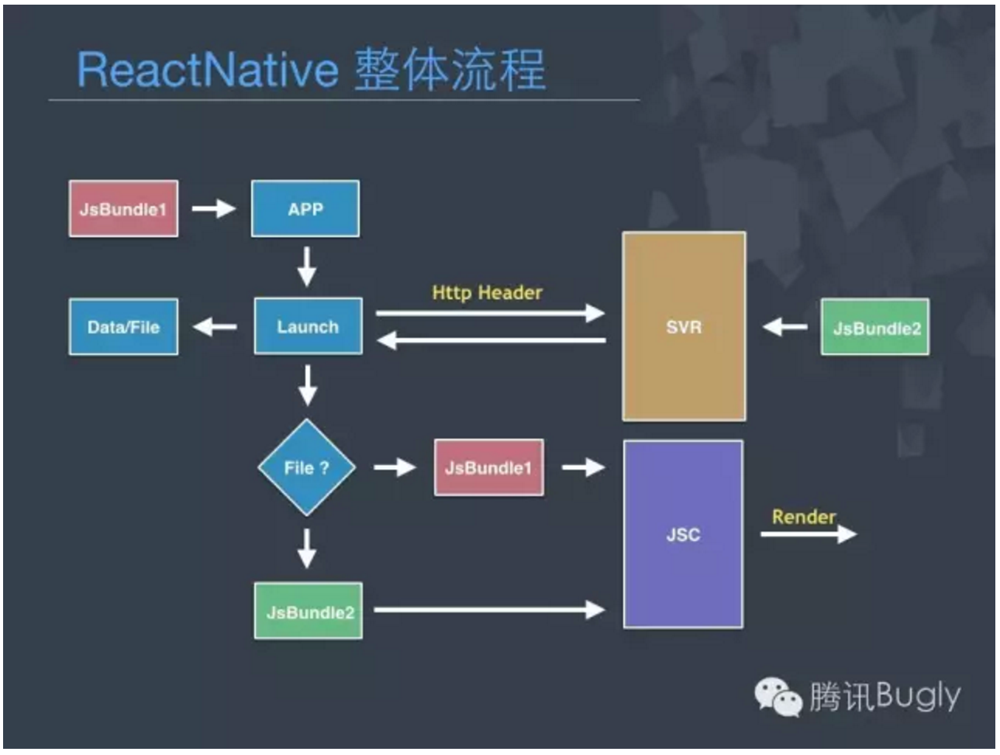

## ReactNative

原文地址: http://mp.weixin.qq.com/s?__biz=MzA3NTYzODYzMg==&mid=2653577384&idx=2&sn=be6d3cf3bd8b9997aeac2b9f2525b0d4&scene=0#wechat_redirect

#### 优势：

    原生控件的体验，Web的版本节奏，Web的开发效率，跨平台等
    
#### 劣势：

    1. 版本支持度 Android 4.1 (API 16) & iOS 7.0
    2. 项目尚不成熟，容易Crash，部分机器存在兼容性问题
    3. 性能，在高低端机呈现两极    
    4. Android仅基于Gradle，目前业界较多大平台项目均基于 Ant，如Qzone，手Q等
    5. 特别是最后一点，这个也是我们前面说的，版本升级不能跟随fb rn版本的原因，
    我们的每次升级都需要将rn源码进行改造和合并，接口适配等，对开发有一定的额外的工作量。

接下来，我们来看下，使用rn开发的版本整体流程。

首先，我们的app集成了rn的sdk，另外，jsbundle也就是我们使用rn开发的上层业务逻辑代码。
我们在发布app时，我们会内置一份。当上层业务逻辑变化时，我们会重新向我们的cdn发布一份新的jsbundle。
在app启动时，我们检查当时外网有没有jsbundle需要更新，如果有，我们们更新并存放本地。
在点击应用入口时，我们会优先使用新下载的这份文件，否则使用内置的，最后通过JSC(javascript core)进行渲染，
得到我们最终的页面。

## 了解了版本的整体流程，再简单来看看rn原理。

前面我们讲到了jsc(javascript core)，那jsc就是桥接web<>native的一个组件，
在一定意义上等同于我们的浏览器内核。
那讲完jsc，那原理就比较容易理解了，就是通过jsc去解析我们的jsbundle，并将信息传递给native，
最后由native不断去处理来自js层的调用，最终得到我们的native页面。

网上分析rn在iOS的文章也比较多了，我这边也不多讲，主要讲下在android方面的。

主要分为三层：

    java层：主要有ReactCore，主要处理与js的交互，还有处理图片的fresco，网络库okhttp，
    还有一些support和utils等。
    
    Ｃ++层：主要有我们的jsc，bridge,，jsloader等
    
    JS层：这层相对大家就比较熟悉了，主要是包含组件的逻辑处理和一些布局，当然，
    这些布局信息最终也是转成我们终端的布局模型。

接下来，我们来看一下js跟native的通信机制。

    这块内容其实是rn里很重要的内容，这块主要是流程比较长，我们今天就简单讲一下，详细的有兴趣的同学，
    可以去公众号看我之前写文章，或者直接找我。

先来看看从java层到js层的调用。

我们的业务逻辑其实是在js里面，那就这里出现了我们的启动逻辑，这里其实就是java层到js层调用的一个例子，
由java去调用js的某个启动函数。

那js层到java层的调用就更多了，比如像点击图片点看大图浮层，这里更多是业务性质的调用。

当然，还有另外一个可能大家比较关注的问题，就是前端写的标签，比如我们的这样一个组件，
是怎么转换到终端的一个view?这里其实原理也很简单，js层会将控件标签转换成js对终端UI模块的一次调用，
如比像这种UIManager.creaeView或者UIManager.removeView我们无论是java到js还是js到java，
中间都必须经过我们的jsc进行桥接。

上一张稍微复杂点的调用链

这个讲起来时间稍微有点长，其实就是说明标签到控件的一个完整调用链，有兴趣的同学我们下来再讨论。

好了，前面原理讲得比较多，因为可能有先同学先前没接触过rn，我这里就先讲些基础知识。
接下来我们讲些可能大家比较感兴趣的，就是我们踩坑和填坑之路。

## RN的坑

那在接下rn之前，我们会遇到了下面几个问题：

1. 包大小：Android HelloWorld工程 约7m
2. 稳定性：业界尚未有真实外网数据，内部仅能通过大量机器进行稳定性测试，但未能覆盖所有机型
3. 安全性：Jsbundle可能发生被拦截等情况，容易导致Native Crash
4. 兼容性：Android 4.1 (API 16) & iOS 7.0 Jsbundle与Native版本兼容 支持版本对机型兼容
5. 性能：业界尚未有真实外网数据，仅靠实验室有限数据支撑

基于上面这几个问题，我们决定第一个版本，使用rn来改造之前的情侣空间业务(H5)，我们使用独立插件的技术来实现。

独立插件通过异步下载，并且，我们使用独立进程来承载它防止拖垮主进程，最后，再加个云开关，
假如外网有问题可以随时将rn切到h5。

这里第一个项目的细节就不细讲了，在这个项目，主要是想通过这个第一涉水项目，我们发现了哪些问题，
以及我们是怎么解决的。主要是首屏方面，我们通过实验log数据，得知wifi下，首屏将近6s才能完全渲染出来。
其次，fps主观上没明显卡顿，中低端机对比老版本下降明显，这个两个问题。

接下来，我们决定进行第二个业务话题圈使用rn进行改造。

那我们将先前情侣空间的log进行分块，主要是 插件及进程启动 2.1s＋RN上下文启动＋1.1s 
首屏数据＋2s Render 0.9s。接下来我们分块解决这些问题。

插件及进程启动：消灭这份耗时其实比较容易，rn和Qzone集成并绑在主进程即可。
但是集成我们遇到一个问题就是Qzone是基本ant的构建，rn是基于gradle的构建，两者无法直接融合，
那只能是将rn改造ant的构建。

那我们话题圈最终改造的计划是：

    ant改造rn -> 集成到Qzone -> 业务开发 -> 性能优化
    

集成到Qzone主要是方法数的问题，那业务开发，我简单讲一个点，就是在开发前，
终端同学需要与前端同学定制好你们业务的所有接口。这里我有个建议，形参建议只保留两个，
一个是你们业务数据的json，另外一个就是cb。因为rn在接口调用方法，如果参数个数对不上，会直接导致应用crash。

那我们接下来看性能优化方面的东西，我们这里已经将Qzone与rn进行集成了，
那关于插件启动和进程启动的耗时已经可以消除，那接下来我们看下，怎么去消除首屏和上下文的耗时。

那我们先来看一下，一个传统的启动流程：

    点击入口 -> native cxt -> web cxt -> 前端发起数据请求 -> 回包 -> 渲染
    
很明显，这里的流程是串行的，那我们是不是把一些东西并行起来，或者提前先做呢？
和其他启动优化类似，还是内存换时间，我们这里加了预加载的逻辑。

预加载啥呢？我们这里预加载的是native context。
假如你们的业务在二级页的话，我觉得预加载是没啥问题的，当然在主页面或者整个app都是用rn的话，可能就得换种思路了。
另外数据的话我们是这样做的。首先，我们给前端提供一个数据模块，这个模块提供可以读写本地数据的接口。
我们点击入口的时候，终端会先去拉后台数据并存到sdcard，那当我们点击入口，前端再使用的我们提供的数据模块，
读取缓存的数据进行渲染。当时，我们前端还是照样会发请求给后台拉最新的数据，随后覆盖到sdcard，
假如数据有更新话，前台页面再重新渲染。最终我们的首屏定格在1.5s左右。
（由于话题圈页面相对比较重，我们之前使用的是wns-html技术，这个数据其实已经超越了之前该页面的首屏速度）

那首屏讲完了，我们来看下FPS，对比我们之前的情侣空间，我们这次FPS同样有很多的提升，
其实很多的优化思路我们是从前端优化思想中借鉴过来，像FPS就是，我们做了以下的优化：

### UI方面：

    减少View层级嵌套
    合理设置背景色透明

### JS方面:

    JS层使Listview控件渲染数据，废弃使用ScrollView控件
    避免滑动做过多事情，减少JS线程掉帧

最终FPS基本定格在53-54左右。

### 我们最后再来看一下包精简的方案:

原始的rn接近7m左右，那里面是不是有些优化空间呢？
很多人在说，我们平台也有自己的网络库，真得还得使用rn里面的okhttp么？图片库也是，不能复用么？
其实是可以，我们一起来看下包精简。

那包精简主要分为下面4部分：

    SO：
    放弃对x86的支持
    借用TBS能力，移除JSC
    
    Java:
    去除暂时不需要Module&UIManager
    Release 去除Dev Support
    
    Jar:
    对接平台网络库(WNS,MSF)，移除OKHTTP
    对接平台图片库(ImageManager)，移除Fresco
    平台 Support 阉割库 复用补齐
    
    Res:
    移除无用的Res文件，language val
    平台 Support Res复用补齐

接下来，我们来看下crash方面的一些小经验。我们从三方面来分析crash。

    1. 先来看看so层的crash，这层的crash会比较被动，因为基本没办法去解决，一般都只能等官方来更新解决，
    先前我们碰到一个处理cookie的crash，其实我们并没有调用那个api，但系统自己启动调用了，
    我们当时的解决方案是将java的调用入口注释了。当然，还有一些so兼容的crash等等。
    
    2. 那java层的crash相对还好，源码在手，天下任走，这块我们可以随意修复，但建议是自己一定要把修改备注好，
    否则后面升级等都是灾难。
    
    3. 最后来看看js层的crash，前面几天我在gmtc分享的时候，就有个兄弟专门过来我问了我这个问题，
    他们遇到了js层一些属性转换的问题，并且直接表现就是实然crash。
    那这个问题，其实也困拢了我很久，我这边也没太好的解决方案，我们和前端同学定位过，
    属性类型肯定是没问题的，最后我们时间问题，解决方案是改动源码。
    源码在处理属性等问题上，稍微一言不和就直接throws exception，
    那我们这里临时的解决方案也只能是将throws改动log的标记，临时解决然后静等升级。

这里再稍微讲一下，我们在手Q方面的一些实践，当然这块参与的同学比较多了，这些也不单单由我一个人完成的。
先来看一下我们这边又做了哪些优化。

主要有以下两方面：

    1. 分包。前面我们讲预加载的知识。我们当时预加载的仅是native cxt，那我们可不可以把前端cxt也加载了呢？
    其实肯定是可以 ，我们试过直接预加载到整一个view的级别，但是，这样会增加近40m的内存，当然是秒开，
    但是还是要保证内存和首屏的权衡。后来，我们进一步思考，假如后续业务众多，
    每次业务切换是否每次都去重新加载那个1m多的jsbundle呢？
    后来，我们有了另外一个方案，就是将jsbundle进行拆分为base和busi两个zip。
    base我们进行预加载，并且，我们在业务切换的时候，我们会进行复用，能更有效地提高首屏的速度。
    
    2. 独立进程操作so。这个主要是因为手Q对内存要求比较严格，在界面退出的时候所有连带内存必须清理干净。
    那rn在这方面其实做的并没有那么好，有部分so层的内存一直占用着。
    那我们解决方案只能是将JNI拆分为独立进程并且在界面退出时，直接退出dalvik，回收所有内存。
    当然，这里就有些老技巧了，无非是进程预加载和延迟销毁。

## 问答环节

    Q1：rn中用到js实现的逻辑容易出现性能问题吗?
    A1：性能瓶颈还是在终端上，前端目前暂没发现严重的性能问题。

    Q2：目前的空间和QQ都是部分使用RN，后面会继续扩大使用范围吗？
    A2：肯定会的。rn目前是快速成长期，我们对rn有长期的归划。
        同样，希望更多兄弟团队一起来推动rn的成长，一起来贡献一份力

    Q3：之前听到外界有团队抱怨 RN 相对原生来说组件太少，反而加大了开发量，什么都要自己来，现在是否有改善了呢？
    A3：目前来看，其实组件是满足大部分开发者的，除非像某特些定制化的组件，比如像emojtext这种，
        我们才需要自己去自定义，当然，现在git上面也很多rn的组件了，应该能满足你

    Q4：刚才分享的一些crash的例子好像都会导致rn直接崩掉，那你们用什么手段来定位究竟是那段js代码导致问题呢?
    A4：这里还要讲明一点。主是掌握源码才有真正的主动权。很多问题，我们也都是去阅读源码发现的。
        其实源码并不复杂，里面很多知识沉淀，我个人是非常建议去读源码的。

    Q5：我是做安卓的，不知道要不要尝试一下这个新技术? 现在团队做一些应用也不是很重，安卓和ios搞两套实在有些蛋疼
    A5：android iOS两套这个问题，其实只是某些基础组件属于平台特有，但大部分逻辑还是有共性的。

    Q6：目前rn发展还未稳定，预测一下未来是否会大规模应用并取代传统的native开发，真正实现一次编写，到处运行？
    A6：动态更新其实这个问题很早前就有人提出，像插件啊，热更新其实目的也是一致的，rn只是另外一钟思路，weex也类似。
        完全取代native 开发个人觉得不太现实，因为像rn还是需要native的一些开发工作的。

    Q7：自定义ui组件需要对rn适配吗?
    A7：需要。但适配工作量并不高，仅对接相应接口，暴露一些属性即可

    Q8：RN整套框架是基于原生构建的，UI接口升级的时候整套框架能够及时保持兼容吗?
    A8：这里还要说明一下，jsbundle的版本跟native的版本其实是不兼容的。这里建议jsbundle的url都使用后台下发。
        另外，接口在升级后可能会有些改变，这里需要前终端一起配合
    
    Q9：rn跨平台的话是不是还是需要维护两套js，只是有些组件可以跨平台共用呢？
    A9：其实维护的js代码是一套。但可能在构建成特别平台的jsbundle前有小小的修改。
        大部分组件还是可以复用的，除了平台特有的，比如像actionbar这种
    
    Q10：关于使用rn遇到的crash情况，你觉得rqd可以在哪些方面优化，帮助更好解决问题?
    A10：目前业务使用rn的大平台还比较少，其实很多crash我们也在放量外网之后才发现的。
        这里我比较建议是在使用rn前，先大致读下rn的源码，并正式发布前多加一层保险开关。
        当前，目前就qzone使用的版本我也提交了一些pr，有些也收录了，后面相信 crash等会越来越少的
    
    Q11：从Android的机型问题看，最怕的就是平台还不成熟，并且还开源。rn会不会重蹈覆辙?
    A11：rn目前是开源的。目前开发者社区都是高活跃，应该不会存在kpi项目之类的问题，并且动态更新肯定是趋势，
        我觉得可能会有其他方案，但暂时来看，rn还是相当优秀的解决方案的