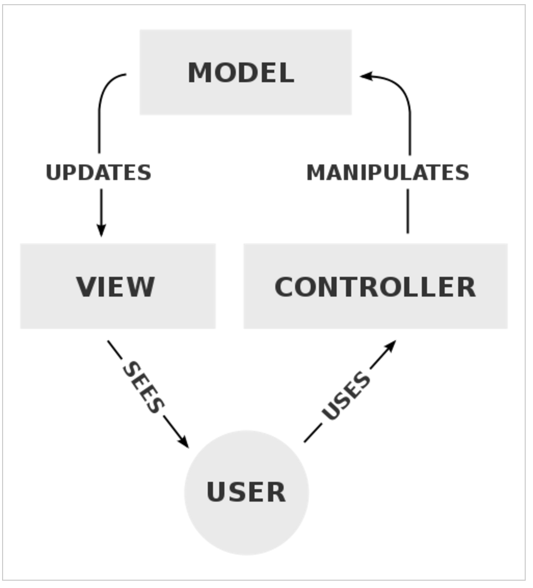
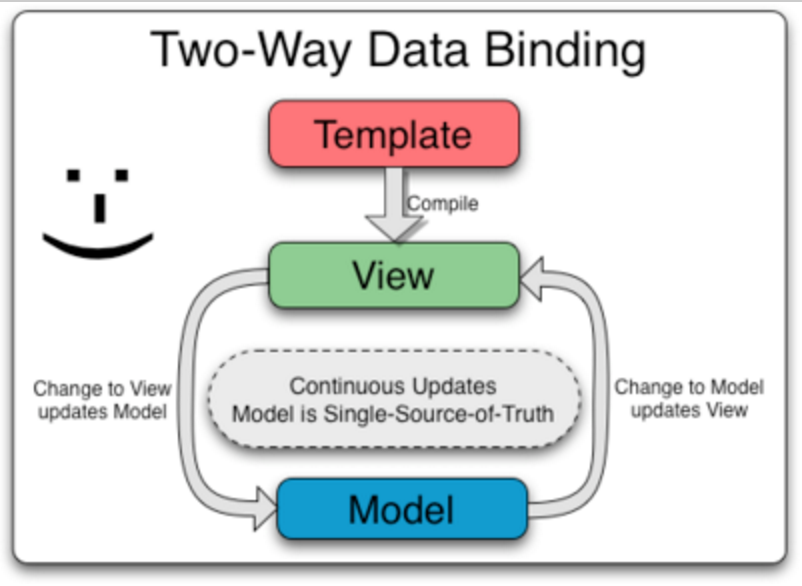
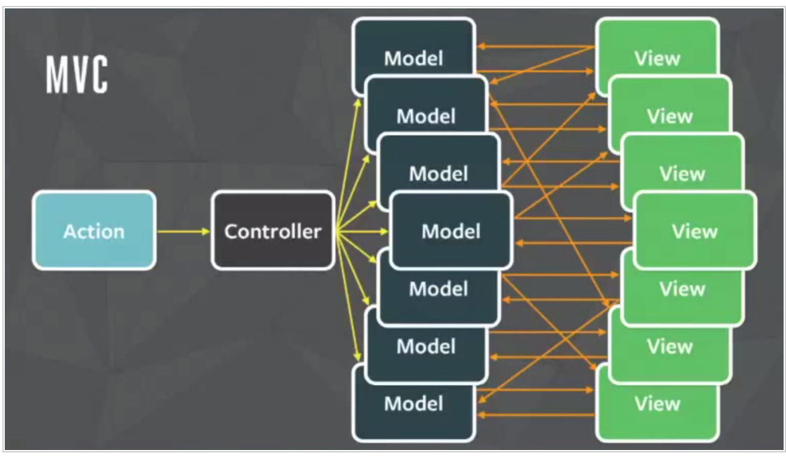

## React原理及优点

## Good old MVC

    在一个交互式应用程序一切罪恶的根源是管理状态。 
    “传统”的方式是MVC架构，或者一些变体。
    MVC提出你的模型是检验真理的唯一来源 - 所有的状态住在那里。
    视图是源自模型，并且必须保持同步。
    当模式的转变，所以没有查看。
    
`最后，用户交互是由控制器，它更新模型抓获`。

## 模型发生变化时就要对视图进行渲染
这看起来相当简单。首先，我们需要描述视图——它是如何将模型状态转换到DOM上去的。
然后，用户一发生了什么操作我们就要对模型进行更新，并且要对整个页面进行重新渲染... 对不? 
没这么快哦. 不幸的事，这其实并没有这么直接，因为如下两个原因:

1. DOM实际上有某种状态，就比如一个文本输入框中的内容. 如果你完全作废你的DOM来进行重新渲染，
这样的内容会丢失掉.
2. DOM 操作 (像删除和插入节点) 真的慢. 频繁的渲染会导致严重的性能问题.

## 那么我们如果在避免这些问题的前提下保持模型和视图同步呢?
### 数据绑定

    过去三年，被引进用来解决这个问题最常用多框架功能就是数据绑定.
    数据绑定能自动地保持模型和视图的同步. 通常在JavaScript中就代表了对象和DOM.
    它会通过让你声明应用中各个块之间的依赖来对这一同步进行打包。
    状态的变化会在整个应用程序中蔓延，然后所有的依赖块都会被自动更新.
    
让我们来看看一些有名的框架中它实际是如何运作的吧.

#### Knockout

Knockout 主张使用的是 MVVM (模型－视图－视图模型) 方法，并且帮你实现了“视图”的部分:
 
    // View (a template)
    
First name: <input data-bind="value: firstName" />
 
    
Last name: <input data-bind="value: lastName" />
 
    <h2>Hello,  !</h2>
    // ViewModel (diplay data... and logic?)
    var ViewModel = function(first, last) { 
     this.firstName = ko.observable(first);
     this.lastName = ko.observable(last);
     this.fullName = ko.pureComputed(function() {
       // Knockout tracks dependencies automatically. It knows that fullName depends on firstName and lastName, because these get called when evaluating fullName.
       return this.firstName() + " " + this.lastName();
     }, this);
    };
    
而这就是了. 不管改变那边的输入值都在让span中发生变化。你从来都不需要写代码将其进行绑定。这多酷啊，呵?
但是等等，模型不是真相的来源么? 这里的视图模型从来获得它的状态呢? 它是怎么知道模型发生了变化的呢? 有趣的问题啊.

#### Angular
Angular 采用保持模型和视图同步的方式描述了数据绑定. 文档时这么描述的:

但是... 视图应该直接通模型打交道么? 这样它们不久紧紧的耦合起来了么?
不管怎么样，我们还是来义务地看看hello world示例吧:
 
    // View (a template) 
    
 
     <label>Name:</label>
     <input type="text" ng-model="hello.firstName">
     <input type="text" ng-model="hello.lastName">
     <h1>Hello {{hello.fullName()}}!</h1>
    

     
    // Controller 
    angular.module('helloApp', []) 
    .controller('HelloController', function() {
     var hello = this;
     hello.fullName = function() {
      return hello.firstName + hello.lastName;
     };
    });
    
从这个示例中，看起来像是控制器有了状态，并且有类似模型的行为 - 或者也许是一个视图模型? 
假设模型在其它的地方, 那它是如何保持与控制器的同步的呢?
我的头开始有点儿疼了.

## 数据绑定的问题
数据绑定在小的例子中运行起来很不错。不过，随着你的应用规模变大，你可能会遇到下面这些问题.

## 声明的依赖会很快引入循环
最经常要处理的问题就是对付状态中变化的副作用。这张图来自 Flux 介绍，它解释了依赖是如何开始挖坑的：

你能预计到当一个模型发生变化时跟着会发生什么改变么? 
当依赖发生变化时，对于可以任意次序执行的代码你很难推理出问题的起因。

## 模板和展示逻辑被人为的分离

    视图扮演了什么角色呢? 它扮演的就是向用户展示数据的角色。
    视图模型扮演的角色又是什么呢? 它扮演的也是向用户展示数据的角色？有啥不同？完全没有！
    
        毫无疑问，模板割裂了计数  ~ Pete Hunt
        
    最后，视图组件应该能操作其数据并以需要的格式对数据进行展示。
    然后，所有的模板语言本质上都是有缺陷的：它们从来都不能达到跟代码一样的表现力和功能。
    很简单， {{# each}}, ng-repeat 和 databind="foreach" 这些都是针对 JavaScript 
    中某些原生和琐碎事务的拙劣替代物。而它们不会更进一步走得更远。因此它们不会为你提供过滤器或者映射。
    
    数据绑定是应重新渲染而生的小技巧
    什么是圣杯不再我们的讨论之列。每个人总是想要得到的是，当状态发生变化时能重新对整个应用进行渲染。
    这样，我们就不用去处理所有麻烦问题的根源了：状态总是会随着时间发生变化——给定任何特定的状态，
    我们就可以简单的描述出应用回是什么样子的。

## 拥抱Facebook的React
事实证明他们做到了。React实现了一个虚拟的DOM，一种给我们带来的圣杯的利器.
虚拟的DOM是啥东西呢?
很高兴你能这么问？让我们来看看一个简单React示例.
 
    var Hello = React.createClass({ 
      render: function() {
        return 
Hello {this.props.name}
;
      }
    });
    React.render(<Hello name="World" />, document.getElementById('container'));
    
这就是一个React组件的所有API。你必须要有一个渲染方法。复杂吧，呵呵?
OK, 但是 
 是什么意思? 那不是 JavaScript 啊! 对了，它就不是.
你的新伙伴，JSX
这段代码实际上是用 JSX 写的，它是 JavaScript 的一个超集，包含了用于定义组件的语法。
上面的代码会被编译成 JavaScript，因此实际上会变成：
 
    var Hello = React.createClass({displayName: "Hello", 
      render: function() {
        return React.createElement("div", null, "Hello ", this.props.name);
      }
    });
    React.render(React.createElement(Hello, {name: "World"}), document.getElementById('container'));

你明白这段对 createElement 调用的代码么? 这些对象组成了虚拟 DOM 的实现。

    很简单 : React 首先在内存中对应用的整个结构进行了组装。
    然后它会把这个结构装换成实际的 DOM 节点并将其插入浏览器的 DOM 中。
 
## 虚拟的DOM就是快

    我们已经讨论过, 操作 DOM 消耗大得离谱，因此它必须以尽可能少的时间完成。
    React 的虚拟 DOM 使得两棵 DOM 结构的比对真正快起来，并且能确切的找到它们之间有什么变化. 
    如此，React 就能计算出更新 DOM 所需要做出的最小变更。
    实话说，React 能比对两棵 DOM 树，找出它所要执行的最小操作集。这有两个意义:
        1. 如果一个带有文本的输入框被重新渲染，React 会知道它有的内容, 它不会碰那个碰那个输入框。不会有状态发生丢失的!
        2. 比对虚拟 DOM 开销一点也不昂贵，因此我们想怎么比对都可以。当其准备好要对 DOM 进行实际的修改时，
        它只会进行最少量的操作。没有额外的拖慢布局之虞!
    
## React 将状态映射到 DOM

    React 中只有虚拟 DOM 的渲染和比对是神奇的部分。其优秀性能是使得我们拥有简化了许多的整理架构的基础。有多简单呢?
    React 组件都是幂等（一个幂等操作的特点是其任意多次执行所产生的影响均与一次执行的影响相同）的函数。
    它们能在任意一个实时的点来描述你的UI。~ Pete Hunt, React: 对最佳实践的重新思考

## 简单的幂等函数。

React 组件整个就是这么一个东西，真的。它将当前的应用状态映射到了 DOM。
并且你也拥有JavaScript的全部能力去描述你的 UI——循环，函数，作用域，组合，模块 - 不是一个蹩脚的模板语言哦.
 
    var CommentList = React.createClass({ 
     render: function() {
      var commentNodes = this.props.data.map(function (comment) {
       return (    <Comment author={comment.author}>
         {comment.text}    </Comment>
       );
      });
      return (   

        {commentNodes}   

      );
     }
    });
     
    var CommentBox = React.createClass({ 
     render: function() {
      return (   

        <h1>Comments</h1>
        <CommentList data={this.props.data} />
       

      );
     }
    });
     
    React.render( 
     <CommentBox data={data} />,
     document.getElementById('content')
    );